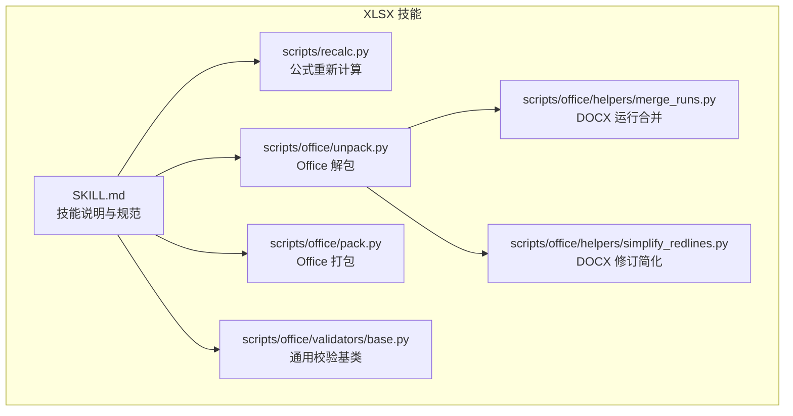
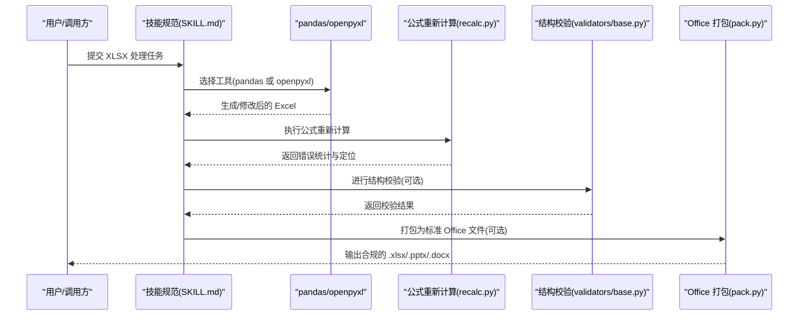
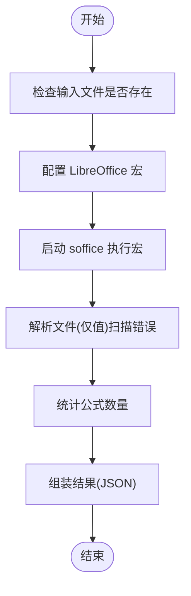
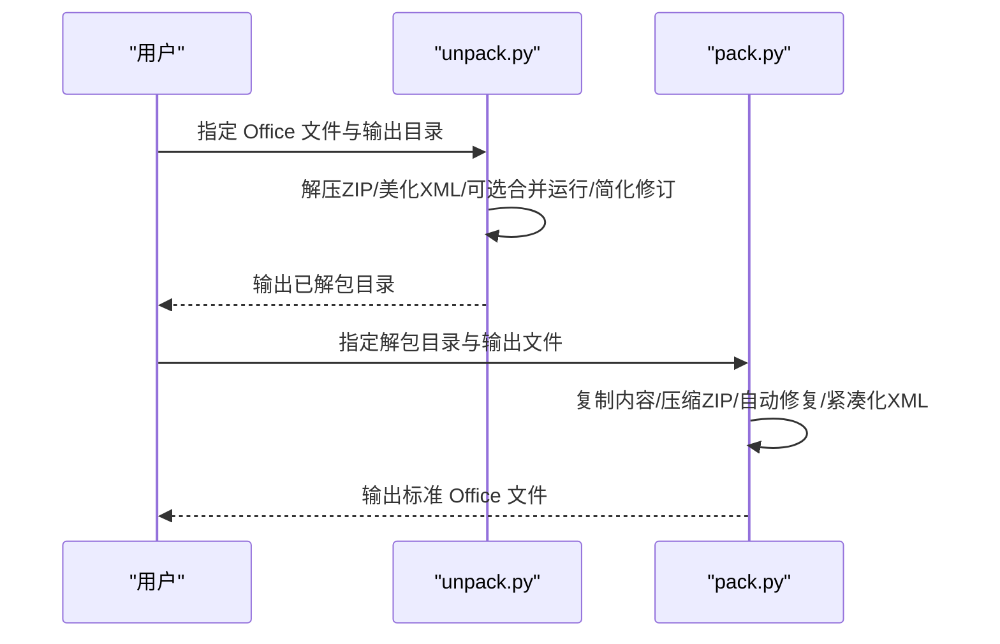
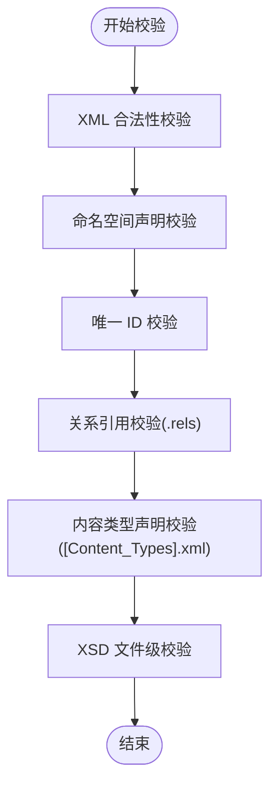
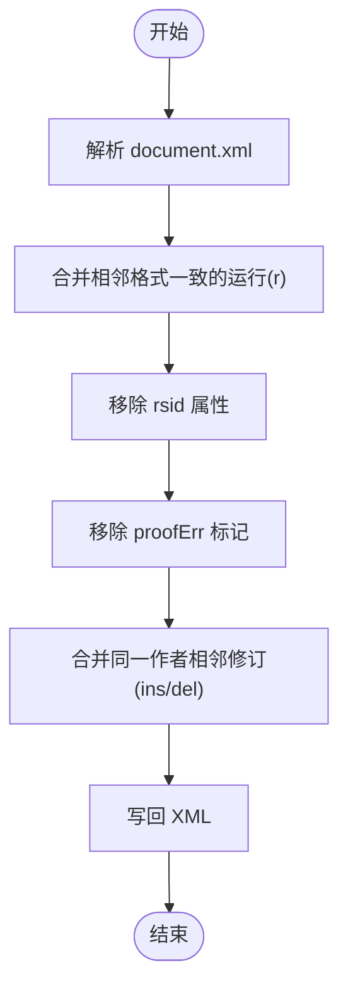
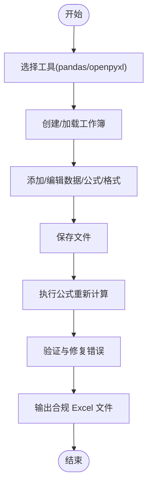
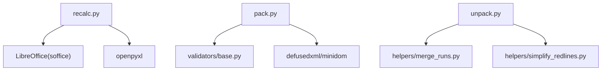

# XLSX 处理技能

<cite>
**本文档引用的文件**
- [SKILL.md](file://skills/skills/xlsx/SKILL.md)
- [recalc.py](file://skills/skills/xlsx/scripts/recalc.py)
- [pack.py](file://skills/skills/xlsx/scripts/office/pack.py)
- [unpack.py](file://skills/skills/xlsx/scripts/office/unpack.py)
- [base.py](file://skills/skills/xlsx/scripts/office/validators/base.py)
- [merge_runs.py](file://skills/skills/xlsx/scripts/office/helpers/merge_runs.py)
- [simplify_redlines.py](file://skills/skills/xlsx/scripts/office/helpers/simplify_redlines.py)
</cite>

## 目录
1. [简介](#简介)
2. [项目结构](#项目结构)
3. [核心组件](#核心组件)
4. [架构总览](#架构总览)
5. [详细组件分析](#详细组件分析)
6. [依赖分析](#依赖分析)
7. [性能考虑](#性能考虑)
8. [故障排除指南](#故障排除指南)
9. [结论](#结论)
10. [附录](#附录)

## 简介
本技能文档面向需要处理 Excel 电子表格（.xlsx/.xlsm/.csv/.tsv）的用户与开发者，系统性阐述以下能力：
- 工作簿读取与编辑：支持从现有文件加载、在内存中修改、保存输出
- 单元格操作：按行列索引访问、插入/删除行列、批量写入
- 公式计算与重新计算：通过 LibreOffice 自动计算并扫描常见错误
- 数据验证与修复：基于 OpenXML 规范的结构校验、唯一标识校验、关系引用校验、内容类型声明校验
- 打包与解包：将 Office 文档目录压缩为标准 .xlsx/.pptx/.docx 文件，同时进行 XML 压缩与自动修复
- 图表与格式化：结合 openpyxl 的样式与图表集成能力（本技能提供调用方式与最佳实践）

本技能强调“动态可更新”的模型设计：所有计算应以 Excel 公式形式保留，避免在 Python 中硬编码结果；并在完成修改后执行公式重新计算与错误检查。

## 项目结构
XLSX 技能位于 skills/skills/xlsx 目录，包含技能说明与一组用于 Office 文档处理的脚本工具：
- 技能说明：定义了输出规范、财务模型颜色与格式标准、公式构建规则、工作流与最佳实践
- 脚本工具：
  - recalc.py：使用 LibreOffice 计算公式并扫描常见错误
  - office/unpack.py / office/pack.py：Office 文档解包与打包，美化 XML 并进行自动修复
  - office/validators/base.py：通用 Office 文档校验基类，提供 XSD 校验、唯一 ID 校验、关系引用校验、内容类型校验等
  - office/helpers/merge_runs.py 与 simplify_redlines.py：针对 DOCX 的文本运行合并与修订简化（XLSX 场景不适用，但体现了 Office 文档处理思路）

**图示来源**
- [SKILL.md:1-292](file://skills/skills/xlsx/SKILL.md#L1-L292)
- [recalc.py:1-185](file://skills/skills/xlsx/scripts/recalc.py#L1-L185)
- [unpack.py:1-133](file://skills/skills/xlsx/scripts/office/unpack.py#L1-L133)
- [pack.py:1-160](file://skills/skills/xlsx/scripts/office/pack.py#L1-L160)
- [base.py:1-848](file://skills/skills/xlsx/scripts/office/validators/base.py#L1-L848)
- [merge_runs.py:1-200](file://skills/skills/xlsx/scripts/office/helpers/merge_runs.py#L1-L200)
- [simplify_redlines.py:1-198](file://skills/skills/xlsx/scripts/office/helpers/simplify_redlines.py#L1-L198)

**章节来源**
- [SKILL.md:1-292](file://skills/skills/xlsx/SKILL.md#L1-L292)

## 核心组件
- 技能规范与工作流
  - 输出要求：专业字体、零公式错误、金融模型颜色与格式标准、假设放置与注释规范
  - 工具选择：pandas 用于数据分析与批量导出；openpyxl 用于复杂格式与公式
  - 关键流程：选择工具 → 创建/加载 → 修改 → 保存 → 使用 recalc.py 重新计算 → 验证与修复
- 公式重新计算
  - 依赖 LibreOffice，自动配置宏，遍历所有工作表计算并扫描常见错误类型
  - 返回 JSON 包含状态、错误总数、公式总数与按错误类型的汇总位置
- Office 文档解包与打包
  - 解包：提取 ZIP 内容，美化 XML，对 DOCX 可选合并相邻文本运行与简化修订
  - 打包：压缩为 .docx/.pptx/.xlsx，自动修复与 XML 紧凑化
- 结构校验
  - 基于 XSD 的 XML 合法性校验
  - 唯一 ID 校验（如评论、书签、工作表等）
  - 关系引用校验（.rels 文件与目标文件一致性）
  - 内容类型声明校验（[Content_Types].xml）

**章节来源**
- [SKILL.md:66-292](file://skills/skills/xlsx/SKILL.md#L66-L292)
- [recalc.py:1-185](file://skills/skills/xlsx/scripts/recalc.py#L1-L185)
- [unpack.py:1-133](file://skills/skills/xlsx/scripts/office/unpack.py#L1-L133)
- [pack.py:1-160](file://skills/skills/xlsx/scripts/office/pack.py#L1-L160)
- [base.py:1-848](file://skills/skills/xlsx/scripts/office/validators/base.py#L1-L848)

## 架构总览
下图展示了 XLSX 处理的端到端流程：从技能触发到最终输出 Excel 文件，贯穿数据读取、公式计算与验证修复。

**图示来源**
- [SKILL.md:66-292](file://skills/skills/xlsx/SKILL.md#L66-L292)
- [recalc.py:1-185](file://skills/skills/xlsx/scripts/recalc.py#L1-L185)
- [pack.py:1-160](file://skills/skills/xlsx/scripts/office/pack.py#L1-L160)
- [base.py:1-848](file://skills/skills/xlsx/scripts/office/validators/base.py#L1-L848)

## 详细组件分析

### 组件 A：公式重新计算与错误扫描（recalc.py）
职责：
- 自动配置 LibreOffice 宏环境，首次运行时写入必要模块
- 通过 soffice 无头模式调用宏，触发“全部计算 → 保存 → 关闭”
- 读取文件（data_only=True）扫描常见 Excel 错误类型（#REF!、#DIV/0!、#VALUE!、#NAME?、#NULL!、#NUM!、#N/A）
- 统计公式总数与错误分布，返回 JSON

**图示来源**
- [recalc.py:70-162](file://skills/skills/xlsx/scripts/recalc.py#L70-L162)

**章节来源**
- [recalc.py:1-185](file://skills/skills/xlsx/scripts/recalc.py#L1-L185)

### 组件 B：Office 文档解包与打包（unpack.py / pack.py）
职责：
- 解包：提取 ZIP，美化 XML，对 DOCX 可选合并相邻文本运行与简化修订
- 打包：复制内容至临时目录，压缩为 .docx/.pptx/.xlsx，自动修复与 XML 紧凑化

**图示来源**
- [unpack.py:34-89](file://skills/skills/xlsx/scripts/office/unpack.py#L34-L89)
- [pack.py:24-66](file://skills/skills/xlsx/scripts/office/pack.py#L24-L66)

**章节来源**
- [unpack.py:1-133](file://skills/skills/xlsx/scripts/office/unpack.py#L1-L133)
- [pack.py:1-160](file://skills/skills/xlsx/scripts/office/pack.py#L1-L160)

### 组件 C：通用结构校验（validators/base.py）
职责：
- XML 合法性校验（lxml.etree）
- 命名空间声明校验
- 唯一 ID 校验（评论、书签、工作表等）
- 关系引用校验（.rels 与目标文件一致性）
- 内容类型声明校验（[Content_Types].xml）
- 基于 XSD 的文件级校验，支持忽略特定历史性或兼容性问题

**图示来源**
- [base.py:143-168](file://skills/skills/xlsx/scripts/office/validators/base.py#L143-L168)
- [base.py:170-197](file://skills/skills/xlsx/scripts/office/validators/base.py#L170-L197)
- [base.py:199-287](file://skills/skills/xlsx/scripts/office/validators/base.py#L199-L287)
- [base.py:289-383](file://skills/skills/xlsx/scripts/office/validators/base.py#L289-L383)
- [base.py:492-596](file://skills/skills/xlsx/scripts/office/validators/base.py#L492-L596)
- [base.py:598-683](file://skills/skills/xlsx/scripts/office/validators/base.py#L598-L683)

**章节来源**
- [base.py:1-848](file://skills/skills/xlsx/scripts/office/validators/base.py#L1-L848)

### 组件 D：辅助工具（DOCX 文本运行合并与修订简化）
职责：
- 合并相邻且格式相同的文本运行（r），移除 rsid 属性与拼写/语法标记
- 合并同一作者的相邻插入/删除修订，减少嵌套层级

注意：这些工具主要面向 DOCX，但在 Office 文档处理的整体思路与 XML 处理方式上具有参考价值。

**图示来源**
- [merge_runs.py:16-40](file://skills/skills/xlsx/scripts/office/helpers/merge_runs.py#L16-L40)
- [simplify_redlines.py:22-44](file://skills/skills/xlsx/scripts/office/helpers/simplify_redlines.py#L22-L44)

**章节来源**
- [merge_runs.py:1-200](file://skills/skills/xlsx/scripts/office/helpers/merge_runs.py#L1-L200)
- [simplify_redlines.py:1-198](file://skills/skills/xlsx/scripts/office/helpers/simplify_redlines.py#L1-L198)

### 组件 E：技能规范与最佳实践（SKILL.md）
职责：
- 明确输出规范：字体、颜色、数字格式、百分比与负数格式
- 财务模型颜色与格式标准：假设、公式、跨表链接、外部链接、关键假设高亮
- 公式构建规则：假设集中放置、避免硬编码、错误预防清单
- 工具选择与工作流：pandas 与 openpyxl 的适用场景、LibreOffice 公式重算要求
- 常见错误与修复策略：#REF!、#DIV/0!、#VALUE!、#NAME? 等

**图示来源**
- [SKILL.md:97-150](file://skills/skills/xlsx/SKILL.md#L97-L150)

**章节来源**
- [SKILL.md:1-292](file://skills/skills/xlsx/SKILL.md#L1-L292)

## 依赖分析
- 外部依赖
  - LibreOffice：用于公式重新计算（soffice 宏）
  - lxml / defusedxml：XML 解析与安全处理
  - openpyxl：Excel 文件读写（配合 recalc.py 实现公式值更新）
- 内部依赖
  - recalc.py 依赖 office/soffice 环境配置（脚本中导入）
  - pack.py 依赖 validators 基类与 XSD 校验
  - unpack.py 依赖 helpers（DOCX 场景下的运行合并与修订简化）

**图示来源**
- [recalc.py:13-15](file://skills/skills/xlsx/scripts/recalc.py#L13-L15)
- [pack.py:20-22](file://skills/skills/xlsx/scripts/office/pack.py#L20-L22)
- [unpack.py:21-24](file://skills/skills/xlsx/scripts/office/unpack.py#L21-L24)

**章节来源**
- [recalc.py:1-185](file://skills/skills/xlsx/scripts/recalc.py#L1-L185)
- [pack.py:1-160](file://skills/skills/xlsx/scripts/office/pack.py#L1-L160)
- [unpack.py:1-133](file://skills/skills/xlsx/scripts/office/unpack.py#L1-L133)

## 性能考虑
- 大文件处理
  - 读取：使用只读模式（read_only=True）或写入：写入模式（write_only=True）以降低内存占用
  - 分批处理：对超大工作簿采用分片读取与增量写入策略
- 公式重算
  - 合理设置超时时间，避免长时间阻塞
  - 仅在必要时执行重算，减少不必要的 LibreOffice 调用
- XML 处理
  - 打包前进行 XML 紧凑化，减小文件体积
  - 仅对需要的 XML 文件进行美化与修复，避免全量处理

## 故障排除指南
- 公式错误
  - 常见错误类型：#REF!、#DIV/0!、#VALUE!、#NAME?、#NULL!、#NUM!、#N/A
  - 排查步骤：先验证单元格引用是否正确、范围是否一致、是否存在循环引用
  - 修复建议：修正引用、增加条件判断（如 IFERROR）、确保数据类型匹配
- LibreOffice 配置问题
  - 症状：宏未配置或无法调用
  - 处理：确认首次运行会自动创建宏文件；检查 soffice 环境变量与权限
- 结构校验失败
  - XML 不合法：检查命名空间声明与元素嵌套
  - 唯一 ID 冲突：检查评论、书签、工作表等 ID 的唯一性
  - 关系引用缺失：确保 .rels 文件中的目标路径存在且可访问
  - 内容类型未声明：在 [Content_Types].xml 中补充媒体扩展名映射

**章节来源**
- [recalc.py:103-158](file://skills/skills/xlsx/scripts/recalc.py#L103-L158)
- [base.py:143-197](file://skills/skills/xlsx/scripts/office/validators/base.py#L143-L197)
- [base.py:199-383](file://skills/skills/xlsx/scripts/office/validators/base.py#L199-L383)
- [base.py:492-596](file://skills/skills/xlsx/scripts/office/validators/base.py#L492-L596)

## 结论
本技能提供了从数据读取、公式构建、格式化到结构校验与打包输出的完整 XLSX 处理链路。通过明确的规范与工具组合，能够确保输出文件在视觉与逻辑层面均符合专业标准，并具备良好的可维护性与可扩展性。建议在实际应用中遵循“公式优先、动态更新、先校验再输出”的原则，以获得稳定可靠的 Excel 处理体验。

## 附录
- 使用建议
  - 数据分析与批量导出：优先使用 pandas
  - 复杂格式与公式：使用 openpyxl
  - 公式值更新：务必执行 recalc.py
  - 输出合规性：可选执行结构校验与打包
- 参考路径
  - 技能说明与规范：[SKILL.md:1-292](file://skills/skills/xlsx/SKILL.md#L1-L292)
  - 公式重新计算：[recalc.py:1-185](file://skills/skills/xlsx/scripts/recalc.py#L1-L185)
  - Office 解包与打包：[unpack.py:1-133](file://skills/skills/xlsx/scripts/office/unpack.py#L1-L133)、[pack.py:1-160](file://skills/skills/xlsx/scripts/office/pack.py#L1-L160)
  - 结构校验基类：[base.py:1-848](file://skills/skills/xlsx/scripts/office/validators/base.py#L1-L848)
  - DOCX 辅助工具：[merge_runs.py:1-200](file://skills/skills/xlsx/scripts/office/helpers/merge_runs.py#L1-L200)、[simplify_redlines.py:1-198](file://skills/skills/xlsx/scripts/office/helpers/simplify_redlines.py#L1-L198)