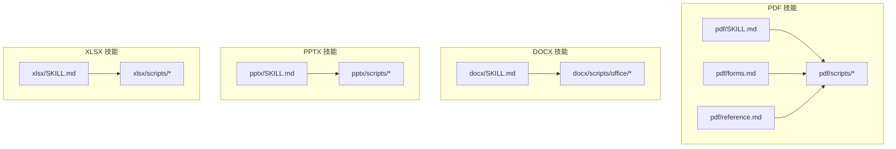
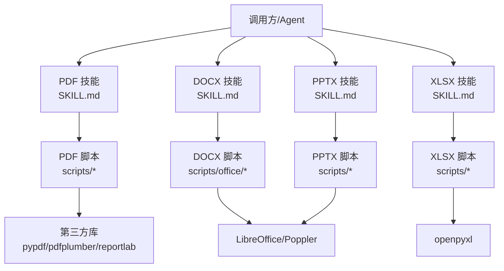
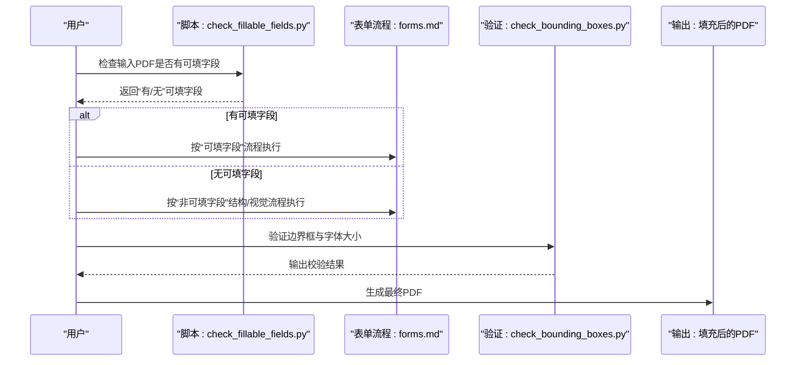
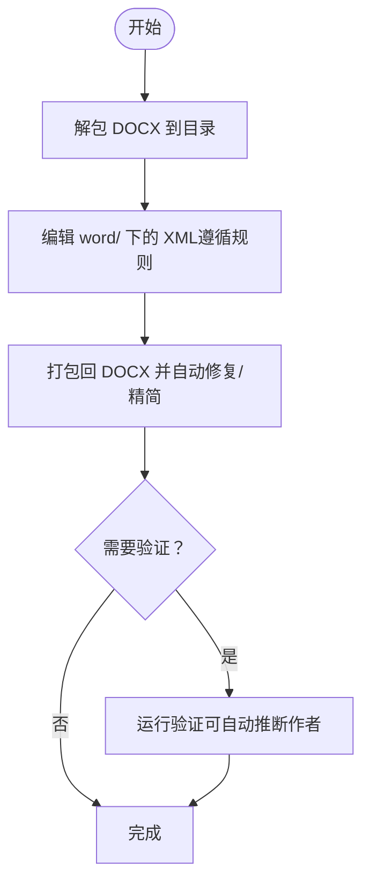
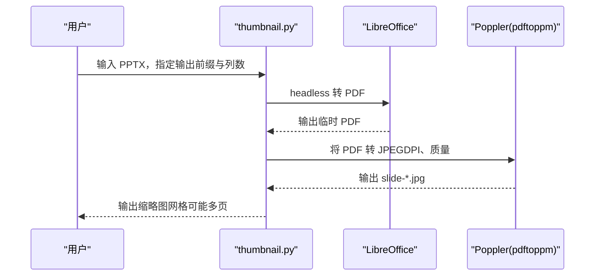
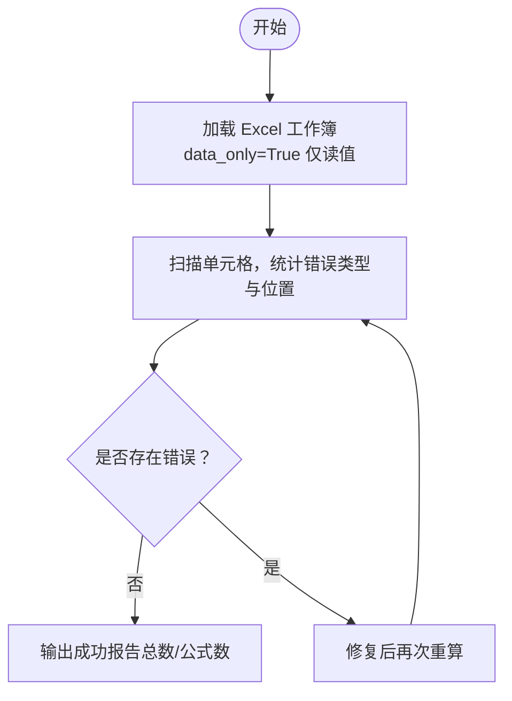
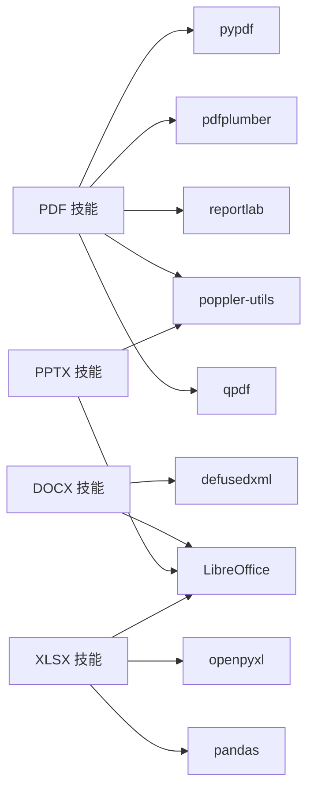

# 文档处理技能

<cite>
**本文引用的文件**
- [pdf/SKILL.md](file://skills/skills/pdf/SKILL.md)
- [pdf/forms.md](file://skills/skills/pdf/forms.md)
- [pdf/reference.md](file://skills/skills/pdf/reference.md)
- [pdf/scripts/check_fillable_fields.py](file://skills/skills/pdf/scripts/check_fillable_fields.py)
- [docx/SKILL.md](file://skills/skills/docx/SKILL.md)
- [docx/scripts/office/unpack.py](file://skills/skills/docx/scripts/office/unpack.py)
- [docx/scripts/office/pack.py](file://skills/skills/docx/scripts/office/pack.py)
- [docx/scripts/office/validate.py](file://skills/skills/docx/scripts/office/validate.py)
- [pptx/SKILL.md](file://skills/skills/pptx/SKILL.md)
- [pptx/scripts/thumbnail.py](file://skills/skills/pptx/scripts/thumbnail.py)
- [xlsx/SKILL.md](file://skills/skills/xlsx/SKILL.md)
- [xlsx/scripts/recalc.py](file://skills/skills/xlsx/scripts/recalc.py)
</cite>

## 目录
1. [简介](#简介)
2. [项目结构](#项目结构)
3. [核心组件](#核心组件)
4. [架构总览](#架构总览)
5. [详细组件分析](#详细组件分析)
6. [依赖分析](#依赖分析)
7. [性能考虑](#性能考虑)
8. [故障排查指南](#故障排查指南)
9. [结论](#结论)
10. [附录](#附录)

## 简介
本文件系统性梳理仓库中“文档处理技能”模块在 PDF、DOCX、PPTX、XLSX 四类办公文档上的实现与使用模式，覆盖以下方面：
- 技能目标与触发条件
- 核心能力与典型任务
- 接口与调用关系（命令行与Python脚本）
- 领域模型（文件格式、XML结构、公式计算）
- 使用模式与最佳实践
- 常见问题与排错建议
- 性能优化与扩展参考

## 项目结构
该技能模块以“按文件类型分技能”的方式组织，每类技能包含：
- 技能说明文档（SKILL.md）：概述能力、快速参考、依赖与注意事项
- 脚本工具（scripts/...）：命令行工具或Python脚本，支撑具体任务
- 子主题文档（如 forms.md、reference.md、editing.md、pptxgenjs.md 等）：深入某一方向的流程与方法

图示来源
- [pdf/SKILL.md](file://skills/skills/pdf/SKILL.md)
- [pdf/forms.md](file://skills/skills/pdf/forms.md)
- [pdf/reference.md](file://skills/skills/pdf/reference.md)
- [docx/SKILL.md](file://skills/skills/docx/SKILL.md)
- [pptx/SKILL.md](file://skills/skills/pptx/SKILL.md)
- [xlsx/SKILL.md](file://skills/skills/xlsx/SKILL.md)

章节来源
- [pdf/SKILL.md](file://skills/skills/pdf/SKILL.md)
- [docx/SKILL.md](file://skills/skills/docx/SKILL.md)
- [pptx/SKILL.md](file://skills/skills/pptx/SKILL.md)
- [xlsx/SKILL.md](file://skills/skills/xlsx/SKILL.md)

## 核心组件
- PDF 技能：文本/表格提取、合并/拆分、旋转、加水印、创建、表单填写、加密/解密、图片提取、OCR 扫描版识别等
- DOCX 技能：DOCX 读取/分析、从头创建、基于模板编辑、tracked changes 接受、XML 层面的验证与修复
- PPTX 技能：幻灯片内容读取、缩略图网格生成、模板分析、从零创建
- XLSX 技能：数据读写与分析、动态公式建模、跨工作表链接、公式重算与错误检测

章节来源
- [pdf/SKILL.md](file://skills/skills/pdf/SKILL.md)
- [docx/SKILL.md](file://skills/skills/docx/SKILL.md)
- [pptx/SKILL.md](file://skills/skills/pptx/SKILL.md)
- [xlsx/SKILL.md](file://skills/skills/xlsx/SKILL.md)

## 架构总览
整体采用“技能文档 + 工具脚本”的分层架构：
- 技能文档定义能力边界与使用规范
- 工具脚本提供可复用的命令行或Python接口
- 通过命令行工具（如 LibreOffice、Poppler）与第三方库（pypdf、pdfplumber、reportlab、openpyxl 等）完成具体操作

图示来源
- [pdf/SKILL.md](file://skills/skills/pdf/SKILL.md)
- [docx/SKILL.md](file://skills/skills/docx/SKILL.md)
- [pptx/SKILL.md](file://skills/skills/pptx/SKILL.md)
- [xlsx/SKILL.md](file://skills/skills/xlsx/SKILL.md)

## 详细组件分析

### PDF 处理技能
- 能力范围
  - 文本/表格提取：pypdf、pdfplumber、pdftotext
  - 合并与拆分：pypdf、qpdf
  - 页面旋转、加水印、元数据读取
  - 创建 PDF：reportlab
  - 表单填写：可直接填充字段或通过注释标注坐标
  - 加密/解密、图片提取、扫描版 OCR
- 关键脚本
  - 表单字段检查：判断是否可直接填充
  - 表单结构提取与注释式填充流程
  - 高级参考：pypdfium2、pdf-lib、pdfjs-dist 的高级用法
- 典型调用序列（表单填写）

图示来源
- [pdf/scripts/check_fillable_fields.py](file://skills/skills/pdf/scripts/check_fillable_fields.py)
- [pdf/forms.md](file://skills/skills/pdf/forms.md)

- 领域模型
  - PDF 文件由页面、注释、表单字段、页面盒等组成；表单字段类型包括文本、复选框、单选组、下拉选择等
  - 坐标系统：PDF 坐标系原点在左下角，y 轴向上增长；注释/结构提取时需注意坐标转换
- 参数与返回
  - 表单字段检查：输入 PDF 路径，输出“有/无可填字段”的提示信息
  - 结构/注释式填充：输入 PDF、fields.json（含页号、描述、标签与入口区域的边界框、字体大小），输出带注释的 PDF
- 使用模式
  - 可填字段优先：直接设置字段值，保持表单结构
  - 非可填字段：先结构提取（文本、线条、复选框），再视觉估计，最后统一坐标系统并注释到 PDF
- 常见问题
  - 字段 ID 不匹配、值不在允许集合内、边界框过小导致文字被截断
  - 扫描版 PDF 需要 OCR 预处理
- 性能与扩展
  - 大文件建议分页处理、批量导出图像、使用 pypdfium2 进行渲染与提取
  - 参考 advanced reference 中的批处理、裁剪、优化与错误处理模式

章节来源
- [pdf/SKILL.md](file://skills/skills/pdf/SKILL.md)
- [pdf/forms.md](file://skills/skills/pdf/forms.md)
- [pdf/reference.md](file://skills/skills/pdf/reference.md)
- [pdf/scripts/check_fillable_fields.py](file://skills/skills/pdf/scripts/check_fillable_fields.py)

### DOCX 处理技能
- 能力范围
  - DOCX 本质是 ZIP 包含 XML 文件；支持读取/分析、从头创建、基于模板编辑、接受 tracked changes、图片插入、样式与列表/表格/分栏/目录/页眉页脚等
  - 提供命令行工具进行打包/解包、验证与自动修复
- 关键脚本
  - 解包：将 DOCX 解压为目录，美化 XML，可选合并相邻运行与简化修订
  - 打包：压缩回 DOCX，自动修复与精简 XML，可选验证
  - 验证：基于 XSD 与修订规则进行校验
- 典型调用序列（编辑现有文档）

图示来源
- [docx/scripts/office/unpack.py](file://skills/skills/docx/scripts/office/unpack.py)
- [docx/scripts/office/pack.py](file://skills/skills/docx/scripts/office/pack.py)
- [docx/scripts/office/validate.py](file://skills/skills/docx/scripts/office/validate.py)

- 领域模型
  - OOXML 结构：document.xml、settings.xml、styles.xml、节属性、段落/运行样式、修订标记（插入/删除）、注释等
  - 图像：媒体文件、关系表、内容类型声明
- 参数与返回
  - 解包/打包：输入路径、输出路径、可选开关（是否合并运行、简化修订、验证、原始文件用于对比）
  - 验证：输出“全部通过/失败”及自动修复数量
- 使用模式
  - 新建：使用 docx-js 生成后验证
  - 编辑：解包 → 修改 → 打包 → 验证
- 常见问题
  - 修订标记未正确嵌套、缺失 xml:space="preserve"、durableId 超限、智能引号未转义实体
- 性能与扩展
  - 大文档建议分块处理、避免一次性加载所有 XML
  - 自动修复可处理常见结构性问题

章节来源
- [docx/SKILL.md](file://skills/skills/docx/SKILL.md)
- [docx/scripts/office/unpack.py](file://skills/skills/docx/scripts/office/unpack.py)
- [docx/scripts/office/pack.py](file://skills/skills/docx/scripts/office/pack.py)
- [docx/scripts/office/validate.py](file://skills/skills/docx/scripts/office/validate.py)

### PPTX 处理技能
- 能力范围
  - 内容读取（文本提取）、缩略图网格生成、模板分析、从零创建（pptxgenjs）
- 关键脚本
  - 缩略图：将 PPTX 转 PDF 再转 JPEG，生成网格图，便于快速审阅布局与隐藏幻灯片
- 典型调用序列（模板分析与 QA）

图示来源
- [pptx/scripts/thumbnail.py](file://skills/skills/pptx/scripts/thumbnail.py)

- 领域模型
  - PPTX 结构：presentation.xml、slide 关系、主题与布局、备注与注释
- 参数与返回
  - 输入：PPTX 路径、输出前缀、列数
  - 输出：缩略图网格文件列表
- 使用模式
  - 模板分析：先生成缩略图网格，再逐张核对布局、占位符、隐藏幻灯片
  - QA 流程：文本提取 + 视觉检查 + 修正 + 再验证
- 常见问题
  - 隐藏幻灯片未显示、缩略图分辨率不足、列数过多导致单页拥挤
- 性能与扩展
  - 大型演示文稿建议分批导出特定页、限制列数

章节来源
- [pptx/SKILL.md](file://skills/skills/pptx/SKILL.md)
- [pptx/scripts/thumbnail.py](file://skills/skills/pptx/scripts/thumbnail.py)

### XLSX 处理技能
- 能力范围
  - 数据读取与分析（pandas）、复杂格式与公式（openpyxl）、动态模型构建、公式重算与错误检测
- 关键脚本
  - 公式重算：通过 LibreOffice 宏自动计算并扫描错误类型，输出 JSON 报告
- 典型调用序列（公式重算与验证）

图示来源
- [xlsx/scripts/recalc.py](file://skills/skills/xlsx/scripts/recalc.py)

- 领域模型
  - 工作簿/工作表/单元格；公式字符串保存但不计算，需外部重算
  - 错误类型：#VALUE!、#DIV/0!、#REF!、#NAME?、#NULL!、#NUM!、#N/A
- 参数与返回
  - 输入：Excel 文件路径、超时秒数
  - 输出：JSON，包含状态、错误总数、公式总数、按类型汇总的位置列表
- 使用模式
  - 动态建模：使用 openpyxl 添加公式与格式；完成后必须重算并验证
  - 数据分析：pandas 读取与导出，适合批量与统计
- 常见问题
  - 引用错误、除零、跨表引用格式错误、边缘情况（零、负数、极大值）
- 性能与扩展
  - 大文件建议只读/只写模式、分表处理、合理设置超时

章节来源
- [xlsx/SKILL.md](file://skills/skills/xlsx/SKILL.md)
- [xlsx/scripts/recalc.py](file://skills/skills/xlsx/scripts/recalc.py)

## 依赖分析
- 第三方库与工具
  - PDF：pypdf、pdfplumber、reportlab、pypdfium2、pdf-lib、pdfjs-dist、poppler-utils、qpdf
  - DOCX/PPTX：LibreOffice（soffice）、Poppler（pdftoppm）、defusedxml
  - XLSX：openpyxl、pandas、LibreOffice（宏）
- 组件耦合
  - 技能文档与脚本强耦合：文档定义流程，脚本提供实现
  - 脚本与外部工具弱耦合：通过命令行交互，便于在不同环境部署
- 循环依赖
  - 未发现循环依赖；各脚本职责清晰，按流程串联

图示来源
- [pdf/SKILL.md](file://skills/skills/pdf/SKILL.md)
- [docx/SKILL.md](file://skills/skills/docx/SKILL.md)
- [pptx/SKILL.md](file://skills/skills/pptx/SKILL.md)
- [xlsx/SKILL.md](file://skills/skills/xlsx/SKILL.md)

## 性能考虑
- 大文件处理
  - 分页/分块：pypdfium2 渲染、qpdf 分割、openpyxl 只读/只写
  - 流式处理：避免一次性加载整份文档
- 文本与图像提取
  - 文本：pdftotext -bbox-layout 快速提取；pdfplumber 更精细
  - 图像：pdfimages 直接提取更快；pypdfium2 渲染后处理
- 公式重算
  - 设置合理超时；仅在必要时重算；错误定位后增量修复

## 故障排查指南
- PDF
  - 表单字段不可填：使用结构/视觉流程，确保边界框与字体大小校验通过
  - OCR 扫描版：确认 poppler 与 tesseract 可用，图像分辨率足够
  - 加密/损坏：qpdf 检查与修复；密码保护需提供正确口令
- DOCX
  - 修订/注释异常：遵循插入/删除嵌套规则，保留 rPr 格式
  - 智能引号：统一使用 XML 实体
  - 验证失败：利用自动修复修复 hex ID 与空白保留
- PPTX
  - 缩略图失败：检查 soffice 与 pdftoppm 是否可用
  - 隐藏幻灯片：缩略图以占位图显示，注意区分
- XLSX
  - 公式错误：根据 JSON 报告定位，修复引用/除零/类型错误
  - 重算失败：确认 LibreOffice 宏已安装并可执行

章节来源
- [pdf/reference.md](file://skills/skills/pdf/reference.md)
- [docx/SKILL.md](file://skills/skills/docx/SKILL.md)
- [pptx/SKILL.md](file://skills/skills/pptx/SKILL.md)
- [xlsx/SKILL.md](file://skills/skills/xlsx/SKILL.md)
- [xlsx/scripts/recalc.py](file://skills/skills/xlsx/scripts/recalc.py)

## 结论
该技能模块围绕四类办公文档提供了从“读取/分析”到“创建/编辑/验证”的完整工具链，既满足日常办公自动化需求，又具备高级场景下的扩展能力。通过明确的流程、严谨的验证与自动修复机制，以及对第三方库与命令行工具的合理组合，能够在保证质量的同时提升效率。

## 附录
- 快速参考
  - PDF：合并/拆分/旋转/水印/加密/OCR/表单填写
  - DOCX：解包/打包/验证；tracked changes；图片/样式/表格/目录/页眉页脚
  - PPTX：缩略图网格；模板分析；从零创建
  - XLSX：pandas 数据分析；openpyxl 格式与公式；公式重算与错误检测