# 前端设计技能

<cite>
**本文档引用的文件**
- [package.json](file://package.json)
- [src/app/layout.tsx](file://src/app/layout.tsx)
- [src/app/[locale]/layout.tsx](file://src/app/[locale]/layout.tsx)
- [src/app/api/contact/route.ts](file://src/app/api/contact/route.ts)
- [src/components/layout/Navbar.tsx](file://src/components/layout/Navbar.tsx)
- [src/components/layout/Footer.tsx](file://src/components/layout/Footer.tsx)
- [src/components/layout/LanguageSwitcher.tsx](file://src/components/layout/LanguageSwitcher.tsx)
- [src/components/sections/HeroSection.tsx](file://src/components/sections/HeroSection.tsx)
- [src/components/sections/BrandStory.tsx](file://src/components/sections/BrandStory.tsx)
- [src/components/sections/ComparisonSection.tsx](file://src/components/sections/ComparisonSection.tsx)
- [src/components/sections/ContactInfo.tsx](file://src/components/sections/ContactInfo.tsx)
- [src/components/sections/CoreAdvantages.tsx](file://src/components/sections/CoreAdvantages.tsx)
- [src/components/sections/CraftsmanshipSection.tsx](file://src/components/sections/CraftsmanshipSection.tsx)
- [src/components/sections/ProductLineup.tsx](file://src/components/sections/ProductLineup.tsx)
- [src/components/sections/ProductStructure.tsx](file://src/components/sections/ProductStructure.tsx)
- [src/components/sections/Specifications.tsx](file://src/components/sections/Specifications.tsx)
- [src/components/sections/SuccessCases.tsx](file://src/components/sections/SuccessCases.tsx)
- [src/components/sections/InquiryForm.tsx](file://src/components/sections/InquiryForm.tsx)
- [src/components/ui/SectionHeading.tsx](file://src/components/ui/SectionHeading.tsx)
- [src/styles/globals.css](file://src/styles/globals.css)
- [tailwind.config.ts](file://tailwind.config.ts)
- [src/i18n/routing.ts](file://src/i18n/routing.ts)
- [src/i18n/navigation.ts](file://src/i18n/navigation.ts)
- [src/messages/en.json](file://src/messages/en.json)
- [src/messages/zh.json](file://src/messages/zh.json)
- [src/messages/fr.json](file://src/messages/fr.json)
- [src/messages/es.json](file://src/messages/es.json)
- [src/lib/images.ts](file://src/lib/images.ts)
</cite>

## 更新摘要
**所做更改**
- 新增完整前端项目结构，包括品牌故事、产品对比、工艺展示、技术规格、产品结构、联系信息、核心优势、询盘表单等组件
- 更新页面布局架构，整合新增组件到首页
- 完善国际化消息文件，新增各组件的多语言支持
- 增强图片资源管理，支持多语言结构图和工艺图
- 新增联系表单 API 路由，实现后端接口支持
- 完善导航系统和语言切换器组件

## 目录
1. [简介](#简介)
2. [项目结构](#项目结构)
3. [核心组件](#核心组件)
4. [架构概览](#架构概览)
5. [详细组件分析](#详细组件分析)
6. [国际化实现](#国际化实现)
7. [API 路由系统](#api-路由系统)
8. [依赖关系分析](#依赖关系分析)
9. [性能考虑](#性能考虑)
10. [故障排除指南](#故障排除指南)
11. [结论](#结论)

## 简介

这是一个基于 Next.js 构建的专业葡萄酒陶罐企业网站项目。项目采用现代化的前端技术栈，专注于展示高品质的陶瓷酿造设备，通过精心设计的用户界面传达产品的专业性和艺术价值。

该项目的核心特色包括：
- 多语言国际化支持（英语、中文、法语、西班牙语）
- 响应式设计，适配各种设备屏幕
- 基于 Tailwind CSS 的现代化样式系统
- 高级动画效果和视觉体验
- 专业的色彩搭配（酒红色、香槟金、象牙白）
- 完整的产品展示体系，涵盖技术规格、工艺展示、产品对比等多个维度
- 完整的前端组件系统和后端 API 支持

## 项目结构

项目采用标准的 Next.js 应用程序结构，主要分为以下几个核心目录：

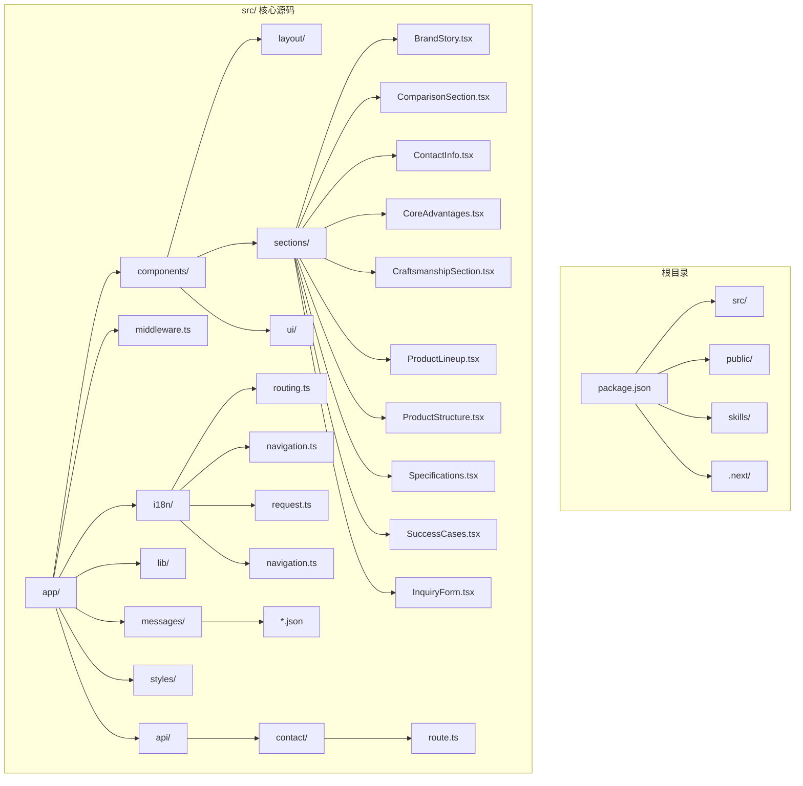

**图表来源**
- [package.json:1-30](file://package.json#L1-L30)
- [src/app/layout.tsx:1-36](file://src/app/layout.tsx#L1-L36)
- [src/app/[locale]/page.tsx:1-36](file://src/app/[locale]/page.tsx#L1-L36)

**章节来源**
- [package.json:1-30](file://package.json#L1-L30)
- [src/app/layout.tsx:1-36](file://src/app/layout.tsx#L1-L36)
- [src/app/[locale]/page.tsx:1-36](file://src/app/[locale]/page.tsx#L1-L36)

## 核心组件

### 设计系统与主题

项目建立了完整的视觉设计系统，包括：

**色彩系统**：采用深酒红色 (#1a0505) 作为主色调，搭配香槟金 (#d4af37) 和象牙白等辅助色，营造出高端、专业的视觉效果。

**字体系统**：集成了三个 Google Fonts 字体
- Cinzel：用于标题显示，提供优雅的装饰性字体
- Playfair Display：用于副标题和强调文本
- Lato：用于正文和界面元素

**动画系统**：实现了流畅的进入动画效果，包括淡入上移动画和延迟动画序列。

**章节来源**
- [tailwind.config.ts:1-38](file://tailwind.config.ts#L1-L38)
- [src/styles/globals.css:1-50](file://src/styles/globals.css#L1-L50)
- [src/app/layout.tsx:1-36](file://src/app/layout.tsx#L1-L36)

### 导航系统

导航栏采用固定定位设计，支持桌面端和移动端两种模式：

**桌面端特性**：
- 品牌标识和导航链接
- 语言切换器集成
- 悬停效果和过渡动画
- 毛玻璃背景效果

**移动端特性**：
- 三明治菜单按钮
- 下拉式菜单面板
- 完整的导航链接列表
- 语言切换器适配

**章节来源**
- [src/components/layout/Navbar.tsx:1-111](file://src/components/layout/Navbar.tsx#L1-L111)
- [src/components/layout/LanguageSwitcher.tsx:1-53](file://src/components/layout/LanguageSwitcher.tsx#L1-L53)

### 国际化架构

项目实现了完整的多语言支持系统：

**路由配置**：支持四种语言（en、fr、es、zh），默认语言为英语

**消息管理**：每个语言都有独立的消息文件，包含所有界面文本

**导航集成**：语言切换器与路由系统无缝集成

**元数据支持**：每种语言都有对应的 SEO 元数据

**章节来源**
- [src/i18n/routing.ts:1-8](file://src/i18n/routing.ts#L1-L8)
- [src/i18n/navigation.ts:1-6](file://src/i18n/navigation.ts#L1-L6)
- [src/app/[locale]/layout.tsx:1-73](file://src/app/[locale]/layout.tsx#L1-L73)

## 架构概览

项目采用分层架构设计，清晰分离了关注点：

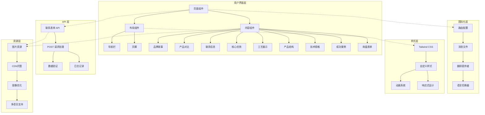

**图表来源**
- [src/app/[locale]/layout.tsx:49-72](file://src/app/[locale]/layout.tsx#L49-L72)
- [src/components/layout/Navbar.tsx:17-110](file://src/components/layout/Navbar.tsx#L17-L110)
- [src/styles/globals.css:1-50](file://src/styles/globals.css#L1-L50)
- [src/app/api/contact/route.ts:1-55](file://src/app/api/contact/route.ts#L1-L55)

## 详细组件分析

### 英雄区域组件

英雄区域是整个网站的视觉焦点，采用了多层次的设计策略：

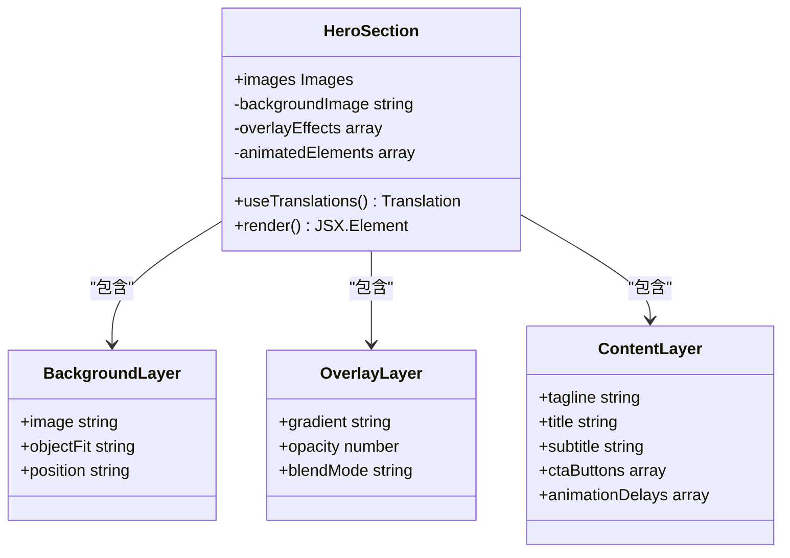

**图表来源**
- [src/components/sections/HeroSection.tsx:4-55](file://src/components/sections/HeroSection.tsx#L4-L55)

**组件特点**：
- 多层背景叠加：纯色背景 + 渐变背景 + 纹理覆盖
- 层次化的动画效果：分阶段的淡入动画
- 响应式设计：适配从移动端到桌面端的不同屏幕尺寸
- 视觉焦点：通过对比度和层次感突出主要内容

**章节来源**
- [src/components/sections/HeroSection.tsx:1-56](file://src/components/sections/HeroSection.tsx#L1-L56)

### 品牌故事组件

品牌故事组件展示了企业的历史传承和核心优势：

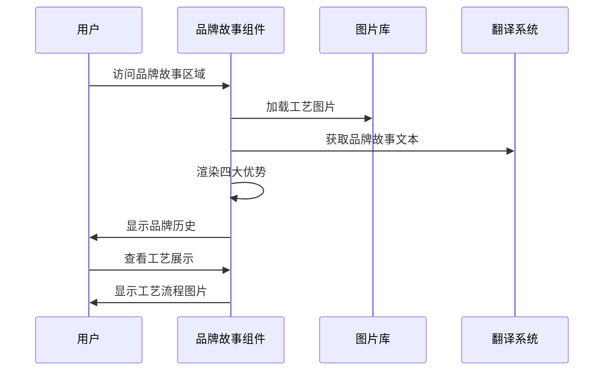

**图表来源**
- [src/components/sections/BrandStory.tsx:13-81](file://src/components/sections/BrandStory.tsx#L13-L81)

**设计亮点**：
- 四大核心优势展示：采用图标+文字的组合形式
- 工艺流程展示：双图展示制作过程
- 渐变背景设计：营造高端氛围
- 响应式网格布局：适配不同屏幕尺寸

**章节来源**
- [src/components/sections/BrandStory.tsx:1-81](file://src/components/sections/BrandStory.tsx#L1-L81)

### 产品对比组件

产品对比组件清晰展示了传统工艺与现代技术的差异：

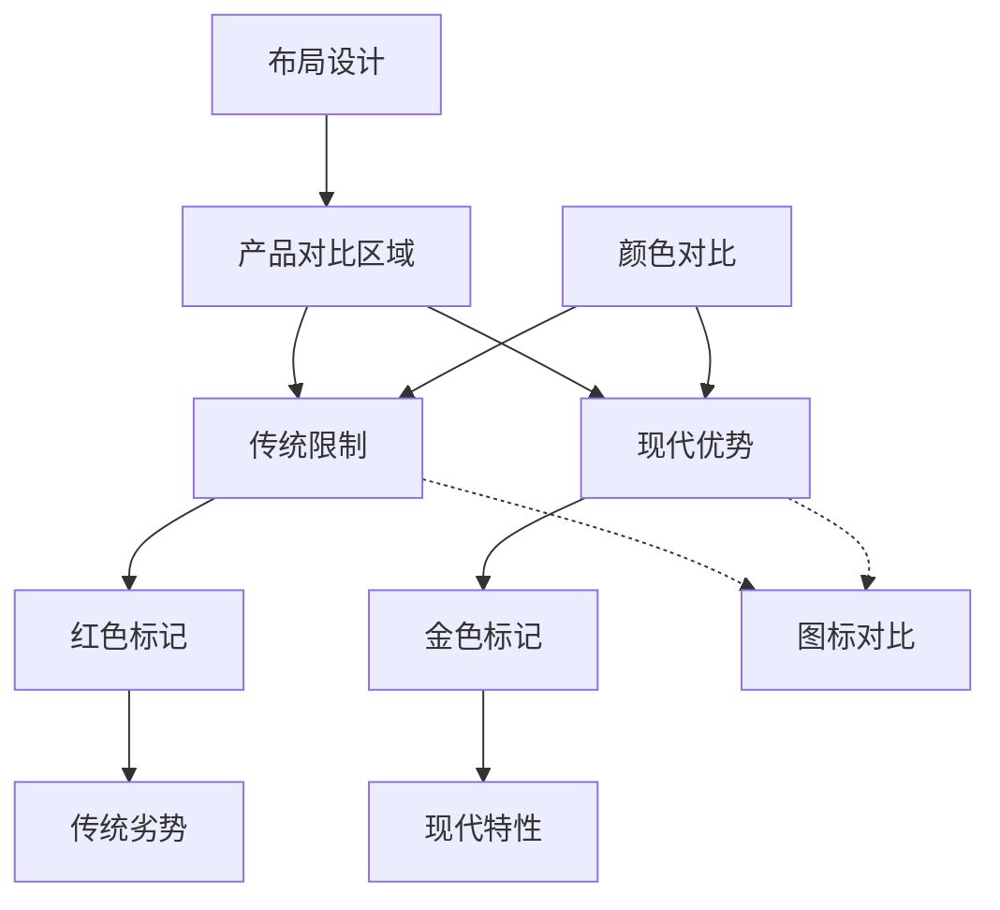

**图表来源**
- [src/components/sections/ComparisonSection.tsx:9-53](file://src/components/sections/ComparisonSection.tsx#L9-L53)

**实现特点**：
- 左右对比布局：传统限制 vs 现代优势
- 颜色编码系统：红色代表传统劣势，金色代表现代优势
- 图标强化：使用感叹号和星形图标增强视觉效果
- 响应式设计：适配移动端和桌面端

**章节来源**
- [src/components/sections/ComparisonSection.tsx:1-53](file://src/components/sections/ComparisonSection.tsx#L1-L53)

### 联系信息组件

联系信息组件提供了完整的商务联系方式和复制功能：

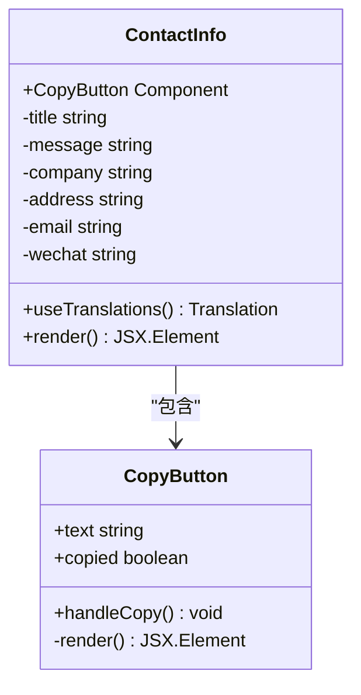

**图表来源**
- [src/components/sections/ContactInfo.tsx:7-77](file://src/components/sections/ContactInfo.tsx#L7-L77)

**功能特性**：
- 复制功能：一键复制邮箱和微信信息
- 响应式设计：移动端和桌面端适配
- 渐变背景：营造专业商务氛围
- 多语言支持：支持中英双语显示

**章节来源**
- [src/components/sections/ContactInfo.tsx:1-77](file://src/components/sections/ContactInfo.tsx#L1-L77)

### 核心优势组件

核心优势组件全面展示了产品的技术特色和服务保障：

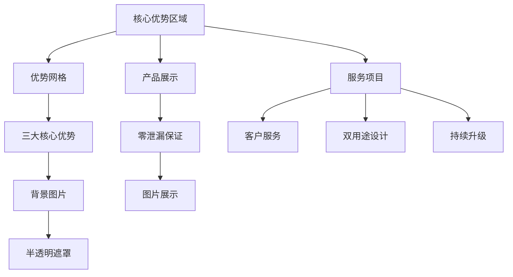

**图表来源**
- [src/components/sections/CoreAdvantages.tsx:13-120](file://src/components/sections/CoreAdvantages.tsx#L13-L120)

**设计特色**：
- 两列布局：优势展示 + 产品展示
- 背景图片叠加：增强视觉层次
- 编号标识：1-2-3的递进展示
- 服务图标：客户服务、双用途、持续升级

**章节来源**
- [src/components/sections/CoreAdvantages.tsx:1-120](file://src/components/sections/CoreAdvantages.tsx#L1-L120)

### 工艺展示组件

工艺展示组件详细介绍了制作工艺和技术特色：

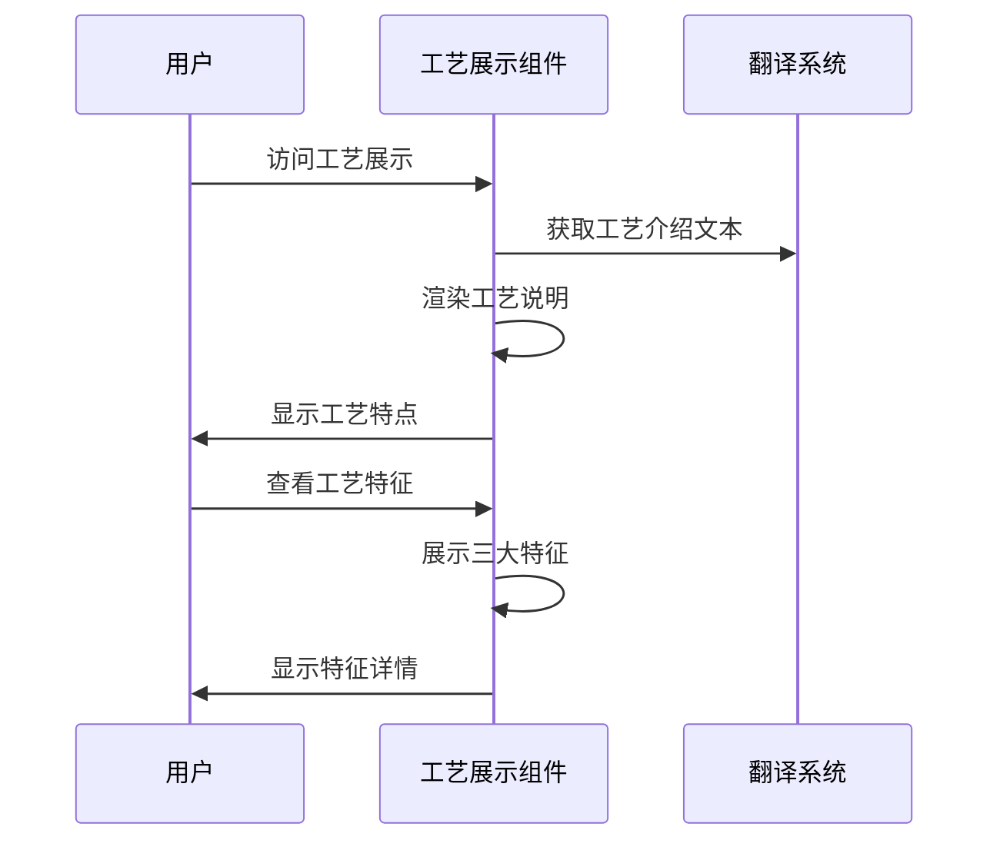

**图表来源**
- [src/components/sections/CraftsmanshipSection.tsx:6-48](file://src/components/sections/CraftsmanshipSection.tsx#L6-L48)

**组件构成**：
- 工艺介绍：多段落详细说明
- 特征展示：三大工艺特征
- 图标系统：火焰、手工、叶子图标
- 响应式布局：适应不同屏幕尺寸

**章节来源**
- [src/components/sections/CraftsmanshipSection.tsx:1-48](file://src/components/sections/CraftsmanshipSection.tsx#L1-L48)

### 产品结构组件

产品结构组件展示了技术规格和内部构造：

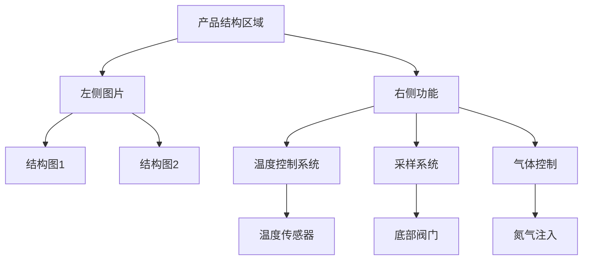

**图表来源**
- [src/components/sections/ProductStructure.tsx:13-85](file://src/components/sections/ProductStructure.tsx#L13-L85)

**技术特色**：
- 多语言结构图：支持中英法西四语言
- 三系统展示：温度控制、采样、气体控制
- 图文结合：图片+文字的详细说明
- 响应式设计：左右布局适配移动端

**章节来源**
- [src/components/sections/ProductStructure.tsx:1-85](file://src/components/sections/ProductStructure.tsx#L1-L85)

### 技术规格组件

技术规格组件提供了详细的产品参数和容量选择：

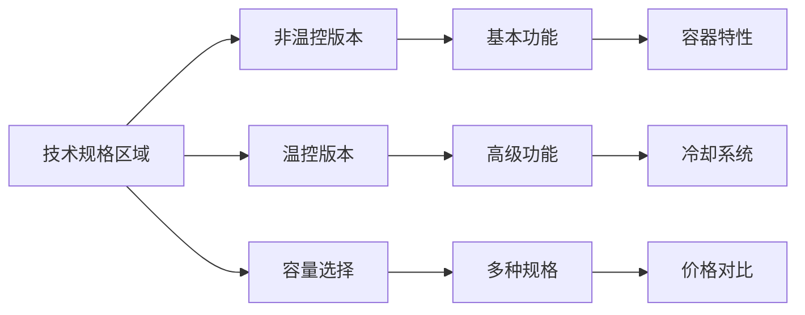

**图表来源**
- [src/components/sections/Specifications.tsx:5-78](file://src/components/sections/Specifications.tsx#L5-L78)

**规格特点**：
- 双版本对比：非温控 vs 温控
- 功能清单：详细的特性列表
- 容量选择：多种规格供选择
- 价格透明：清晰的价格信息

**章节来源**
- [src/components/sections/Specifications.tsx:1-78](file://src/components/sections/Specifications.tsx#L1-L78)

### 成功案例组件

成功案例组件展示了全球范围内的客户案例：

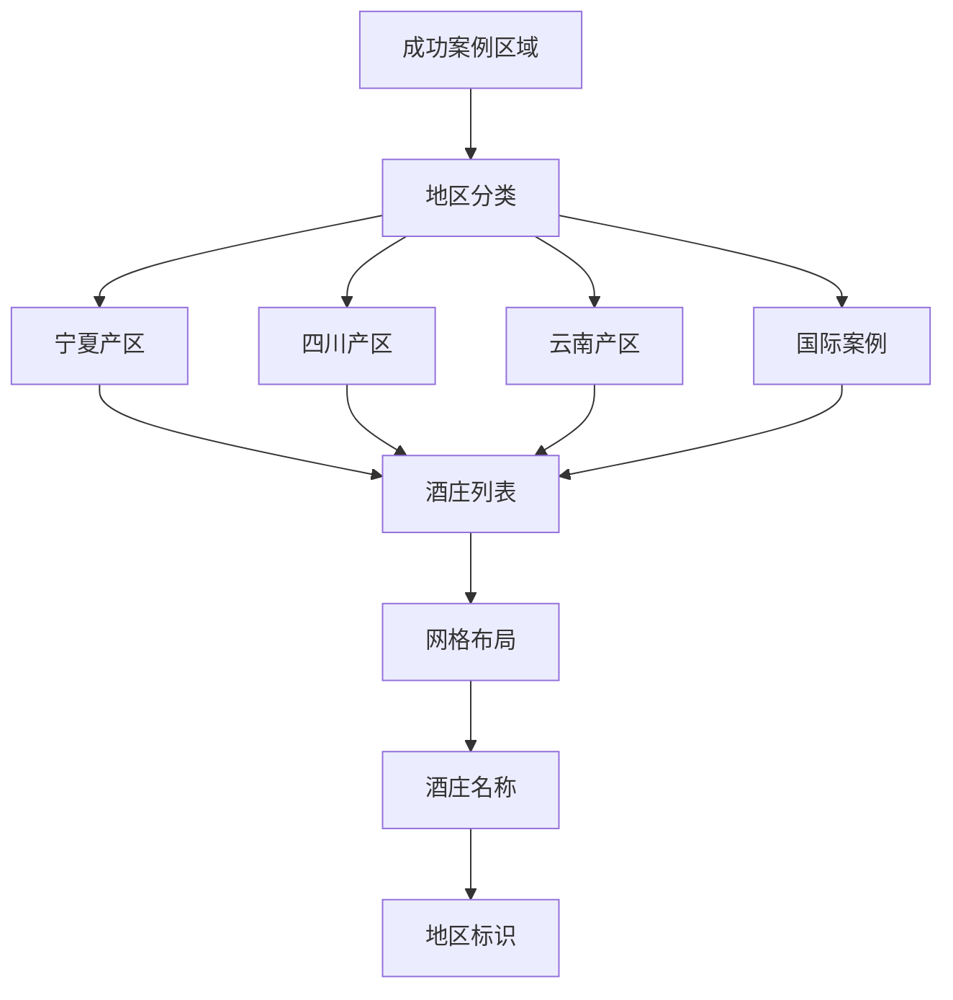

**图表来源**
- [src/components/sections/SuccessCases.tsx:5-53](file://src/components/sections/SuccessCases.tsx#L5-L53)

**实现特点**：
- 地理分区展示：按葡萄酒产区组织内容
- 可视化设计：使用地图图标增强识别度
- 响应式网格：适应不同屏幕尺寸
- 内容动态加载：通过翻译系统获取本地化内容

**章节来源**
- [src/components/sections/SuccessCases.tsx:1-53](file://src/components/sections/SuccessCases.tsx#L1-L53)

### 询盘表单组件

询盘表单组件提供了完整的客户咨询功能：

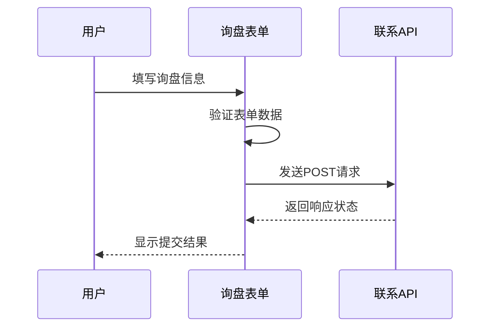

**图表来源**
- [src/components/sections/InquiryForm.tsx:6-178](file://src/components/sections/InquiryForm.tsx#L6-L178)

**表单功能**：
- 多字段输入：姓名、邮箱、公司、国家
- 产品选择：多选框选择感兴趣的产品
- 防垃圾邮件：honeypot字段检测
- 状态反馈：提交成功/失败提示

**章节来源**
- [src/components/sections/InquiryForm.tsx:1-178](file://src/components/sections/InquiryForm.tsx#L1-L178)

### 页面布局架构

项目采用分层布局架构，确保内容的一致性和可维护性：

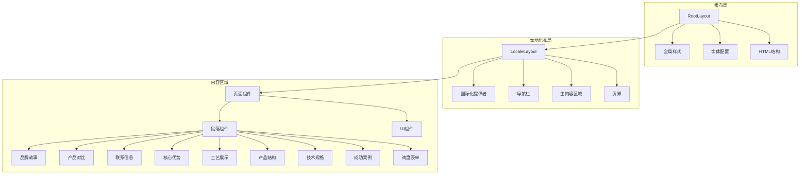

**图表来源**
- [src/app/layout.tsx:23-35](file://src/app/layout.tsx#L23-L35)
- [src/app/[locale]/layout.tsx:49-72](file://src/app/[locale]/layout.tsx#L49-L72)

**章节来源**
- [src/app/layout.tsx:1-36](file://src/app/layout.tsx#L1-L36)
- [src/app/[locale]/layout.tsx:1-73](file://src/app/[locale]/layout.tsx#L1-L73)
- [src/app/[locale]/page.tsx:1-36](file://src/app/[locale]/page.tsx#L1-L36)

## 国际化实现

### 多语言路由配置

项目实现了基于 next-intl 的完整国际化路由系统：

**路由定义**：使用 defineRouting 创建支持四种语言的路由配置
- 支持语言：英语(en)、中文(zh)、法语(fr)、西班牙语(es)
- 默认语言：英语
- 路由前缀：按需添加，避免冗余

**静态参数生成**：generateStaticParams 函数为每个语言生成静态路由参数

**元数据国际化**：generateMetadata 函数根据当前语言动态生成 SEO 元数据

**章节来源**
- [src/i18n/routing.ts:1-8](file://src/i18n/routing.ts#L1-L8)
- [src/app/[locale]/layout.tsx:8-47](file://src/app/[locale]/layout.tsx#L8-L47)

### 语言切换器组件

语言切换器是国际化系统的核心交互组件：

**状态管理**：使用 useLocale 和 usePathname 获取当前语言和路径
- localeLabels 映射：将语言代码映射到显示标签
- 动态路径构建：根据当前语言和目标语言构建新路径

**用户交互**：点击按钮触发语言切换
- 路径替换逻辑：处理带前缀和不带前缀的路径
- 实时跳转：使用 window.location.href 进行页面跳转

**样式设计**：响应式设计适配不同屏幕尺寸
- 悬停效果：hover:text-champagne-gold
- 活跃状态：bg-champagne-gold text-wine-dark
- 移动端适配：sm:px-2 sm:py-1 sm:text-xs

**章节来源**
- [src/components/layout/LanguageSwitcher.tsx:1-53](file://src/components/layout/LanguageSwitcher.tsx#L1-L53)

### 消息文件管理系统

项目建立了完整的多语言消息文件体系：

**文件结构**：每个语言对应一个 JSON 文件
- en.json：英语消息文件
- zh.json：中文消息文件  
- fr.json：法语消息文件
- es.json：西班牙语消息文件

**消息分类**：按照功能模块组织消息键值
- Metadata：SEO 元数据
- Navbar：导航栏文本
- Hero：英雄区域文本
- ProductLineup：产品展示文本
- SuccessCases：成功案例文本
- Footer：页脚文本
- BrandStory：品牌故事文本
- Comparison：产品对比文本
- Contact：联系信息文本
- CoreAdvantages：核心优势文本
- Craftsmanship：工艺展示文本
- ProductStructure：产品结构文本
- Specifications：技术规格文本

**翻译覆盖**：确保所有界面文本都有对应翻译
- 产品描述：包含技术规格和特性说明
- 用户界面：导航链接和按钮文本
- 联系信息：联系方式和公司信息

**章节来源**
- [src/messages/en.json:1-318](file://src/messages/en.json#L1-L318)
- [src/messages/zh.json:1-318](file://src/messages/zh.json#L1-L318)
- [src/messages/fr.json:1-318](file://src/messages/fr.json#L1-L318)
- [src/messages/es.json:1-318](file://src/messages/es.json#L1-L318)

### 图片资源国际化

项目实现了图片资源的多语言支持：

**资源组织**：图片资源按功能模块分类
- hero：英雄区域背景图
- structure：产品结构图（包含多语言版本）
- craftsmanship：工艺流程图
- advantages：优势展示图
- products：产品展示图

**多语言支持**：同一功能的图片提供多种语言版本
- 结构图：包含中文、英文、法文、西班牙文版本
- 工艺图：提供多语言说明
- 产品图：支持多语言描述

**CDN 优化**：使用阿里云 OSS 提供图片服务
- 静态域名：ligeyuanshan.oss-cn-beijing.aliyuncs.com
- 国际化域名：ceramic-jar.oss-ap-southeast-1.aliyuncs.com

**章节来源**
- [src/lib/images.ts:1-39](file://src/lib/images.ts#L1-L39)

## API 路由系统

### 联系表单 API

项目新增了完整的联系表单 API 路由系统，支持客户端表单提交：

**路由定义**：在 src/app/api/contact/route.ts 中定义
- HTTP 方法：POST
- 路径：/api/contact
- 请求处理：异步函数处理表单数据

**数据验证**：
- 必填字段验证：姓名和邮箱必须存在
- 邮箱格式验证：使用正则表达式验证邮箱格式
- 错误处理：返回适当的 HTTP 状态码

**请求处理流程**：
- 解析 JSON 请求体
- 提取表单字段：name、email、company、country、products、message
- 数据验证和清理
- 日志记录：在控制台输出询盘信息
- 响应处理：返回成功或错误状态

**扩展性设计**：
- 留有邮件发送集成的注释代码
- 支持 Resend SDK 集成
- 易于扩展其他验证规则

**章节来源**
- [src/app/api/contact/route.ts:1-55](file://src/app/api/contact/route.ts#L1-L55)

### API 集成流程

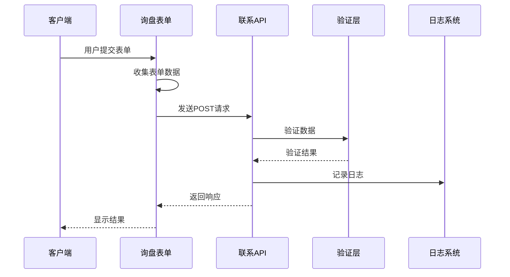

**图表来源**
- [src/components/sections/InquiryForm.tsx:34-49](file://src/components/sections/InquiryForm.tsx#L34-L49)
- [src/app/api/contact/route.ts:3-47](file://src/app/api/contact/route.ts#L3-L47)

**章节来源**
- [src/components/sections/InquiryForm.tsx:1-178](file://src/components/sections/InquiryForm.tsx#L1-L178)
- [src/app/api/contact/route.ts:1-55](file://src/app/api/contact/route.ts#L1-L55)

## 依赖关系分析

项目的技术依赖关系体现了现代化前端开发的最佳实践：

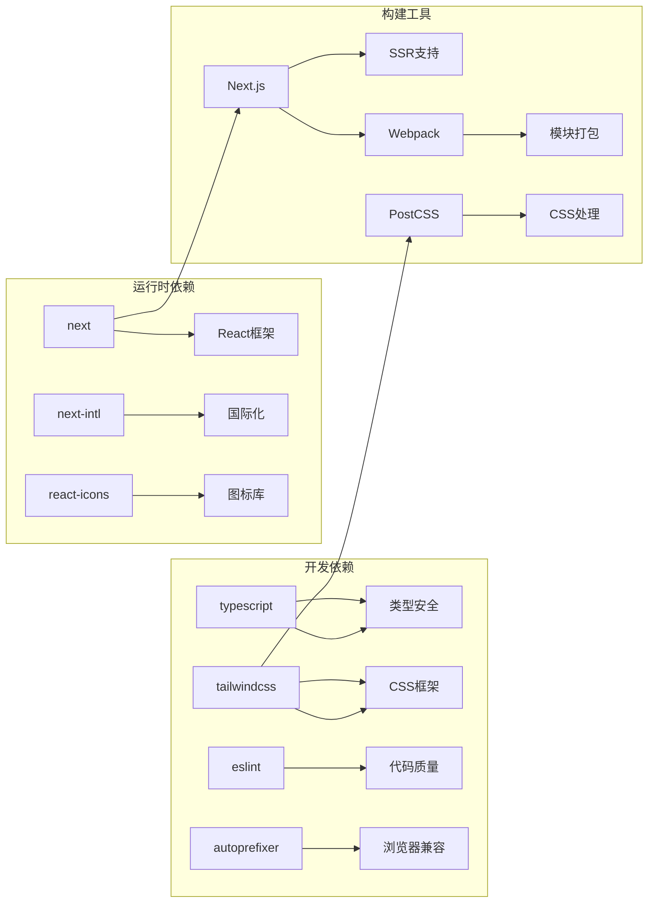

**图表来源**
- [package.json:11-28](file://package.json#L11-L28)

**依赖特点**：
- 轻量级核心：仅包含必要的运行时依赖
- 类型安全保障：TypeScript 提供编译时类型检查
- 现代化构建：支持服务器端渲染和静态生成
- 开发体验：完善的开发工具链支持

**章节来源**
- [package.json:1-30](file://package.json#L1-L30)

## 性能考虑

项目在多个层面考虑了性能优化：

### 图像优化
- CDN 托管：使用阿里云 OSS 提供图片服务
- 响应式图片：根据屏幕尺寸加载合适分辨率的图片
- 懒加载：延迟加载非首屏图片

### 样式优化
- Tailwind CSS：按需生成样式，避免未使用的 CSS
- 自定义动画：使用硬件加速的 CSS 动画
- 组件化样式：避免全局样式污染

### 代码分割
- 路由级别的代码分割
- 组件级别的懒加载
- 国际化消息的按需加载

### 缓存策略
- 浏览器缓存：静态资源长期缓存
- CDN 缓存：图片和静态文件缓存
- API 缓存：国际化消息缓存

### API 性能
- 异步处理：避免阻塞主线程
- 错误处理：快速失败机制
- 日志优化：生产环境下的日志控制

## 故障排除指南

### 常见问题及解决方案

**国际化问题**
- 问题：语言切换无效
- 解决：检查路由配置和语言文件完整性
- 验证：确认 translations 函数正确初始化

**样式问题**
- 问题：自定义样式不生效
- 解决：检查 Tailwind 配置中的 content 路径
- 验证：确认 CSS 层级正确应用

**图片加载问题**
- 问题：图片无法显示
- 解决：验证 CDN URL 可访问性
- 验证：检查图片格式和尺寸

**响应式问题**
- 问题：移动端显示异常
- 解决：检查断点设置和媒体查询
- 验证：使用浏览器开发者工具测试

**表单提交问题**
- 问题：询盘表单提交失败
- 解决：检查 API 端点和网络连接
- 验证：确认 honeypot 字段未被填写

**API 错误处理**
- 问题：联系表单 API 返回错误
- 解决：检查请求格式和验证规则
- 验证：查看控制台错误日志

**章节来源**
- [src/i18n/routing.ts:1-8](file://src/i18n/routing.ts#L1-L8)
- [tailwind.config.ts:1-38](file://tailwind.config.ts#L1-L38)
- [src/lib/images.ts:1-39](file://src/lib/images.ts#L1-L39)
- [src/app/api/contact/route.ts:1-55](file://src/app/api/contact/route.ts#L1-L55)

## 结论

这个前端设计技能项目展现了现代 Web 开发的最佳实践，通过精心设计的组件架构、完善的国际化支持和优秀的用户体验，成功地传达了专业葡萄酒陶罐的品牌价值。

项目的主要优势包括：
- **技术先进性**：采用最新的 Next.js 技术栈
- **设计专业性**：符合高端品牌的视觉要求
- **国际化完善**：支持多语言和多地区
- **组件完整性**：涵盖从品牌故事到询盘表单的完整业务流程
- **API 支持**：完整的后端接口支持联系表单功能
- **性能优化**：注重加载速度和用户体验
- **可维护性**：清晰的代码结构和文档

通过这个项目，开发者可以学习到如何构建一个既美观又实用的企业网站，为类似的专业产品展示提供了优秀的参考模板。新增的完整组件体系和 API 路由系统进一步增强了项目的实用性，为用户提供了一站式的了解和咨询体验。

项目不仅展示了技术实现的完整性，更重要的是体现了一个完整产品展示网站应有的专业性和用户体验，是一个值得学习和借鉴的优秀案例。