# 辅助工具技能

<cite>
**本文引用的文件**
- [frontend-design/SKILL.md](file://skills/skills/frontend-design/SKILL.md)
- [slack-gif-creator/SKILL.md](file://skills/skills/slack-gif-creator/SKILL.md)
- [web-artifacts-builder/SKILL.md](file://skills/skills/web-artifacts-builder/SKILL.md)
- [skill-creator/SKILL.md](file://skills/skills/skill-creator/SKILL.md)
- [gif_builder.py](file://skills/skills/slack-gif-creator/core/gif_builder.py)
- [frame_composer.py](file://skills/skills/slack-gif-creator/core/frame_composer.py)
- [easing.py](file://skills/skills/slack-gif-creator/core/easing.py)
- [validators.py](file://skills/skills/slack-gif-creator/core/validators.py)
- [init-artifact.sh](file://skills/skills/web-artifacts-builder/scripts/init-artifact.sh)
- [bundle-artifact.sh](file://skills/skills/web-artifacts-builder/scripts/bundle-artifact.sh)
- [package_skill.py](file://skills/skills/skill-creator/scripts/package_skill.py)
- [run_eval.py](file://skills/skills/skill-creator/scripts/run_eval.py)
- [aggregate_benchmark.py](file://skills/skills/skill-creator/scripts/aggregate_benchmark.py)
- [generate_review.py](file://skills/skills/skill-creator/eval-viewer/generate_review.py)
- [analyzer.md](file://skills/skills/skill-creator/agents/analyzer.md)
- [comparator.md](file://skills/skills/skill-creator/agents/comparator.md)
- [grader.md](file://skills/skills/skill-creator/agents/grader.md)
- [utils.py](file://skills/skills/skill-creator/scripts/utils.py)
- [quick_validate.py](file://skills/skills/skill-creator/scripts/quick_validate.py)
- [routing.ts](file://src/i18n/routing.ts)
- [navigation.ts](file://src/i18n/navigation.ts)
- [request.ts](file://src/i18n/request.ts)
- [middleware.ts](file://src/middleware.ts)
- [layout.tsx](file://src/app/[locale]/layout.tsx)
- [route.ts](file://src/app/api/contact/route.ts)
- [en.json](file://src/messages/en.json)
- [es.json](file://src/messages/es.json)
- [fr.json](file://src/messages/fr.json)
- [zh.json](file://src/messages/zh.json)
- [Navbar.tsx](file://src/components/layout/Navbar.tsx)
- [LanguageSwitcher.tsx](file://src/components/layout/LanguageSwitcher.tsx)
- [Footer.tsx](file://src/components/layout/Footer.tsx)
- [HeroSection.tsx](file://src/components/sections/HeroSection.tsx)
- [SectionHeading.tsx](file://src/components/ui/SectionHeading.tsx)
- [sitemap.ts](file://src/app/sitemap.ts)
- [robots.ts](file://src/app/robots.ts)
</cite>

## 更新摘要
**变更内容**
- 新增前端设计技能模块的完整架构分析，包含设计思维、美学指南和实现策略
- 添加多语言国际化系统的详细实现说明，涵盖路由配置、请求处理、导航集成和中间件保护
- 补充API路由系统的完整功能模块介绍，包括联系表单API和SEO优化路由
- 更新架构总览以反映15个专业组件的完整生态系统
- 增强前端组件库分析，包含导航栏、语言切换器、页脚、英雄区域和UI组件

## 目录
1. [简介](#简介)
2. [项目结构](#项目结构)
3. [核心组件](#核心组件)
4. [架构总览](#架构总览)
5. [详细组件分析](#详细组件分析)
6. [前端设计技能模块](#前端设计技能模块)
7. [多语言国际化系统](#多语言国际化系统)
8. [API路由系统](#api路由系统)
9. [前端组件库](#前端组件库)
10. [依赖分析](#依赖分析)
11. [性能考虑](#性能考虑)
12. [故障排查指南](#故障排查指南)
13. [结论](#结论)
14. [附录](#附录)

## 简介
本文件系统性梳理"辅助工具技能"模块，现已扩展为包含15个专业组件的完整生态系统，覆盖四大核心能力域：
- **前端设计技能**：创建具有高设计品质的生产级前端界面，包含设计思维、美学指南和实现策略。
- **Slack GIF 创作**：基于帧合成与优化的动画 GIF 构建流水线，含尺寸/色彩/去重/抖动等策略。
- **网络工件构建**：以现代前端技术栈生成可内嵌的单文件 HTML 工件，支持初始化、打包与验证。
- **技能创作者**：面向技能生命周期的创作、评测、基准聚合与评审可视化，包含触发评估、盲比较、分析器与评审器。

目标是帮助初学者快速上手，同时为有经验的开发者提供实现细节、调用关系、接口契约与最佳实践。

## 项目结构
该模块现由四个主要子技能组成，每个子技能均提供独立的 SKILL.md 使用说明与配套脚本/模块：
- **frontend-design**：生产级前端界面设计技能，强调独特性和设计品质。
- **slack-gif-creator**：核心 Python 模块（GIFBuilder、帧合成、缓动函数、校验器）与使用示例。
- **web-artifacts-builder**：前端工件初始化与打包脚本，指导如何生成单文件 HTML 工件。
- **skill-creator**：技能全生命周期工具链，包括打包、触发评估、基准聚合、评审可视化与分析器。

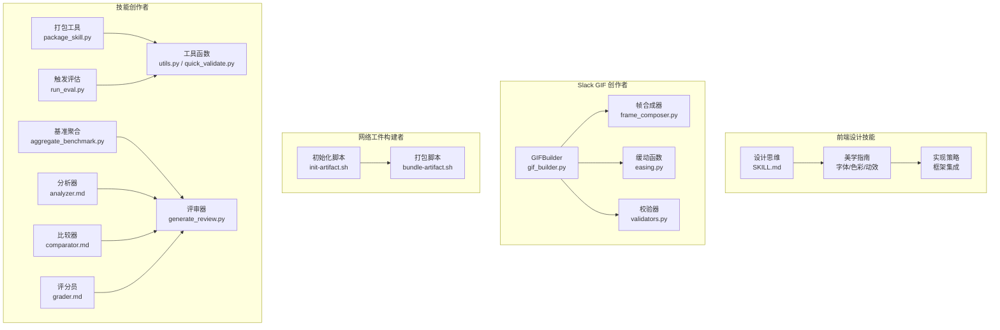

**图表来源**
- [frontend-design/SKILL.md:1-43](file://skills/skills/frontend-design/SKILL.md#L1-L43)
- [gif_builder.py:17-270](file://skills/skills/slack-gif-creator/core/gif_builder.py#L17-L270)
- [frame_composer.py:15-177](file://skills/skills/slack-gif-creator/core/frame_composer.py#L15-L177)
- [easing.py:12-235](file://skills/skills/slack-gif-creator/core/easing.py#L12-L235)
- [validators.py:11-137](file://skills/skills/slack-gif-creator/core/validators.py#L11-L137)
- [init-artifact.sh:1-323](file://skills/skills/web-artifacts-builder/scripts/init-artifact.sh#L1-L323)
- [bundle-artifact.sh:1-54](file://skills/skills/web-artifacts-builder/scripts/bundle-artifact.sh#L1-L54)
- [package_skill.py:42-137](file://skills/skills/skill-creator/scripts/package_skill.py#L42-L137)
- [run_eval.py:184-311](file://skills/skills/skill-creator/scripts/run_eval.py#L184-L311)
- [aggregate_benchmark.py:176-402](file://skills/skills/skill-creator/scripts/aggregate_benchmark.py#L176-L402)
- [generate_review.py:60-472](file://skills/skills/skill-creator/eval-viewer/generate_review.py#L60-L472)
- [analyzer.md:1-275](file://skills/skills/skill-creator/agents/analyzer.md#L1-L275)
- [comparator.md:1-203](file://skills/skills/skill-creator/agents/comparator.md#L1-L203)
- [grader.md:1-224](file://skills/skills/skill-creator/agents/grader.md#L1-L224)
- [utils.py:7-48](file://skills/skills/skill-creator/scripts/utils.py#L7-L48)
- [quick_validate.py:12-103](file://skills/skills/skill-creator/scripts/quick_validate.py#L12-L103)

**章节来源**
- [frontend-design/SKILL.md:1-43](file://skills/skills/frontend-design/SKILL.md#L1-L43)
- [slack-gif-creator/SKILL.md:1-255](file://skills/skills/slack-gif-creator/SKILL.md#L1-L255)
- [web-artifacts-builder/SKILL.md:1-74](file://skills/skills/web-artifacts-builder/SKILL.md#L1-L74)
- [skill-creator/SKILL.md:1-486](file://skills/skills/skill-creator/SKILL.md#L1-L486)

## 核心组件
- **前端设计技能**
  - 设计思维：强调明确的概念方向和意图性，避免强度而注重意向性。
  - 美学指南：涵盖字体选择、色彩主题、动画动效、空间构图和背景细节。
  - 实现策略：支持HTML/CSS/JS、React、Vue等框架，注重生产级功能和视觉冲击力。
- **Slack GIF 创作者**
  - GIFBuilder：统一的 GIF 组装与优化入口，支持尺寸适配、颜色量化、去重、Emoji 专项优化与保存信息输出。
  - 帧合成器：提供空白帧、渐变背景、圆形/星形绘制与文本绘制等常用图形元素。
  - 缓动函数：提供多种缓动曲线与弧线运动计算，便于自然运动与弹性效果。
  - 校验器：对 GIF 的尺寸、大小、帧数与时长进行严格校验，支持 Emoji 与消息 GIF 的不同约束。
- **网络工件构建者**
  - 初始化脚本：自动创建 React + TypeScript + Vite + Tailwind CSS + shadcn/ui 项目骨架，并配置路径别名与构建工具。
  - 打包脚本：通过 Parcel 将应用构建为单文件 HTML，内联所有资源，便于在 Claude 对话中直接展示。
- **技能创作者**
  - 打包工具：将技能目录打包为 .skill 文件，内置排除规则与前置校验。
  - 触发评估：通过临时注入命令文件的方式，模拟 Claude 调用流程，统计描述触发率。
  - 基准聚合：从运行结果中提取指标，计算均值/标准差/极值与配置间差异。
  - 评审器：扫描工作区，生成自包含的评审页面，支持前后迭代对比与反馈收集。
  - 分析器/比较器/评分员：提供盲比较、后验分析与期望评分的标准化流程。

**章节来源**
- [frontend-design/SKILL.md:11-43](file://skills/skills/frontend-design/SKILL.md#L11-L43)
- [gif_builder.py:17-270](file://skills/skills/slack-gif-creator/core/gif_builder.py#L17-L270)
- [frame_composer.py:15-177](file://skills/skills/slack-gif-creator/core/frame_composer.py#L15-L177)
- [easing.py:12-235](file://skills/skills/slack-gif-creator/core/easing.py#L12-L235)
- [validators.py:11-137](file://skills/skills/slack-gif-creator/core/validators.py#L11-L137)
- [init-artifact.sh:1-323](file://skills/skills/web-artifacts-builder/scripts/init-artifact.sh#L1-L323)
- [bundle-artifact.sh:1-54](file://skills/skills/web-artifacts-builder/scripts/bundle-artifact.sh#L1-L54)
- [package_skill.py:42-137](file://skills/skills/skill-creator/scripts/package_skill.py#L42-L137)
- [run_eval.py:184-311](file://skills/skills/skill-creator/scripts/run_eval.py#L184-L311)
- [aggregate_benchmark.py:176-402](file://skills/skills/skill-creator/scripts/aggregate_benchmark.py#L176-L402)
- [generate_review.py:60-472](file://skills/skills/skill-creator/eval-viewer/generate_review.py#L60-L472)
- [analyzer.md:1-275](file://skills/skills/skill-creator/agents/analyzer.md#L1-L275)
- [comparator.md:1-203](file://skills/skills/skill-creator/agents/comparator.md#L1-L203)
- [grader.md:1-224](file://skills/skills/skill-creator/agents/grader.md#L1-L224)
- [utils.py:7-48](file://skills/skills/skill-creator/scripts/utils.py#L7-L48)
- [quick_validate.py:12-103](file://skills/skills/skill-creator/scripts/quick_validate.py#L12-L103)

## 架构总览
下图展示了四大类技能之间的协作关系与数据流，现在包含完整的15个专业组件架构：

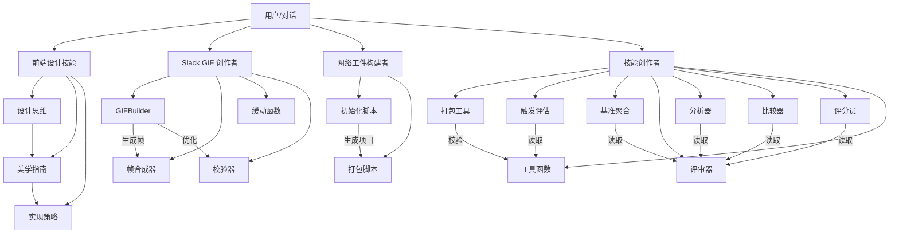

**图表来源**
- [frontend-design/SKILL.md:11-43](file://skills/skills/frontend-design/SKILL.md#L11-L43)
- [gif_builder.py:17-270](file://skills/skills/slack-gif-creator/core/gif_builder.py#L17-L270)
- [frame_composer.py:15-177](file://skills/skills/slack-gif-creator/core/frame_composer.py#L15-L177)
- [easing.py:12-235](file://skills/skills/slack-gif-creator/core/easing.py#L12-L235)
- [validators.py:11-137](file://skills/skills/slack-gif-creator/core/validators.py#L11-L137)
- [init-artifact.sh:1-323](file://skills/skills/web-artifacts-builder/scripts/init-artifact.sh#L1-L323)
- [bundle-artifact.sh:1-54](file://skills/skills/web-artifacts-builder/scripts/bundle-artifact.sh#L1-L54)
- [package_skill.py:42-137](file://skills/skills/skill-creator/scripts/package_skill.py#L42-L137)
- [run_eval.py:184-311](file://skills/skills/skill-creator/scripts/run_eval.py#L184-L311)
- [aggregate_benchmark.py:176-402](file://skills/skills/skill-creator/scripts/aggregate_benchmark.py#L176-L402)
- [generate_review.py:60-472](file://skills/skills/skill-creator/eval-viewer/generate_review.py#L60-L472)
- [analyzer.md:1-275](file://skills/skills/skill-creator/agents/analyzer.md#L1-L275)
- [comparator.md:1-203](file://skills/skills/skill-creator/agents/comparator.md#L1-L203)
- [grader.md:1-224](file://skills/skills/skill-creator/agents/grader.md#L1-L224)
- [utils.py:7-48](file://skills/skills/skill-creator/scripts/utils.py#L7-L48)
- [quick_validate.py:12-103](file://skills/skills/skill-creator/scripts/quick_validate.py#L12-L103)

## 详细组件分析

### 前端设计技能：设计思维与美学指南
- **设计思维**
  - 强调明确的概念方向和意图性，避免强度而注重意向性。
  - 包括目的性、音调选择、技术约束和差异化要素。
  - 要求在编码前理解上下文并承诺大胆的美学方向。
- **美学指南**
  - 字体：选择美丽、独特且有趣的字体，避免通用字体如Arial和Inter。
  - 色彩与主题：承诺一致的美学，使用CSS变量保持一致性。
  - 动画：使用CSS-only解决方案，注重高影响力时刻。
  - 空间构图：意外布局、不对称、重叠、对角流动等。
  - 背景与视觉细节：创造氛围和深度，避免默认纯色。
- **实现策略**
  - 支持HTML/CSS/JS、React、Vue等框架。
  - 生产级功能和视觉冲击力并重。
  - 注重每个细节的精心打磨。

**章节来源**
- [frontend-design/SKILL.md:11-43](file://skills/skills/frontend-design/SKILL.md#L11-L43)

### Slack GIF 创作者：GIFBuilder 类
- **职责**
  - 接收帧（PIL Image 或 numpy 数组），统一尺寸与格式。
  - 颜色量化：全局调色板或逐帧量化，控制色彩数量。
  - 去重：基于像素差异阈值去除近似重复帧。
  - 专项优化：Emoji 模式下强制 128x128、降低颜色数与帧数。
  - 保存：写入 GIF，输出尺寸、帧数、FPS、时长与颜色数等元信息。
- **关键接口**
  - add_frame/add_frames：添加帧。
  - optimize_colors：颜色量化。
  - deduplicate_frames：去重。
  - save：保存并返回信息字典。
- **复杂度与性能**
  - 颜色量化涉及多帧像素合并与调色板生成，时间复杂度与帧数与像素数成正比；建议在 Emoji 模式下减少帧数与颜色数以显著降体积。
- **错误处理**
  - 无帧时抛出异常；尺寸不一致自动缩放；过大文件给出体积提示。

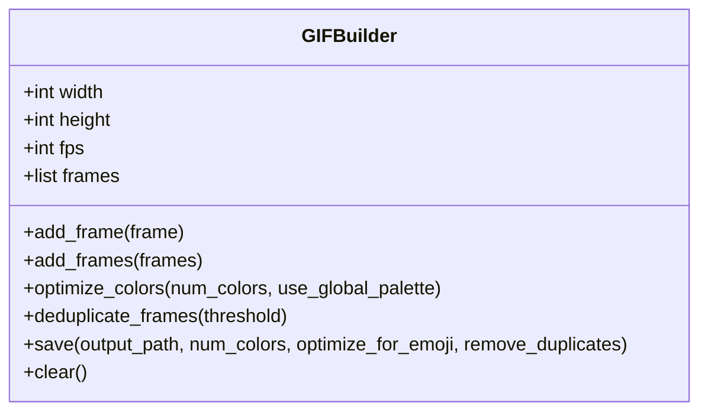

**图表来源**
- [gif_builder.py:17-270](file://skills/skills/slack-gif-creator/core/gif_builder.py#L17-L270)

**章节来源**
- [gif_builder.py:17-270](file://skills/skills/slack-gif-creator/core/gif_builder.py#L17-L270)

### Slack GIF 创作者：帧合成器与缓动函数
- **帧合成器**
  - create_blank_frame：创建纯色背景帧。
  - create_gradient_background：生成垂直渐变背景。
  - draw_circle/draw_star/draw_text：绘制基础图形与文本。
- **缓动函数**
  - 提供线性、二次、弹跳、弹性、回摆等多种缓动曲线。
  - 支持弧线运动计算，便于自然轨迹。
- **使用模式**
  - 先用帧合成器生成基础帧，再用缓动函数计算位置/缩放/透明度等参数，最后交给 GIFBuilder 组装。

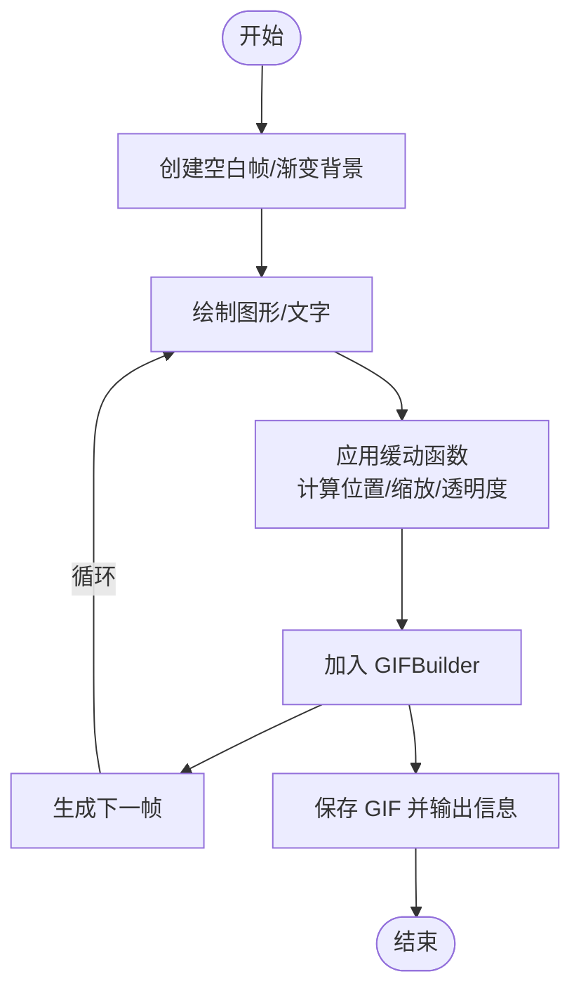

**图表来源**
- [frame_composer.py:15-177](file://skills/skills/slack-gif-creator/core/frame_composer.py#L15-L177)
- [easing.py:12-235](file://skills/skills/slack-gif-creator/core/easing.py#L12-L235)
- [gif_builder.py:17-270](file://skills/skills/slack-gif-creator/core/gif_builder.py#L17-L270)

**章节来源**
- [frame_composer.py:15-177](file://skills/skills/slack-gif-creator/core/frame_composer.py#L15-L177)
- [easing.py:12-235](file://skills/skills/slack-gif-creator/core/easing.py#L12-L235)

### Slack GIF 创作者：校验器
- **功能**
  - 校验 GIF 尺寸（Emoji 128x128 或消息 GIF 的宽高比与最小边约束）、文件大小、帧数与时长。
  - 可选详细输出与快速判定。
- **使用场景**
  - 在保存后对产物进行合规性检查，确保符合 Slack 要求。

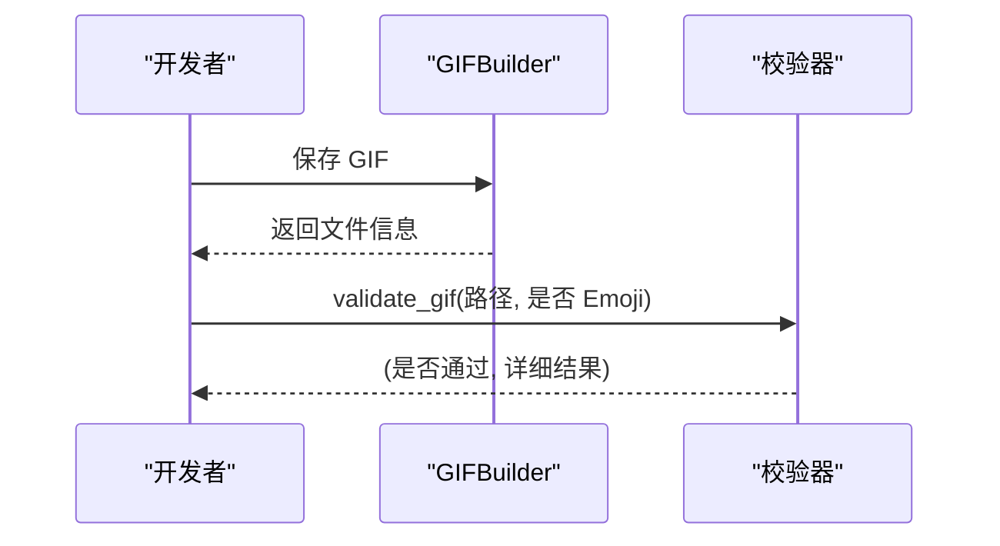

**图表来源**
- [gif_builder.py:160-265](file://skills/skills/slack-gif-creator/core/gif_builder.py#L160-L265)
- [validators.py:11-137](file://skills/skills/slack-gif-creator/core/validators.py#L11-L137)

**章节来源**
- [validators.py:11-137](file://skills/skills/slack-gif-creator/core/validators.py#L11-L137)

### 网络工件构建者：初始化与打包
- **初始化脚本**
  - 自动检测 Node 版本，选择合适的 Vite 版本，安装 Tailwind CSS、shadcn/ui 相关依赖，配置路径别名与主题变量。
- **打包脚本**
  - 安装 Parcel 与解析器，清理旧构建，执行构建并将资源内联到单个 HTML 文件。
- **设计要点**
  - 严格要求根目录存在 index.html；输出 bundle.html 可直接作为 Claude 工件分享。

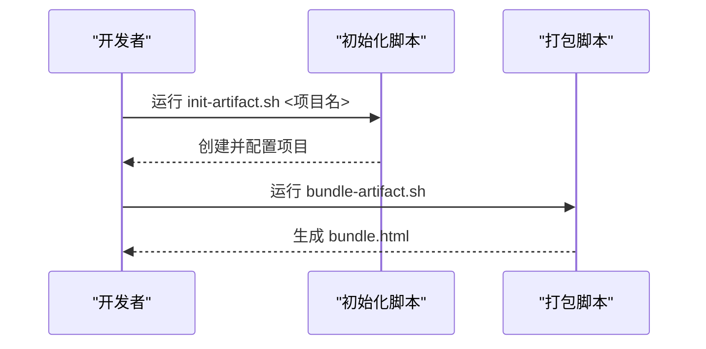

**图表来源**
- [init-artifact.sh:1-323](file://skills/skills/web-artifacts-builder/scripts/init-artifact.sh#L1-L323)
- [bundle-artifact.sh:1-54](file://skills/skills/web-artifacts-builder/scripts/bundle-artifact.sh#L1-L54)

**章节来源**
- [web-artifacts-builder/SKILL.md:1-74](file://skills/skills/web-artifacts-builder/SKILL.md#L1-L74)
- [init-artifact.sh:1-323](file://skills/skills/web-artifacts-builder/scripts/init-artifact.sh#L1-L323)
- [bundle-artifact.sh:1-54](file://skills/skills/web-artifacts-builder/scripts/bundle-artifact.sh#L1-L54)

### 技能创作者：打包与触发评估
- **打包工具**
  - 校验 SKILL.md 存在与基本格式，按排除规则打包为 .skill 文件。
- **触发评估**
  - 通过临时命令文件注入技能描述，使用 claude -p 流式事件检测是否触发，统计触发率并输出结果。
- **关键参数**
  - worker 数、超时、每查询运行次数、阈值、模型标识等。

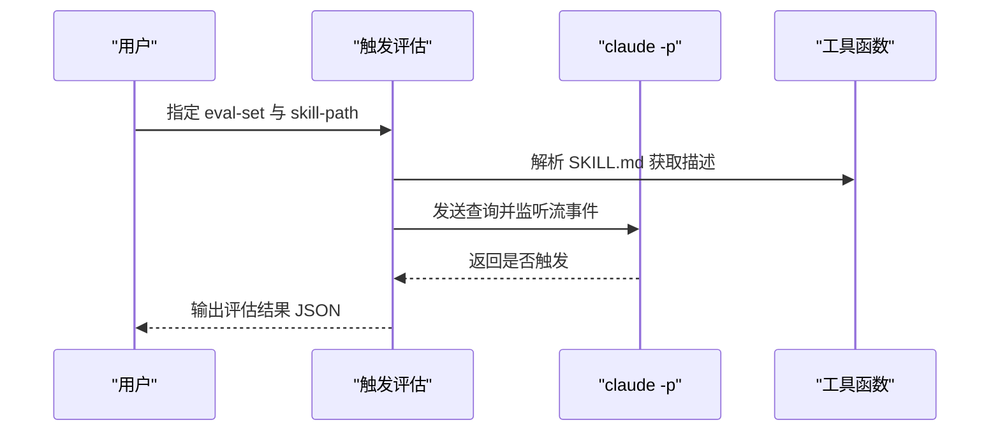

**图表来源**
- [run_eval.py:184-311](file://skills/skills/skill-creator/scripts/run_eval.py#L184-L311)
- [utils.py:7-48](file://skills/skills/skill-creator/scripts/utils.py#L7-L48)

**章节来源**
- [package_skill.py:42-137](file://skills/skills/skill-creator/scripts/package_skill.py#L42-L137)
- [run_eval.py:184-311](file://skills/skills/skill-creator/scripts/run_eval.py#L184-L311)
- [utils.py:7-48](file://skills/skills/skill-creator/scripts/utils.py#L7-L48)
- [quick_validate.py:12-103](file://skills/skills/skill-creator/scripts/quick_validate.py#L12-L103)

### 技能创作者：基准聚合与评审可视化
- **基准聚合**
  - 从运行结果加载 grading.json，计算各配置的 pass_rate、时间与令牌均值/标准差与 delta。
- **评审可视化**
  - 扫描工作区，发现 outputs/ 目录，内嵌数据生成自包含 HTML 页面，支持前后迭代对比与反馈收集。
- **分析器/比较器/评分员**
  - 提供盲比较、后验分析与期望评分的标准化流程，输出结构化 JSON 用于改进技能。

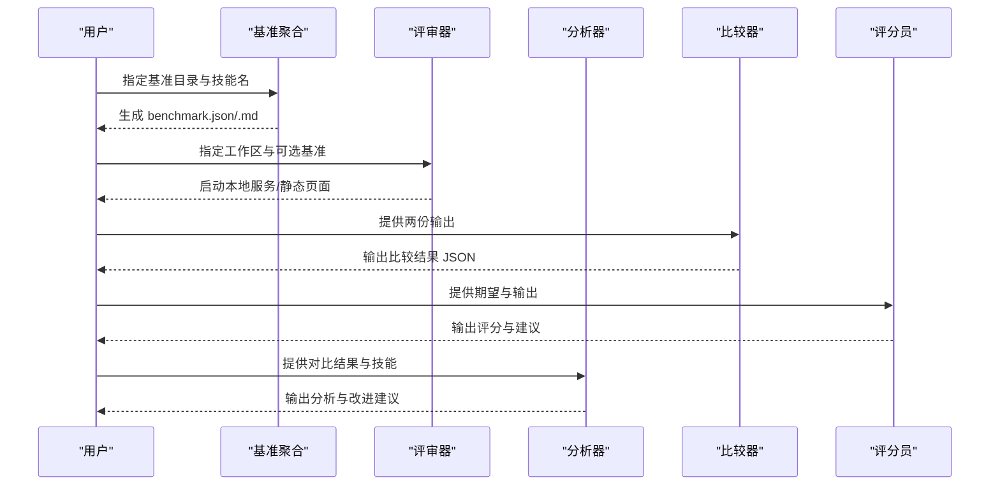

**图表来源**
- [aggregate_benchmark.py:176-402](file://skills/skills/skill-creator/scripts/aggregate_benchmark.py#L176-L402)
- [generate_review.py:60-472](file://skills/skills/skill-creator/eval-viewer/generate_review.py#L60-L472)
- [analyzer.md:1-275](file://skills/skills/skill-creator/agents/analyzer.md#L1-L275)
- [comparator.md:1-203](file://skills/skills/skill-creator/agents/comparator.md#L1-L203)
- [grader.md:1-224](file://skills/skills/skill-creator/agents/grader.md#L1-L224)

**章节来源**
- [aggregate_benchmark.py:176-402](file://skills/skills/skill-creator/scripts/aggregate_benchmark.py#L176-L402)
- [generate_review.py:60-472](file://skills/skills/skill-creator/eval-viewer/generate_review.py#L60-L472)
- [analyzer.md:1-275](file://skills/skills/skill-creator/agents/analyzer.md#L1-L275)
- [comparator.md:1-203](file://skills/skills/skill-creator/agents/comparator.md#L1-L203)
- [grader.md:1-224](file://skills/skills/skill-creator/agents/grader.md#L1-L224)

## 前端设计技能模块

### 设计思维体系
前端设计技能模块的核心在于建立完整的创意设计思维体系，强调概念方向的明确性和意图性的强烈表达。

**设计原则**
- **目的性**：明确界面要解决的问题和目标用户群体
- **音调选择**：从多种设计风格中选择极端风格，如 Brutalist、Retro-Futuristic、Organic/Natural 等
- **技术约束**：考虑框架、性能、可访问性等技术要求
- **差异化**：确定什么让界面令人难忘的独特要素

**执行标准**
- 在编码前深入理解上下文并承诺大胆的美学方向
- 实现具有生产级功能和视觉冲击力的工作代码
- 保持整体美学的一致性和明确的设计观点
- 在每个细节上都经过精心打磨

### 美学指南体系
系统化的美学指导原则涵盖了字体、色彩、动画、空间构图和背景细节等各个方面。

**字体设计**
- 选择美丽、独特且有趣的字体，避免通用字体如 Arial 和 Inter
- 采用独特的展示字体与精致的正文字体搭配
- 字体选择应与整体美学方向相匹配

**色彩与主题**
- 承诺一致的美学，使用 CSS 变量保持色彩一致性
- 主色调搭配锐利的强调色，优于平淡均匀的配色方案
- 色彩方案应服务于整体设计目标

**动画设计**
- 优先使用 CSS-only 解决方案，注重高影响力时刻
- 使用 Motion 库等 React 动画库时要谨慎选择
- 专注于高影响力的页面加载动画和分层出现效果
- 利用滚动触发和悬停状态创造惊喜

**空间构图**
- 采用非传统的布局方式，如不对称、重叠、对角流动
- 打破网格限制，创造可控的密度或充足的负空间
- 通过意外的布局和构图创造视觉兴趣

**背景与视觉细节**
- 创建氛围和深度，避免默认纯色背景
- 添加与整体美学相匹配的上下文效果和纹理
- 运用渐变网格、噪声纹理、几何图案等创意形式

### 实现策略
支持多种前端框架和技术栈，注重生产级功能和视觉冲击力的平衡。

**框架支持**
- HTML/CSS/JS 原生技术
- React 框架及其动画库
- Vue 框架及其生态

**质量标准**
- 生产级功能和视觉冲击力并重
- 保持整体设计的一致性
- 注重每个细节的精心打磨
- 实现复杂度与美学愿景相匹配

**章节来源**
- [frontend-design/SKILL.md:11-43](file://skills/skills/frontend-design/SKILL.md#L11-L43)

## 多语言国际化系统
系统采用 Next.js Internationalization (next-intl) 实现完整的多语言支持，包含15个专业组件架构中的国际化功能模块。

### 国际化配置架构
- **路由配置**：定义支持的语言列表（en、fr、es、zh）和默认语言。
- **请求处理**：动态获取客户端语言偏好并加载对应的消息文件。
- **导航集成**：提供语言切换组件和路由导航工具。
- **中间件保护**：确保语言前缀正确处理和匹配。

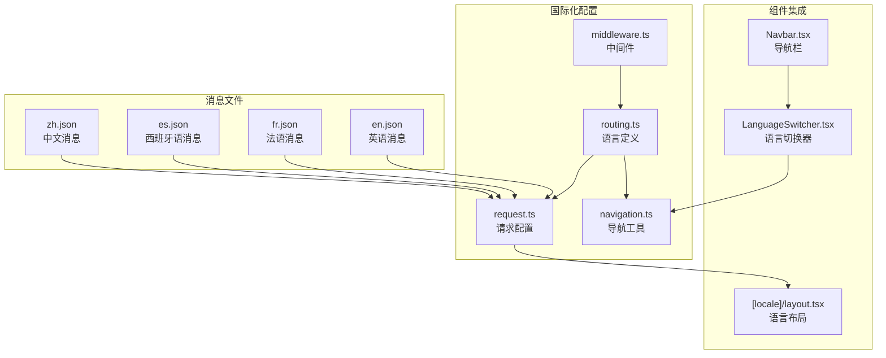

**图表来源**
- [routing.ts:1-8](file://src/i18n/routing.ts#L1-L8)
- [request.ts:1-16](file://src/i18n/request.ts#L1-L16)
- [navigation.ts:1-6](file://src/i18n/navigation.ts#L1-L6)
- [middleware.ts:1-9](file://src/middleware.ts#L1-L9)
- [LanguageSwitcher.tsx:1-53](file://src/components/layout/LanguageSwitcher.tsx#L1-L53)
- [Navbar.tsx:1-111](file://src/components/layout/Navbar.tsx#L1-L111)
- [layout.tsx:1-72](file://src/app/[locale]/layout.tsx#L1-L72)

### 语言切换机制
- **动态语言检测**：根据客户端请求自动检测语言偏好。
- **消息加载**：按需加载对应语言的消息文件。
- **URL处理**：维护语言前缀的正确路由。
- **状态管理**：在客户端组件中提供语言状态访问。

**章节来源**
- [routing.ts:1-8](file://src/i18n/routing.ts#L1-L8)
- [request.ts:1-16](file://src/i18n/request.ts#L1-L16)
- [navigation.ts:1-6](file://src/i18n/navigation.ts#L1-L6)
- [middleware.ts:1-9](file://src/middleware.ts#L1-L9)
- [LanguageSwitcher.tsx:1-53](file://src/components/layout/LanguageSwitcher.tsx#L1-L53)
- [Navbar.tsx:1-111](file://src/components/layout/Navbar.tsx#L1-L111)
- [layout.tsx:1-72](file://src/app/[locale]/layout.tsx#L1-L72)

### 消息文件结构
系统包含四种语言的消息文件，每种语言都有完整的翻译覆盖：
- **Metadata**：网站元数据和SEO信息
- **Navbar**：导航栏链接和品牌名称
- **Hero**：首页英雄区域文案
- **Sections**：各个产品展示区域的内容
- **Contact**：联系信息和表单字段

**章节来源**
- [en.json:1-324](file://src/messages/en.json#L1-L324)
- [es.json](file://src/messages/es.json)
- [fr.json](file://src/messages/fr.json)
- [zh.json](file://src/messages/zh.json)

## API路由系统
系统提供完整的API路由支持，目前包含联系表单API和搜索引擎优化路由。

### API路由架构
- **联系表单API**：处理客户询盘请求，包含数据验证和日志记录。
- **SEO路由**：生成robots.txt和sitemap.xml文件。
- **中间件保护**：确保API路由正确处理和安全访问。

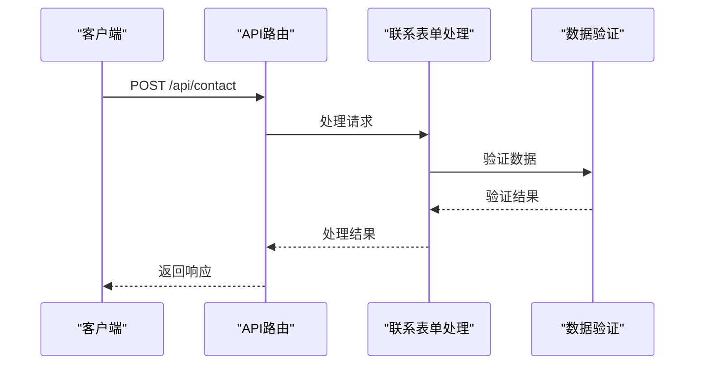

**图表来源**
- [route.ts:1-55](file://src/app/api/contact/route.ts#L1-L55)
- [robots.ts:1-12](file://src/app/robots.ts#L1-L12)
- [sitemap.ts:1-20](file://src/app/sitemap.ts#L1-L20)

### 联系表单API
- **请求处理**：接收JSON格式的询盘数据。
- **数据验证**：验证姓名和邮箱必填项及格式。
- **错误处理**：提供400错误（数据无效）和500错误（服务器错误）。
- **日志记录**：记录询盘信息用于后续处理。
- **扩展支持**：预留邮件发送集成点。

**章节来源**
- [route.ts:1-55](file://src/app/api/contact/route.ts#L1-L55)

### SEO优化路由
- **robots.txt**：允许所有爬虫访问，指向sitemap地址。
- **sitemap.xml**：生成多语言站点地图，包含所有语言版本。
- **动态生成**：根据路由配置动态生成站点地图条目。

**章节来源**
- [robots.ts:1-12](file://src/app/robots.ts#L1-L12)
- [sitemap.ts:1-20](file://src/app/sitemap.ts#L1-L20)

## 前端组件库

### 导航栏组件
导航栏组件提供了完整的响应式导航体验，集成了语言切换功能和移动端适配。

**功能特性**
- **品牌标识**：显示品牌名称和特色字体
- **导航链接**：桌面端显示完整的导航菜单，移动端折叠为汉堡菜单
- **语言切换**：集成 LanguageSwitcher 组件，支持多语言切换
- **响应式设计**：移动端自动切换为汉堡菜单模式
- **活动状态**：根据当前路径高亮显示活动导航项

**组件结构**
- 使用 FaBars 和 FaTimes 图标实现汉堡菜单切换
- 通过 usePathname hook 获取当前路径状态
- 支持外链和内部页面链接的区分处理

**章节来源**
- [Navbar.tsx:1-111](file://src/components/layout/Navbar.tsx#L1-L111)

### 语言切换器组件
语言切换器组件提供了直观的多语言切换界面，支持四种语言的快速切换。

**功能特性**
- **语言标识**：使用 EN、FR、ES、中 等简短标识符
- **状态指示**：当前语言使用金色背景和深色字体突出显示
- **即时切换**：点击即刻切换到目标语言版本
- **URL同步**：自动更新URL中的语言前缀

**实现机制**
- 通过 useLocale 和 usePathname hooks 获取状态
- 动态构建新URL路径，保持路由结构
- 使用 window.location.href 实现页面跳转

**章节来源**
- [LanguageSwitcher.tsx:1-53](file://src/components/layout/LanguageSwitcher.tsx#L1-L53)

### 页脚组件
页脚组件提供了品牌信息、快速链接和联系方式的完整展示。

**内容结构**
- **品牌信息**：显示品牌名称和标语
- **快速链接**：技术、产品、案例、联系等导航链接
- **联系方式**：邮箱和微信等联系信息
- **版权信息**：底部版权声明

**设计特点**
- 使用渐变背景和装饰线条增强视觉层次
- 采用三列布局适应不同屏幕尺寸
- 通过 CSS 变量统一颜色方案

**章节来源**
- [Footer.tsx:1-69](file://src/components/layout/Footer.tsx#L1-L69)

### 英雄区域组件
英雄区域组件提供了引人注目的首页展示区域，结合背景图片和渐变效果。

**视觉设计**
- **背景层次**：多层渐变叠加创造深度感
- **纹理效果**：添加纹理覆盖层增强质感
- **动画效果**：使用淡入动画提升用户体验
- **响应式布局**：适应不同屏幕尺寸的文本排版

**内容组织**
- **品牌标语**：顶部的装饰性标签行
- **主标题**：居中的大标题，使用显示字体
- **副标题**：斜体的装饰性副标题
- **行动按钮**：产品展示和历史了解两个CTA按钮

**章节来源**
- [HeroSection.tsx:1-56](file://src/components/sections/HeroSection.tsx#L1-L56)

### UI组件库
系统提供了基础的UI组件，支持主题化的设计系统。

**SectionHeading 组件**
- **功能**：提供统一的章节标题样式
- **属性**：支持标题文本、副标题和金色主题切换
- **设计**：使用 CSS 变量统一颜色，支持响应式字体大小

**设计原则**
- **主题一致性**：所有组件使用相同的颜色变量
- **响应式设计**：适配移动和桌面设备
- **可复用性**：提供灵活的属性配置

**章节来源**
- [SectionHeading.tsx:1-27](file://src/components/ui/SectionHeading.tsx#L1-L27)

## 依赖分析
- **内部耦合**
  - 前端设计技能模块内部高度内聚：设计思维指导美学指南，美学指南驱动实现策略。
  - Slack GIF 创作者内部模块高度内聚：GIFBuilder 依赖帧合成器与缓动函数进行动画生成，依赖校验器保证合规。
  - 技能创作者工具链通过 utils/quick_validate 提供统一的前置校验与描述解析能力。
  - 国际化系统通过routing.ts、request.ts、navigation.ts形成完整的配置链路。
  - 前端组件库通过共享的CSS变量和设计系统实现统一的视觉体验。
- **外部依赖**
  - 前端设计技能：Next.js、React、TypeScript、Tailwind CSS。
  - Slack GIF 创作者：Pillow、imageio、numpy。
  - 网络工件构建者：Node.js、pnpm、Parcel、Tailwind CSS、shadcn/ui。
  - 技能创作者：Python 标准库、claude CLI（用于触发评估）。
  - 国际化系统：next-intl、next。
  - 前端组件：react-icons（FaBars、FaTimes）、next/link、next/navigation。
- **循环依赖**
  - 未发现模块级循环依赖；脚本之间通过命令行与文件系统交互，避免直接循环导入。

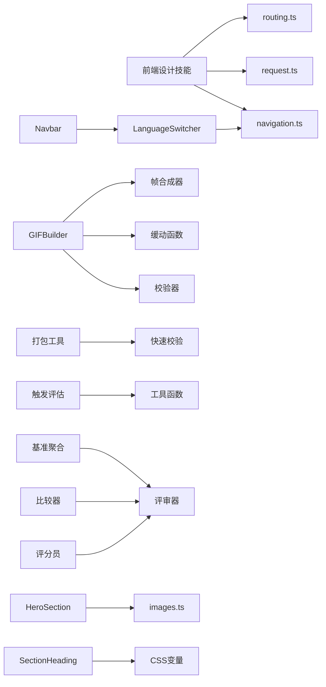

**图表来源**
- [frontend-design/SKILL.md:1-43](file://skills/skills/frontend-design/SKILL.md#L1-L43)
- [routing.ts:1-8](file://src/i18n/routing.ts#L1-L8)
- [request.ts:1-16](file://src/i18n/request.ts#L1-L16)
- [navigation.ts:1-6](file://src/i18n/navigation.ts#L1-L6)
- [gif_builder.py:17-270](file://skills/skills/slack-gif-creator/core/gif_builder.py#L17-L270)
- [frame_composer.py:15-177](file://skills/skills/slack-gif-creator/core/frame_composer.py#L15-L177)
- [easing.py:12-235](file://skills/skills/slack-gif-creator/core/easing.py#L12-L235)
- [validators.py:11-137](file://skills/skills/slack-gif-creator/core/validators.py#L11-L137)
- [package_skill.py:42-137](file://skills/skills/skill-creator/scripts/package_skill.py#L42-L137)
- [quick_validate.py:12-103](file://skills/skills/skill-creator/scripts/quick_validate.py#L12-L103)
- [run_eval.py:184-311](file://skills/skills/skill-creator/scripts/run_eval.py#L184-L311)
- [utils.py:7-48](file://skills/skills/skill-creator/scripts/utils.py#L7-L48)
- [aggregate_benchmark.py:176-402](file://skills/skills/skill-creator/scripts/aggregate_benchmark.py#L176-L402)
- [generate_review.py:60-472](file://skills/skills/skill-creator/eval-viewer/generate_review.py#L60-L472)
- [comparator.md:1-203](file://skills/skills/skill-creator/agents/comparator.md#L1-L203)
- [grader.md:1-224](file://skills/skills/skill-creator/agents/grader.md#L1-L224)
- [LanguageSwitcher.tsx:1-53](file://src/components/layout/LanguageSwitcher.tsx#L1-L53)
- [Navbar.tsx:1-111](file://src/components/layout/Navbar.tsx#L1-L111)
- [HeroSection.tsx:1-56](file://src/components/sections/HeroSection.tsx#L1-L56)
- [SectionHeading.tsx:1-27](file://src/components/ui/SectionHeading.tsx#L1-L27)

**章节来源**
- [frontend-design/SKILL.md:1-43](file://skills/skills/frontend-design/SKILL.md#L1-L43)
- [gif_builder.py:17-270](file://skills/skills/slack-gif-creator/core/gif_builder.py#L17-L270)
- [validators.py:11-137](file://skills/skills/slack-gif-creator/core/validators.py#L11-L137)
- [package_skill.py:42-137](file://skills/skills/skill-creator/scripts/package_skill.py#L42-L137)
- [run_eval.py:184-311](file://skills/skills/skill-creator/scripts/run_eval.py#L184-L311)
- [aggregate_benchmark.py:176-402](file://skills/skills/skill-creator/scripts/aggregate_benchmark.py#L176-L402)
- [generate_review.py:60-472](file://skills/skills/skill-creator/eval-viewer/generate_review.py#L60-L472)

## 性能考虑
- **前端设计技能**
  - 多语言消息文件按需加载，避免不必要的内存占用。
  - 组件级别的国际化切换使用状态管理，避免频繁的DOM操作。
  - 图片和媒体资源采用懒加载策略，提升首屏加载速度。
  - CSS变量的使用减少了样式的重复定义，提升渲染性能。
- **Slack GIF 创作者**
  - 颜色量化与全局调色板会增加处理时间，建议在 Emoji 模式下限制帧数与颜色数。
  - 去重可显著减小体积，但需权衡是否保留细微动画。
- **网络工件构建者**
  - Parcel 构建耗时较长，建议仅在需要时执行；内联资源会增大文件体积，注意平衡可读性与传输效率。
- **技能创作者**
  - 触发评估并发 worker 数与每查询运行次数直接影响稳定性与成本，建议根据环境调整。
  - 基准聚合与评审器扫描大量文件，建议在专用工作区运行并定期清理中间产物。
- **国际化系统**
  - 消息文件采用按需加载，减少初始包大小。
  - 语言切换使用浏览器缓存，避免重复请求相同语言文件。
  - 中间件匹配器优化了路由处理效率。

## 故障排查指南
- **前端设计技能**
  - 语言切换失效：检查LanguageSwitcher组件的onChange函数和路由配置。
  - 消息显示异常：确认对应语言的消息文件是否存在且格式正确。
  - 国际化组件无法渲染：检查NextIntlClientProvider的包裹和消息加载。
- **Slack GIF 创作者**
  - 无帧保存：确保先 add_frame/add_frames 再 save。
  - 尺寸不符：确认输入帧尺寸与 GIFBuilder 初始化尺寸一致，或使用内置缩放。
  - 文件过大：启用 remove_duplicates、降低 num_colors、缩小尺寸或减少帧数。
- **网络工件构建者**
  - 未找到 index.html：确保项目根目录存在 index.html。
  - Node 版本不兼容：脚本会自动检测并提示，按提示升级或使用兼容版本。
- **技能创作者**
  - 打包失败：检查 SKILL.md 前言字段与命名规范，参考快速校验规则。
  - 触发评估无响应：检查 claude -p 可用性与权限，适当提高超时与 worker 数。
  - 评审器端口占用：脚本会尝试杀死占用进程或切换端口，也可手动指定端口。
- **API路由系统**
  - 联系表单提交失败：检查请求格式和必填字段验证逻辑。
  - API路由404：确认路由文件路径和Next.js路由约定。
  - CORS问题：检查API响应头设置和跨域配置。
- **国际化系统**
  - 语言切换按钮无响应：检查useLocale和usePathname hooks的状态。
  - URL语言前缀错误：确认middleware.ts中的matcher配置。
  - 消息文件加载失败：检查messages目录结构和文件命名。
- **前端组件库**
  - 导航栏图标显示异常：检查react-icons依赖和图标导入。
  - 响应式布局失效：检查Tailwind CSS类名和断点设置。
  - 颜色主题不一致：检查CSS变量定义和组件使用。

**章节来源**
- [LanguageSwitcher.tsx:18-33](file://src/components/layout/LanguageSwitcher.tsx#L18-L33)
- [request.ts:4-15](file://src/i18n/request.ts#L4-L15)
- [route.ts:9-24](file://src/app/api/contact/route.ts#L9-L24)
- [gif_builder.py:179-265](file://skills/skills/slack-gif-creator/core/gif_builder.py#L179-L265)
- [validators.py:29-118](file://skills/skills/slack-gif-creator/core/validators.py#L29-L118)
- [bundle-artifact.sh:6-17](file://skills/skills/web-artifacts-builder/scripts/bundle-artifact.sh#L6-L17)
- [init-artifact.sh:6-24](file://skills/skills/web-artifacts-builder/scripts/init-artifact.sh#L6-L24)
- [package_skill.py:55-77](file://skills/skills/skill-creator/scripts/package_skill.py#L55-L77)
- [quick_validate.py:12-94](file://skills/skills/skill-creator/scripts/quick_validate.py#L12-L94)
- [run_eval.py:35-182](file://skills/skills/skill-creator/scripts/run_eval.py#L35-L182)
- [generate_review.py:288-307](file://skills/skills/skill-creator/eval-viewer/generate_review.py#L288-L307)

## 结论
本模块现已发展为包含15个专业组件的完整生态系统，通过清晰的职责划分与标准化工具链，实现了从动画 GIF 创作、前端工件生成、技能全生命周期管理到多语言国际化的完整闭环。新增的前端设计技能强调独特性和设计品质，国际化系统提供完整的多语言支持，API路由系统确保良好的用户体验和SEO优化，完整的前端组件库为项目提供了统一的设计系统和交互体验。对于初学者，建议从示例入手，逐步掌握帧合成、缓动与优化策略以及设计思维；对于高级用户，可利用触发评估、基准聚合与评审器进行系统化的质量保障与持续改进，同时享受多语言国际化带来的全球用户覆盖能力和现代化前端开发体验。

## 附录
- **配置与参数速查**
  - 前端设计技能：设计思维参数、美学指南选项、实现框架支持。
  - GIFBuilder.save：output_path、num_colors、optimize_for_emoji、remove_duplicates。
  - 帧合成器：create_blank_frame、create_gradient_background、draw_circle、draw_text、draw_star。
  - 缓动函数：interpolate(start, end, t, easing)。
  - 校验器：validate_gif(gif_path, is_emoji, verbose)。
  - 初始化脚本：init-artifact.sh <项目名>。
  - 打包脚本：bundle-artifact.sh。
  - 打包工具：package_skill.py <skill-path> [output-dir]。
  - 触发评估：run_eval.py --eval-set --skill-path [--num-workers] [--timeout] [--runs-per-query] [--trigger-threshold] [--model]。
  - 基准聚合：aggregate_benchmark.py <benchmark_dir> [--skill-name] [--skill-path]。
  - 评审器：generate_review.py <workspace> [--port] [--skill-name] [--previous-workspace] [--benchmark] [--static]。
  - 分析器/比较器/评分员：按 agents 文档执行，输出结构化 JSON。
  - 国际化配置：routing.ts中的语言定义、默认语言和前缀设置。
  - API路由：联系表单API的请求格式和响应结构。
  - 前端组件：导航栏链接配置、语言切换器状态管理、英雄区域样式配置。
- **返回值与输出**
  - 前端设计技能：设计文档、美学指南实施结果、实现代码。
  - GIFBuilder.save：返回包含路径、尺寸、帧数、FPS、时长与颜色数的字典。
  - 校验器：返回 (是否通过, 详细结果)。
  - 基准聚合：生成 benchmark.json 与 benchmark.md。
  - 评审器：启动本地服务或生成静态 HTML。
  - 触发评估：输出包含每条查询触发率与汇总的 JSON。
  - 联系表单API：成功响应或错误详情。
  - 国际化系统：消息对象、语言切换状态、路由导航工具。
  - 前端组件：渲染后的HTML结构、样式应用结果。
- **最佳实践**
  - 前端设计：强调概念方向和意图性，避免强度而注重意向性；注重每个细节的精心打磨。
  - Slack GIF：Emoji 模式优先，控制帧数与颜色数；消息 GIF 注重宽高比与最小边。
  - 前端工件：遵循样式指南，避免过度模板化；仅在必要时测试。
  - 技能创作：先定义明确的评估断言，再迭代改进；使用评审器与分析器沉淀经验。
  - 国际化：合理规划语言文件结构，使用按需加载策略；确保SEO优化和用户体验。
  - API开发：遵循RESTful设计原则，提供清晰的错误处理和文档。
  - 前端组件：使用统一的设计系统，保持视觉一致性；实现响应式设计适配。