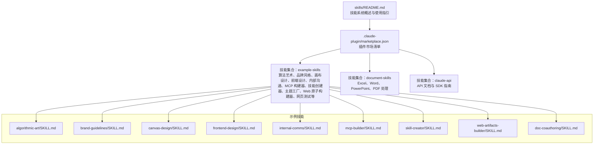
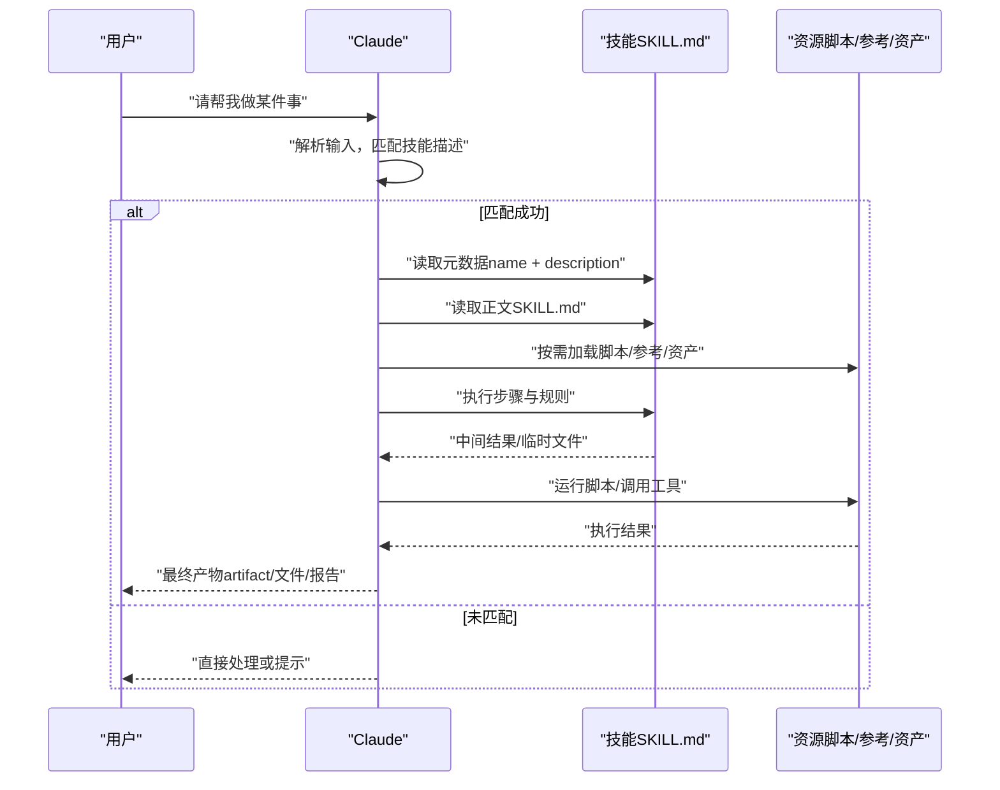
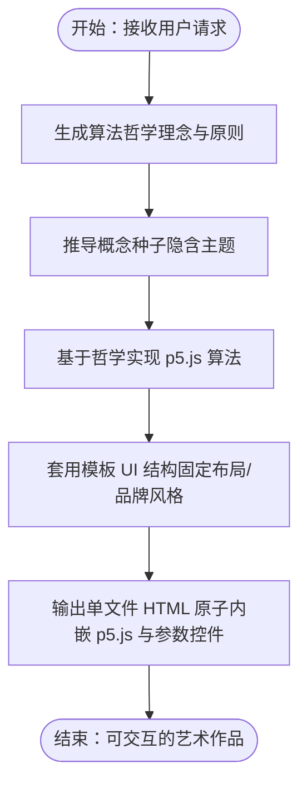
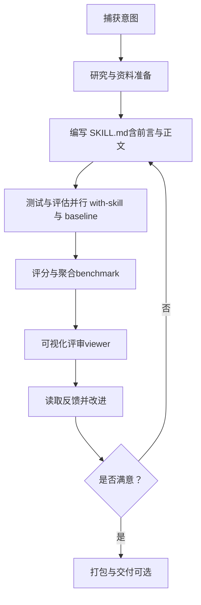
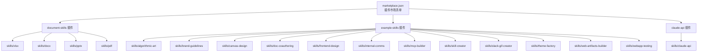

# 什么是技能系统

<cite>
**本文引用的文件**
- [skills/README.md](file://skills/README.md)
- [skills/spec/agent-skills-spec.md](file://skills/spec/agent-skills-spec.md)
- [skills/template/SKILL.md](file://skills/template/SKILL.md)
- [.claude-plugin/marketplace.json](file://skills/.claude-plugin/marketplace.json)
- [skills/skills/algorithmic-art/SKILL.md](file://skills/skills/algorithmic-art/SKILL.md)
- [skills/skills/brand-guidelines/SKILL.md](file://skills/skills/brand-guidelines/SKILL.md)
- [skills/skills/canvas-design/SKILL.md](file://skills/skills/canvas-design/SKILL.md)
- [skills/skills/frontend-design/SKILL.md](file://skills/skills/frontend-design/SKILL.md)
- [skills/skills/internal-comms/SKILL.md](file://skills/skills/internal-comms/SKILL.md)
- [skills/skills/web-artifacts-builder/SKILL.md](file://skills/skills/web-artifacts-builder/SKILL.md)
- [skills/skills/skill-creator/SKILL.md](file://skills/skills/skill-creator/SKILL.md)
- [skills/skills/mcp-builder/SKILL.md](file://skills/skills/mcp-builder/SKILL.md)
- [skills/skills/doc-coauthoring/SKILL.md](file://skills/skills/doc-coauthoring/SKILL.md)
- [skills/skills/skill-creator/scripts/utils.py](file://skills/skills/skill-creator/scripts/utils.py)
- [skills/skills/skill-creator/scripts/quick_validate.py](file://skills/skills/skill-creator/scripts/quick_validate.py)
- [skills/skills/skill-creator/scripts/improve_description.py](file://skills/skills/skill-creator/scripts/improve_description.py)
</cite>

## 目录
1. [引言](#引言)
2. [项目结构](#项目结构)
3. [核心组件](#核心组件)
4. [架构总览](#架构总览)
5. [详细组件分析](#详细组件分析)
6. [依赖关系分析](#依赖关系分析)
7. [性能考量](#性能考量)
8. [故障排查指南](#故障排查指南)
9. [结论](#结论)
10. [附录](#附录)

## 引言
技能系统是 Claude 的一项能力扩展机制：它允许通过“技能”（一个自包含的文件夹）将可复用的指令、脚本与资源动态注入到 Claude 的上下文中，从而在特定任务上提升性能与一致性。你可以把技能看作“可被 Claude 调用的专家”，它们覆盖从创意设计、前端开发、企业沟通，到文档处理、数据分析、MCP 服务集成等广泛场景。技能通过一个名为 SKILL.md 的文件声明元数据与行为规范，并可在需要时按需加载其资源，实现“按需即取”的高效协作。

## 项目结构
该仓库展示了技能系统的典型组织方式：
- 根目录下的 skills 子树包含多种技能示例，每个技能以独立文件夹存在，内含 SKILL.md 以及可选的脚本、参考文档与资源。
- .claude-plugin/marketplace.json 定义了插件市场清单，将多个技能集合打包为插件，便于在 Claude 环境中安装与使用。
- skills/spec 提供了 Agent Skills 规范的链接；skills/template 提供了创建新技能的模板。

图表来源
- [skills/README.md:1-95](file://skills/README.md#L1-L95)
- [.claude-plugin/marketplace.json:1-56](file://skills/.claude-plugin/marketplace.json#L1-L56)

章节来源
- [skills/README.md:12-27](file://skills/README.md#L12-L27)
- [.claude-plugin/marketplace.json:11-54](file://skills/.claude-plugin/marketplace.json#L11-L54)

## 核心组件
- SKILL.md：每个技能的核心，包含 YAML 前言（name、description 等）与正文说明。前言用于触发与元信息，正文提供执行步骤、示例与指导。
- 插件市场清单 marketplace.json：将多个技能归类为插件集合，便于安装与分发。
- 示例技能：涵盖创意、设计、前端、企业沟通、文档处理、MCP 构建、技能创建与优化、主题工厂、Web 原子构建器、网页测试等。
- 触发与加载机制：技能采用渐进披露（progressive disclosure）策略，在不同阶段按需加载元数据、正文与资源，控制上下文大小与执行成本。

章节来源
- [skills/README.md:61-88](file://skills/README.md#L61-L88)
- [skills/skills/skill-creator/SKILL.md:86-110](file://skills/skills/skill-creator/SKILL.md#L86-L110)

## 架构总览
技能系统由“触发—加载—执行—产出”闭环构成：
- 触发：用户输入或上下文匹配技能描述（description）后，Claude 决定是否调用该技能。
- 加载：按渐进披露策略加载元数据（name + description）、正文（SKILL.md），必要时再加载脚本与资源。
- 执行：根据 SKILL.md 中的步骤与规则，结合脚本与资源完成任务。
- 产出：生成可分享的产物（如 HTML 原子、PDF、PNG、文档等）。

图表来源
- [skills/skills/skill-creator/SKILL.md:86-110](file://skills/skills/skill-creator/SKILL.md#L86-L110)
- [skills/skills/skill-creator/SKILL.md:163-251](file://skills/skills/skill-creator/SKILL.md#L163-L251)

## 详细组件分析

### SKILL.md 的作用与结构
- 元数据（前言）：name、description 是触发与识别的关键字段；其他可选字段（如 license、compatibility）用于补充信息。
- 正文：提供执行步骤、示例、指南与最佳实践，指导 Claude 如何完成任务。
- 渐进披露：正文长度建议控制在一定范围内，避免一次性加载过多内容；大型参考文件建议拆分并在需要时引用。

章节来源
- [skills/template/SKILL.md:1-7](file://skills/template/SKILL.md#L1-L7)
- [skills/skills/skill-creator/SKILL.md:62-84](file://skills/skills/skill-creator/SKILL.md#L62-L84)
- [skills/skills/skill-creator/SKILL.md:86-110](file://skills/skills/skill-creator/SKILL.md#L86-L110)

### 动态加载机制与自包含特性
- 自包含：每个技能是一个独立文件夹，包含 SKILL.md 与可选的 scripts、references、assets。Claude 只在需要时读取对应部分。
- 渐进披露：元数据始终在上下文中；正文在触发时加载；资源按需执行脚本或引用。
- 触发优化：description 是主要触发依据，应明确“何时触发、做什么”。技能创建器提供了描述优化工具链，帮助提升触发准确率。

章节来源
- [skills/skills/skill-creator/SKILL.md:86-110](file://skills/skills/skill-creator/SKILL.md#L86-L110)
- [skills/skills/skill-creator/SKILL.md:333-405](file://skills/skills/skill-creator/SKILL.md#L333-L405)

### 示例技能：算法艺术（algorithmic-art）
- 目标：基于算法美学创作可交互的生成式艺术，强调“过程优于结果”“参数化表达”“专家级工艺感”。
- 流程：先生成“算法哲学”（理念与原则），再用 p5.js 实现为可交互 HTML 原子。
- 要点：严格使用模板结构、固定 UI 组件（种子导航、参数控件、动作按钮），仅替换算法与参数定义，保持一致的用户体验与品牌风格。

图表来源
- [skills/skills/algorithmic-art/SKILL.md:90-130](file://skills/skills/algorithmic-art/SKILL.md#L90-L130)
- [skills/skills/algorithmic-art/SKILL.md:221-356](file://skills/skills/algorithmic-art/SKILL.md#L221-L356)

章节来源
- [skills/skills/algorithmic-art/SKILL.md:1-405](file://skills/skills/algorithmic-art/SKILL.md#L1-L405)

### 示例技能：品牌风格（brand-guidelines）
- 目标：为各类制品应用官方品牌色彩与字体，确保视觉一致性。
- 特性：智能字体应用（标题/正文分别使用 Poppins/Lora，无则回退）、颜色方案（主色/强调色）、形状与强调色搭配。
- 技术细节：使用 RGB 颜色值与字体类，保证跨系统的一致性与可读性。

章节来源
- [skills/skills/brand-guidelines/SKILL.md:1-74](file://skills/skills/brand-guidelines/SKILL.md#L1-L74)

### 示例技能：画布设计（canvas-design）
- 目标：以设计哲学为指导，创作海报、图形或静态视觉作品，强调“空间表达、极简文字、专家级工艺”。
- 流程：先生成“视觉哲学”（运动/风格宣言），再在画布上实现，输出 PDF 或 PNG。
- 要求：尊重版式、留白、色彩与字体选择，避免通用 AI 美学，追求“大师级执行”。

章节来源
- [skills/skills/canvas-design/SKILL.md:1-130](file://skills/skills/canvas-design/SKILL.md#L1-L130)

### 示例技能：前端设计（frontend-design）
- 目标：创建生产级、高设计质量的前端界面与组件，避免“AI 拙劣”风格。
- 指南：明确“目的、语调、约束、差异化”，强调排版、色彩、动效、空间构图与背景细节，拒绝平庸与同质化。

章节来源
- [skills/skills/frontend-design/SKILL.md:1-43](file://skills/skills/frontend-design/SKILL.md#L1-L43)

### 示例技能：内部沟通（internal-comms）
- 目标：辅助撰写内部通讯稿，覆盖 3P 更新、公司通讯、FAQ、状态报告、领导更新、项目更新、事件报告等。
- 方法：识别沟通类型，加载相应示例文件，遵循格式、语气与内容收集要求。

章节来源
- [skills/skills/internal-comms/SKILL.md:1-33](file://skills/skills/internal-comms/SKILL.md#L1-L33)

### 示例技能：Web 原子构建器（web-artifacts-builder）
- 目标：使用现代前端技术（React、Tailwind CSS、shadcn/ui）构建复杂 HTML 原子，支持状态管理、路由与组件库。
- 流程：初始化项目、开发、打包为单文件 HTML、分享与可选测试。

章节来源
- [skills/skills/web-artifacts-builder/SKILL.md:1-74](file://skills/skills/web-artifacts-builder/SKILL.md#L1-L74)

### 示例技能：MCP 构建器（mcp-builder）
- 目标：指导构建高质量的 MCP（模型上下文协议）服务器，使 LLM 能通过精心设计的工具与外部服务交互。
- 流程：研究与规划、实现基础设施与工具、代码质量与测试、评估与验证。
- 参考：MCP 协议规范、SDK 文档与语言特定实现指南。

章节来源
- [skills/skills/mcp-builder/SKILL.md:1-237](file://skills/skills/mcp-builder/SKILL.md#L1-L237)

### 示例技能：文档协作文档（doc-coauthoring）
- 目标：提供结构化协作写作流程，帮助用户高效传递上下文、迭代完善内容并通过“读者测试”验证可读性。
- 流程：上下文收集、细化与结构、读者测试与反馈循环。

章节来源
- [skills/skills/doc-coauthoring/SKILL.md:1-376](file://skills/skills/doc-coauthoring/SKILL.md#L1-L376)

### 技能创建器（skill-creator）
- 目标：创建、改进与评测技能，支持描述优化、基准测试、可视化评审与迭代改进。
- 关键流程：捕获意图、研究与资料准备、编写 SKILL.md、测试与评估、改进与重复、打包与交付。
- 工具链：解析 SKILL.md、快速校验、描述优化脚本、评审生成器等。

图表来源
- [skills/skills/skill-creator/SKILL.md:10-31](file://skills/skills/skill-creator/SKILL.md#L10-L31)
- [skills/skills/skill-creator/SKILL.md:163-251](file://skills/skills/skill-creator/SKILL.md#L163-L251)
- [skills/skills/skill-creator/SKILL.md:292-331](file://skills/skills/skill-creator/SKILL.md#L292-L331)

章节来源
- [skills/skills/skill-creator/SKILL.md:1-486](file://skills/skills/skill-creator/SKILL.md#L1-L486)
- [skills/skills/skill-creator/scripts/utils.py:1-47](file://skills/skills/skill-creator/scripts/utils.py#L1-L47)
- [skills/skills/skill-creator/scripts/quick_validate.py:1-103](file://skills/skills/skill-creator/scripts/quick_validate.py#L1-L103)
- [skills/skills/skill-creator/scripts/improve_description.py:103-125](file://skills/skills/skill-creator/scripts/improve_description.py#L103-L125)

## 依赖关系分析
- 插件市场清单将多个技能归集为插件集合，便于统一安装与管理。
- 技能之间无直接耦合，彼此独立；但都共享相同的触发与加载模式。
- 技能创建器为其他技能的迭代与优化提供工具链支撑。

图表来源
- [.claude-plugin/marketplace.json:11-54](file://skills/.claude-plugin/marketplace.json#L11-L54)

章节来源
- [.claude-plugin/marketplace.json:11-54](file://skills/.claude-plugin/marketplace.json#L11-L54)

## 性能考量
- 上下文控制：通过渐进披露减少一次性加载量，避免超长正文影响响应速度。
- 资源按需：脚本与资源仅在需要时执行，降低不必要的计算与 I/O。
- 触发准确性：优化 description 以提升触发命中率，减少误触发与漏触发。
- 评测与基准：使用量化指标（时间、Token、通过率）持续评估与改进技能表现。

## 故障排查指南
- 前言缺失或格式错误：检查 SKILL.md 是否以三短划开头与结尾，且包含 name 与 description。
- 字段不合法：确认前言字段仅包含允许的键（如 name、description、license、allowed-tools、metadata、compatibility）。
- 描述优化失败：使用描述优化脚本生成触发评估查询集，运行优化循环并查看每轮分数变化。
- 评审与可视化：若浏览器不可用，使用静态输出模式生成独立 HTML 评审报告。

章节来源
- [skills/skills/skill-creator/scripts/quick_validate.py:12-56](file://skills/skills/skill-creator/scripts/quick_validate.py#L12-L56)
- [skills/skills/skill-creator/scripts/improve_description.py:213-247](file://skills/skills/skill-creator/scripts/improve_description.py#L213-L247)
- [skills/skills/skill-creator/SKILL.md:333-405](file://skills/skills/skill-creator/SKILL.md#L333-L405)

## 结论
技能系统通过“自包含、按需加载、渐进披露”的设计，让 Claude 能在众多专业领域中稳定、高效地执行任务。无论是重复性自动化、品牌风格应用、组织工作流的数据分析，还是复杂的创意与工程任务，技能都能提供清晰的步骤、可复用的资源与可量化的评测路径。对于初学者而言，从模板 SKILL.md 开始，逐步完善描述与正文，借助技能创建器的工具链进行测试与优化，即可快速构建出高质量的技能。

## 附录
- Agent Skills 规范：参见规范链接。
- 使用示例：在 Claude Code、Claude.ai 与 API 中注册与安装插件，然后直接提及技能名称即可触发。

章节来源
- [skills/spec/agent-skills-spec.md:1-4](file://skills/spec/agent-skills-spec.md#L1-L4)
- [skills/README.md:29-59](file://skills/README.md#L29-L59)