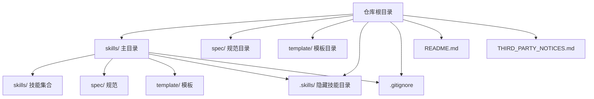
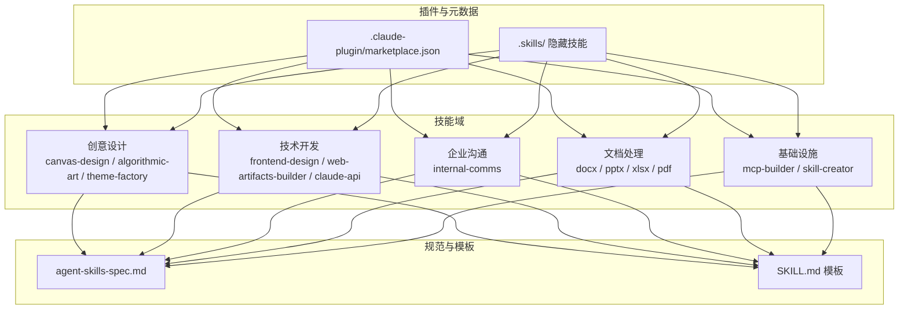
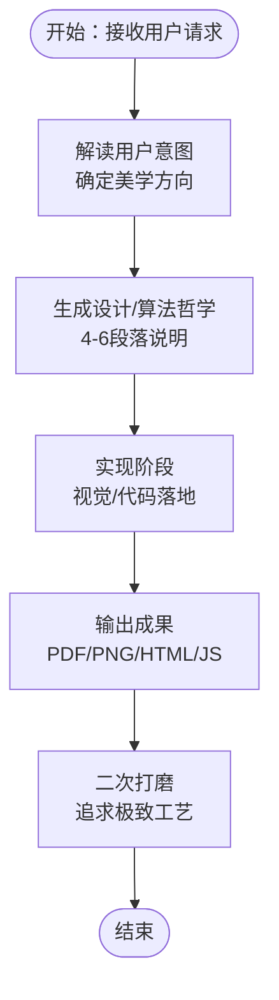
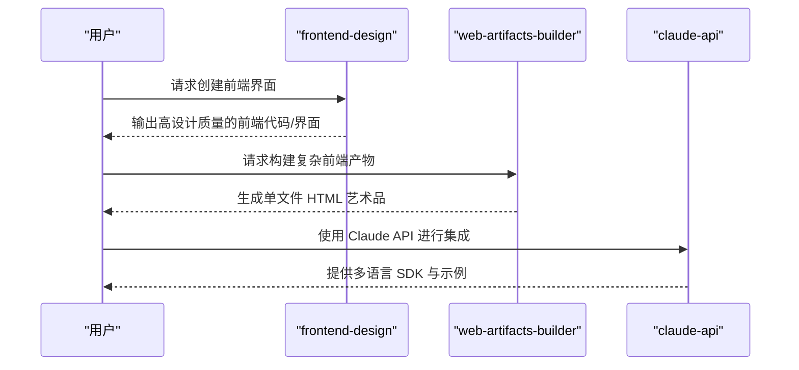
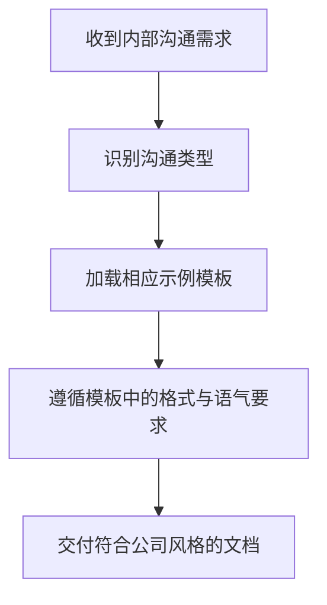
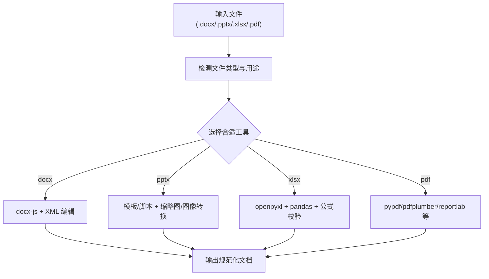
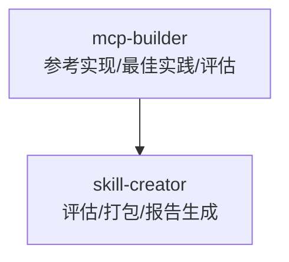
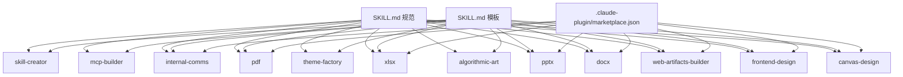

# 仓库结构概览

<cite>
**本文档引用的文件**
- [skills/spec/agent-skills-spec.md](file://skills/spec/agent-skills-spec.md)
- [skills/template/SKILL.md](file://skills/template/SKILL.md)
- [skills/.gitignore](file://skills/.gitignore)
- [skills/skills/algorithmic-art/SKILL.md](file://skills/skills/algorithmic-art/SKILL.md)
- [skills/skills/canvas-design/SKILL.md](file://skills/skills/canvas-design/SKILL.md)
- [skills/skills/frontend-design/SKILL.md](file://skills/skills/frontend-design/SKILL.md)
- [skills/skills/pptx/SKILL.md](file://skills/skills/pptx/SKILL.md)
- [skills/skills/docx/SKILL.md](file://skills/skills/docx/SKILL.md)
- [skills/skills/pdf/SKILL.md](file://skills/skills/pdf/SKILL.md)
- [skills/skills/internal-comms/SKILL.md](file://skills/skills/internal-comms/SKILL.md)
- [skills/skills/web-artifacts-builder/SKILL.md](file://skills/skills/web-artifacts-builder/SKILL.md)
- [skills/skills/xlsx/SKILL.md](file://skills/skills/xlsx/SKILL.md)
- [skills/skills/theme-factory/SKILL.md](file://skills/skills/theme-factory/SKILL.md)
</cite>

## 目录
1. [简介](#简介)
2. [项目结构](#项目结构)
3. [核心组件](#核心组件)
4. [架构总览](#架构总览)
5. [详细组件分析](#详细组件分析)
6. [依赖关系分析](#依赖关系分析)
7. [性能考虑](#性能考虑)
8. [故障排除指南](#故障排除指南)
9. [结论](#结论)
10. [附录](#附录)

## 简介
本仓库是一个面向智能体技能的组织化知识库与工具集合，旨在为不同领域的任务提供标准化、可复用的技能模块与工作流。仓库采用“技能即文档”的理念，每个技能以独立的目录形式存在，并通过统一的规范文件（如 SKILL.md）描述其职责、输入输出、实现流程与最佳实践。同时，仓库还包含规范模板、通用规范文件以及用于插件集成的元数据文件，确保技能的一致性与可扩展性。

该结构的优势在于：
- 明确的职责边界：每个技能专注于特定领域或任务类型
- 可复用的工作流：通过模板与脚本降低重复劳动
- 标准化的接口：统一的规范文件便于集成与测试
- 清晰的导航路径：按功能域分层组织，便于查找与维护

## 项目结构
仓库采用“skills/”作为主目录，内部进一步细分为多个子目录与文件，形成清晰的功能域划分与规范体系：

- skills/ 主目录
  - skills/：技能集合目录，每个技能一个子目录，包含技能说明、模板、脚本、示例与许可证等
  - spec/：技能规范文档，定义技能的通用标准与约束
  - template/：技能模板文件，提供标准化的 SKILL.md 模板
  - .gitignore：Git 忽略规则
  - README.md：仓库顶层说明（未在当前上下文中解析）
  - THIRD_PARTY_NOTICES.md：第三方声明（未在当前上下文中解析）

- .skills/（隐藏目录）
  - canvas-design/、frontend-design/、pptx/、web-artifacts-builder/：与 skills/ 中对应技能相关的补充或示例内容

**图表来源**
- [skills/spec/agent-skills-spec.md:1-4](file://skills/spec/agent-skills-spec.md#L1-L4)
- [skills/template/SKILL.md:1-7](file://skills/template/SKILL.md#L1-L7)
- [skills/.gitignore:1-6](file://skills/.gitignore#L1-L6)

**章节来源**
- [skills/spec/agent-skills-spec.md:1-4](file://skills/spec/agent-skills-spec.md#L1-L4)
- [skills/template/SKILL.md:1-7](file://skills/template/SKILL.md#L1-L7)
- [skills/.gitignore:1-6](file://skills/.gitignore#L1-L6)

## 核心组件
本仓库的核心由以下几类组件构成：

- 技能模块（skills/）
  - 创意设计类：canvas-design、algorithmic-art、theme-factory
  - 技术开发类：frontend-design、web-artifacts-builder、claude-api（多语言 SDK 示例）
  - 企业沟通类：internal-comms
  - 文档处理类：docx、pptx、xlsx、pdf
  - 基础设施类：mcp-builder（参考实现）、skill-creator（评估与打包工具）

- 规范与模板（spec/ 与 template/）
  - 通用规范：agent-skills-spec.md
  - 标准模板：SKILL.md，用于统一技能说明格式与字段

- 插件与元数据（.skills/ 与 claude 插件）
  - claude 插件市场元数据：skills/.claude-plugin/marketplace.json
  - 隐藏技能目录：.skills/ 下的示例与补充内容

这些组件共同构成了一个可扩展、可维护且易于协作的技能生态系统。

**章节来源**
- [skills/skills/canvas-design/SKILL.md:1-130](file://skills/skills/canvas-design/SKILL.md#L1-L130)
- [skills/skills/algorithmic-art/SKILL.md:1-405](file://skills/skills/algorithmic-art/SKILL.md#L1-L405)
- [skills/skills/theme-factory/SKILL.md:1-60](file://skills/skills/theme-factory/SKILL.md#L1-L60)
- [skills/skills/frontend-design/SKILL.md:1-43](file://skills/skills/frontend-design/SKILL.md#L1-L43)
- [skills/skills/web-artifacts-builder/SKILL.md:1-74](file://skills/skills/web-artifacts-builder/SKILL.md#L1-L74)
- [skills/skills/internal-comms/SKILL.md:1-33](file://skills/skills/internal-comms/SKILL.md#L1-L33)
- [skills/skills/docx/SKILL.md:1-591](file://skills/skills/docx/SKILL.md#L1-L591)
- [skills/skills/pptx/SKILL.md:1-233](file://skills/skills/pptx/SKILL.md#L1-L233)
- [skills/skills/xlsx/SKILL.md:1-292](file://skills/skills/xlsx/SKILL.md#L1-L292)
- [skills/skills/pdf/SKILL.md:1-315](file://skills/skills/pdf/SKILL.md#L1-L315)

## 架构总览
仓库采用“技能即模块”的架构模式，每个技能模块自包含说明、模板、脚本与示例，遵循统一的规范文件（SKILL.md）进行描述。技能之间通过共享的规范与模板保持一致性，同时通过插件元数据实现外部集成。

**图表来源**
- [skills/spec/agent-skills-spec.md:1-4](file://skills/spec/agent-skills-spec.md#L1-L4)
- [skills/template/SKILL.md:1-7](file://skills/template/SKILL.md#L1-L7)
- [skills/skills/canvas-design/SKILL.md:1-130](file://skills/skills/canvas-design/SKILL.md#L1-L130)
- [skills/skills/algorithmic-art/SKILL.md:1-405](file://skills/skills/algorithmic-art/SKILL.md#L1-L405)
- [skills/skills/theme-factory/SKILL.md:1-60](file://skills/skills/theme-factory/SKILL.md#L1-L60)
- [skills/skills/frontend-design/SKILL.md:1-43](file://skills/skills/frontend-design/SKILL.md#L1-L43)
- [skills/skills/web-artifacts-builder/SKILL.md:1-74](file://skills/skills/web-artifacts-builder/SKILL.md#L1-L74)
- [skills/skills/internal-comms/SKILL.md:1-33](file://skills/skills/internal-comms/SKILL.md#L1-L33)
- [skills/skills/docx/SKILL.md:1-591](file://skills/skills/docx/SKILL.md#L1-L591)
- [skills/skills/pptx/SKILL.md:1-233](file://skills/skills/pptx/SKILL.md#L1-L233)
- [skills/skills/xlsx/SKILL.md:1-292](file://skills/skills/xlsx/SKILL.md#L1-L292)
- [skills/skills/pdf/SKILL.md:1-315](file://skills/skills/pdf/SKILL.md#L1-L315)

## 详细组件分析

### 创意设计类技能
- canvas-design：指导如何基于设计哲学创作视觉作品，强调空间、色彩与构图的表达，最终输出 PDF 或 PNG 文件。
- algorithmic-art：通过 p5.js 将算法美学转化为交互式生成艺术，包含哲学构建与代码实现两步流程。
- theme-factory：提供预设主题与字体配对，支持一键应用到各类演示文稿与文档中。

**图表来源**
- [skills/skills/canvas-design/SKILL.md:1-130](file://skills/skills/canvas-design/SKILL.md#L1-L130)
- [skills/skills/algorithmic-art/SKILL.md:1-405](file://skills/skills/algorithmic-art/SKILL.md#L1-L405)
- [skills/skills/theme-factory/SKILL.md:1-60](file://skills/skills/theme-factory/SKILL.md#L1-L60)

**章节来源**
- [skills/skills/canvas-design/SKILL.md:1-130](file://skills/skills/canvas-design/SKILL.md#L1-L130)
- [skills/skills/algorithmic-art/SKILL.md:1-405](file://skills/skills/algorithmic-art/SKILL.md#L1-L405)
- [skills/skills/theme-factory/SKILL.md:1-60](file://skills/skills/theme-factory/SKILL.md#L1-L60)

### 技术开发类技能
- frontend-design：指导创建生产级前端界面，强调风格选择、排版、动效与空间布局，避免“AI 呆板”风格。
- web-artifacts-builder：使用现代前端技术栈（React、Tailwind CSS、shadcn/ui）构建复杂 HTML 前端产物，支持打包为单文件 HTML 艺术品。
- claude-api：多语言 SDK 示例（Python、TypeScript、Go、Java、C#、Ruby、PHP），涵盖批量调用、文件 API、流式响应与工具调用等场景。

**图表来源**
- [skills/skills/frontend-design/SKILL.md:1-43](file://skills/skills/frontend-design/SKILL.md#L1-L43)
- [skills/skills/web-artifacts-builder/SKILL.md:1-74](file://skills/skills/web-artifacts-builder/SKILL.md#L1-L74)
- [skills/skills/claude-api/python/README.md](file://skills/skills/claude-api/python/README.md)
- [skills/skills/claude-api/typescript/README.md](file://skills/skills/claude-api/typescript/README.md)

**章节来源**
- [skills/skills/frontend-design/SKILL.md:1-43](file://skills/skills/frontend-design/SKILL.md#L1-L43)
- [skills/skills/web-artifacts-builder/SKILL.md:1-74](file://skills/skills/web-artifacts-builder/SKILL.md#L1-L74)

### 企业沟通类技能
- internal-comms：提供多种内部沟通格式的模板与指南，包括 3P 更新、公司通讯、FAQ 回答、状态报告、领导更新、项目更新与事件报告等。

**图表来源**
- [skills/skills/internal-comms/SKILL.md:1-33](file://skills/skills/internal-comms/SKILL.md#L1-L33)

**章节来源**
- [skills/skills/internal-comms/SKILL.md:1-33](file://skills/skills/internal-comms/SKILL.md#L1-L33)

### 文档处理类技能
- docx：基于 docx-js 与 XML 编辑，支持创建、编辑、验证、转换与注释处理等全流程。
- pptx：提供读取、编辑、从零创建、缩略图生成与图像转换等工具链。
- xlsx：强调公式驱动、颜色编码与格式规范，支持金融模型与数据清洗。
- pdf：覆盖合并、拆分、文本/表格提取、OCR、水印、表单填充与加密解密等常见任务。

**图表来源**
- [skills/skills/docx/SKILL.md:1-591](file://skills/skills/docx/SKILL.md#L1-L591)
- [skills/skills/pptx/SKILL.md:1-233](file://skills/skills/pptx/SKILL.md#L1-L233)
- [skills/skills/xlsx/SKILL.md:1-292](file://skills/skills/xlsx/SKILL.md#L1-L292)
- [skills/skills/pdf/SKILL.md:1-315](file://skills/skills/pdf/SKILL.md#L1-L315)

**章节来源**
- [skills/skills/docx/SKILL.md:1-591](file://skills/skills/docx/SKILL.md#L1-L591)
- [skills/skills/pptx/SKILL.md:1-233](file://skills/skills/pptx/SKILL.md#L1-L233)
- [skills/skills/xlsx/SKILL.md:1-292](file://skills/skills/xlsx/SKILL.md#L1-L292)
- [skills/skills/pdf/SKILL.md:1-315](file://skills/skills/pdf/SKILL.md#L1-L315)

### 基础设施类技能
- mcp-builder：MCP（Model Context Protocol）服务器参考实现与最佳实践，支持评估与连接脚本。
- skill-creator：技能评估、打包与报告生成工具，包含比较器、评分器与可视化组件。

**图表来源**
- [skills/skills/mcp-builder/reference/evaluation.md](file://skills/skills/mcp-builder/reference/evaluation.md)
- [skills/skills/mcp-builder/reference/mcp_best_practices.md](file://skills/skills/mcp-builder/reference/mcp_best_practices.md)
- [skills/skills/skill-creator/scripts/package_skill.py](file://skills/skills/skill-creator/scripts/package_skill.py)
- [skills/skills/skill-creator/scripts/run_eval.py](file://skills/skills/skill-creator/scripts/run_eval.py)

**章节来源**
- [skills/skills/mcp-builder/reference/evaluation.md](file://skills/skills/mcp-builder/reference/evaluation.md)
- [skills/skills/mcp-builder/reference/mcp_best_practices.md](file://skills/skills/mcp-builder/reference/mcp_best_practices.md)
- [skills/skills/skill-creator/scripts/package_skill.py](file://skills/skills/skill-creator/scripts/package_skill.py)
- [skills/skills/skill-creator/scripts/run_eval.py](file://skills/skills/skill-creator/scripts/run_eval.py)

## 依赖关系分析
- 组件内聚性：每个技能模块内部自包含说明、模板、脚本与示例，内聚度高，职责单一。
- 组件耦合性：技能之间通过共享规范（SKILL.md）与模板（template/）耦合，避免重复实现；对外通过插件元数据（marketplace.json）进行集成。
- 外部依赖：各技能根据任务需要引入 Python、Node.js、LibreOffice、Poppler 等工具链，但均通过脚本封装，降低使用门槛。
- 循环依赖：未发现循环依赖迹象，结构清晰。

**图表来源**
- [skills/template/SKILL.md:1-7](file://skills/template/SKILL.md#L1-L7)
- [skills/skills/canvas-design/SKILL.md:1-130](file://skills/skills/canvas-design/SKILL.md#L1-L130)
- [skills/skills/algorithmic-art/SKILL.md:1-405](file://skills/skills/algorithmic-art/SKILL.md#L1-L405)
- [skills/skills/theme-factory/SKILL.md:1-60](file://skills/skills/theme-factory/SKILL.md#L1-L60)
- [skills/skills/frontend-design/SKILL.md:1-43](file://skills/skills/frontend-design/SKILL.md#L1-L43)
- [skills/skills/web-artifacts-builder/SKILL.md:1-74](file://skills/skills/web-artifacts-builder/SKILL.md#L1-L74)
- [skills/skills/docx/SKILL.md:1-591](file://skills/skills/docx/SKILL.md#L1-L591)
- [skills/skills/pptx/SKILL.md:1-233](file://skills/skills/pptx/SKILL.md#L1-L233)
- [skills/skills/xlsx/SKILL.md:1-292](file://skills/skills/xlsx/SKILL.md#L1-L292)
- [skills/skills/pdf/SKILL.md:1-315](file://skills/skills/pdf/SKILL.md#L1-L315)
- [skills/skills/internal-comms/SKILL.md:1-33](file://skills/skills/internal-comms/SKILL.md#L1-L33)
- [skills/skills/mcp-builder/reference/evaluation.md](file://skills/skills/mcp-builder/reference/evaluation.md)
- [skills/skills/skill-creator/scripts/package_skill.py](file://skills/skills/skill-creator/scripts/package_skill.py)

**章节来源**
- [skills/template/SKILL.md:1-7](file://skills/template/SKILL.md#L1-L7)

## 性能考虑
- 工具链优化：优先使用成熟的命令行工具（如 pypdf、pdfplumber、LibreOffice、Poppler）与轻量级脚本，减少不必要的中间步骤。
- 批处理与增量更新：对于大型文档或演示文稿，采用分页/分片处理与增量更新策略，避免全量重算。
- 内存与并发：在 Python 脚本中合理设置读写缓冲区大小与并发参数，避免内存峰值过高。
- 缓存与复用：对重复使用的模板、字体与主题进行缓存，减少 I/O 开销。

## 故障排除指南
- 规范一致性检查
  - 确保每个技能模块包含 SKILL.md，并填写 name、description、license 等字段。
  - 遵循 template/SKILL.md 的模板格式，保证说明结构一致。
- 常见问题定位
  - 文档处理：使用 scripts/office/validate.py 对 docx 进行验证；使用 scripts/recalc.py 校验 xlsx 公式。
  - 幻灯片质量：使用 thumbnail.py 生成缩略图网格，结合 QA 步骤进行视觉检查。
  - PDF 处理：使用 pdftoppm 导出图像进行人工审阅，定位错位、溢出与对比度问题。
- 版本与兼容性
  - 确认 Python 与 Node.js 版本满足脚本要求；LibreOffice 与 Poppler 在 CI 环境中自动配置。
  - 对于第三方依赖（如 docx、pypdf、pdfplumber），定期更新至稳定版本以获得更好的兼容性。

**章节来源**
- [skills/template/SKILL.md:1-7](file://skills/template/SKILL.md#L1-L7)
- [skills/skills/docx/SKILL.md:1-591](file://skills/skills/docx/SKILL.md#L1-L591)
- [skills/skills/pptx/SKILL.md:1-233](file://skills/skills/pptx/SKILL.md#L1-L233)
- [skills/skills/xlsx/SKILL.md:1-292](file://skills/skills/xlsx/SKILL.md#L1-L292)
- [skills/skills/pdf/SKILL.md:1-315](file://skills/skills/pdf/SKILL.md#L1-L315)

## 结论
本仓库通过“技能即模块”的组织方式，实现了跨领域的技能标准化与可复用化。统一的规范与模板确保了技能的一致性，而丰富的工具链与脚本则降低了使用门槛。建议在新增技能时严格遵循 SKILL.md 模板与 agent-skills-spec.md 的规范，以便于后续维护与集成。

## 附录
- 仓库导航指南
  - 快速定位：根据任务类型选择对应技能目录（如创意设计、技术开发、企业沟通、文档处理）。
  - 规范入口：所有技能均应参照 template/SKILL.md 与 skills/spec/agent-skills-spec.md。
  - 插件集成：通过 .skills/ 与 claude 插件元数据实现外部系统对接。
  - 质量保障：利用各技能内置的 QA 流程与脚本进行验证与修复。