# 使用场景与价值

<cite>
**本文引用的文件**
- [skills/README.md](file://skills/README.md)
- [skills/template/SKILL.md](file://skills/template/SKILL.md)
- [skills/spec/agent-skills-spec.md](file://skills/spec/agent-skills-spec.md)
- [skills/skills/algorithmic-art/SKILL.md](file://skills/skills/algorithmic-art/SKILL.md)
- [skills/skills/canvas-design/SKILL.md](file://skills/skills/canvas-design/SKILL.md)
- [skills/skills/frontend-design/SKILL.md](file://skills/skills/frontend-design/SKILL.md)
- [skills/skills/web-artifacts-builder/SKILL.md](file://skills/skills/web-artifacts-builder/SKILL.md)
- [skills/skills/webapp-testing/SKILL.md](file://skills/skills/webapp-testing/SKILL.md)
- [skills/skills/internal-comms/SKILL.md](file://skills/skills/internal-comms/SKILL.md)
- [skills/skills/brand-guidelines/SKILL.md](file://skills/skills/brand-guidelines/SKILL.md)
- [skills/skills/mcp-builder/SKILL.md](file://skills/skills/mcp-builder/SKILL.md)
- [skills/skills/skill-creator/SKILL.md](file://skills/skills/skill-creator/SKILL.md)
- [skills/skills/theme-factory/SKILL.md](file://skills/skills/theme-factory/SKILL.md)
- [skills/skills/slack-gif-creator/SKILL.md](file://skills/skills/slack-gif-creator/SKILL.md)
- [skills/skills/doc-coauthoring/SKILL.md](file://skills/skills/doc-coauthoring/SKILL.md)
- [skills/skills/claude-api/SKILL.md](file://skills/skills/claude-api/SKILL.md)
</cite>

## 目录
1. [引言](#引言)
2. [项目结构](#项目结构)
3. [核心组件](#核心组件)
4. [架构总览](#架构总览)
5. [详细组件分析](#详细组件分析)
6. [依赖关系分析](#依赖关系分析)
7. [性能考量](#性能考量)
8. [故障排查指南](#故障排查指南)
9. [结论](#结论)
10. [附录](#附录)

## 引言
本文件聚焦“技能系统”的使用场景与价值，结合仓库中已实现的技能清单，系统阐述技能如何在创意应用（艺术、音乐、设计）、技术任务（Web 应用测试、MCP 服务器生成）、企业工作流程（沟通、品牌）等领域落地，帮助用户理解何时以及如何使用技能，从而提升 Claude 在个人与企业场景中的实用性与专业度。

## 项目结构
该仓库以“技能”为最小可执行单元，每个技能自包含指令、脚本与资源，通过统一的元数据规范驱动 Claude 动态加载与执行。技能按领域分组，覆盖从创意到工程再到企业协作的广泛需求。

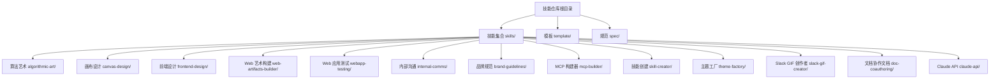

图表来源
- [skills/README.md:24-27](file://skills/README.md#L24-L27)
- [skills/skills/algorithmic-art/SKILL.md:1-12](file://skills/skills/algorithmic-art/SKILL.md#L1-L12)
- [skills/skills/canvas-design/SKILL.md:1-12](file://skills/skills/canvas-design/SKILL.md#L1-L12)
- [skills/skills/frontend-design/SKILL.md:1-6](file://skills/skills/frontend-design/SKILL.md#L1-L6)
- [skills/skills/web-artifacts-builder/SKILL.md:1-16](file://skills/skills/web-artifacts-builder/SKILL.md#L1-L16)
- [skills/skills/webapp-testing/SKILL.md:1-7](file://skills/skills/webapp-testing/SKILL.md#L1-L7)
- [skills/skills/internal-comms/SKILL.md:1-6](file://skills/skills/internal-comms/SKILL.md#L1-L6)
- [skills/skills/brand-guidelines/SKILL.md:1-6](file://skills/skills/brand-guidelines/SKILL.md#L1-L6)
- [skills/skills/mcp-builder/SKILL.md:1-11](file://skills/skills/mcp-builder/SKILL.md#L1-L11)
- [skills/skills/skill-creator/SKILL.md:1-8](file://skills/skills/skill-creator/SKILL.md#L1-L8)
- [skills/skills/theme-factory/SKILL.md:1-10](file://skills/skills/theme-factory/SKILL.md#L1-L10)
- [skills/skills/slack-gif-creator/SKILL.md:1-7](file://skills/skills/slack-gif-creator/SKILL.md#L1-L7)
- [skills/skills/doc-coauthoring/SKILL.md:1-8](file://skills/skills/doc-coauthoring/SKILL.md#L1-L8)
- [skills/skills/claude-api/SKILL.md:1-5](file://skills/skills/claude-api/SKILL.md#L1-L5)

章节来源
- [skills/README.md:12-27](file://skills/README.md#L12-L27)

## 核心组件
- 技能元数据与触发：每个技能以 SKILL.md 元数据驱动触发，描述名称、用途与触发条件，确保 Claude 在合适时机调用。
- 领域化能力矩阵：涵盖创意（算法艺术、画布设计、GIF）、技术（Web 测试、MCP 服务器、前端构建）、企业（内部沟通、品牌、主题工厂、文档协作文档）与开发者工具（Claude API）。
- 可复用脚本与资源：多数技能包含脚本与参考材料，便于在具体任务中直接调用，降低重复劳动。

章节来源
- [skills/template/SKILL.md:1-7](file://skills/template/SKILL.md#L1-L7)
- [skills/README.md:14-18](file://skills/README.md#L14-L18)

## 架构总览
技能系统通过“元数据 + 指令 + 资源/脚本”的组合，形成可动态加载的能力模块。用户在对话中提出任务时，Claude 基于技能描述进行意图识别与路由，再按技能内的步骤与约束执行，最终输出可交互或可交付的结果。

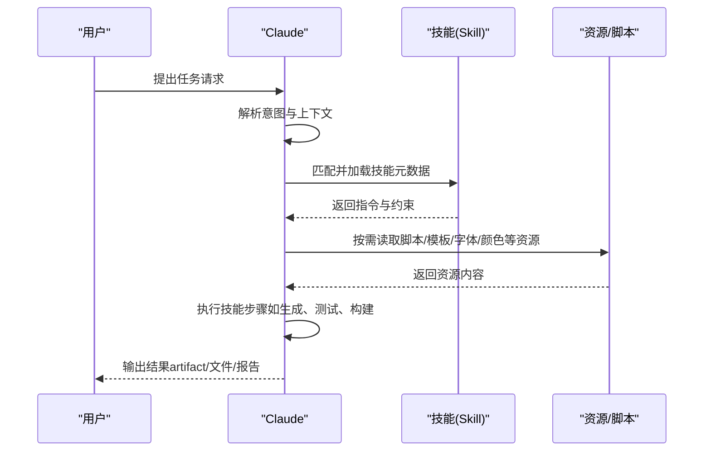

图表来源
- [skills/skills/skill-creator/SKILL.md:10-21](file://skills/skills/skill-creator/SKILL.md#L10-L21)
- [skills/skills/webapp-testing/SKILL.md:9-14](file://skills/skills/webapp-testing/SKILL.md#L9-L14)
- [skills/skills/web-artifacts-builder/SKILL.md:9-16](file://skills/skills/web-artifacts-builder/SKILL.md#L9-L16)

## 详细组件分析

### 创意应用

#### 算法艺术（algorithmic-art）
- 场景价值：将“计算美学”转化为可探索的交互式生成艺术，支持哲学沉淀与参数化表达，避免版权风险。
- 关键流程：先产出算法美学理念（哲学），再以 p5.js 实现为可交互 HTML 艺术品；强调“过程重于产物”，参数化控制与可重现种子。
- 适用对象：设计师、艺术家、创意工程师；适合需要“可探索的算法装置”的演示与展示。
- 预期效果：产出单文件可运行 HTML 艺术品，内置种子导航与参数面板，便于二次创作与分享。

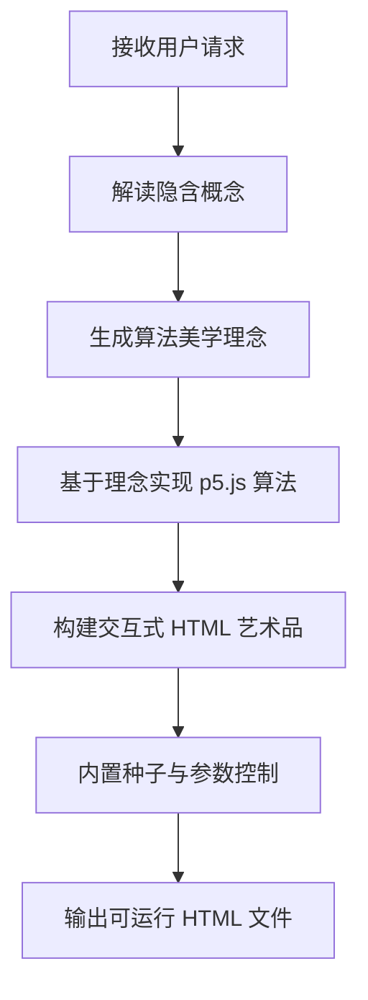

图表来源
- [skills/skills/algorithmic-art/SKILL.md:90-127](file://skills/skills/algorithmic-art/SKILL.md#L90-L127)
- [skills/skills/algorithmic-art/SKILL.md:221-356](file://skills/skills/algorithmic-art/SKILL.md#L221-L356)

章节来源
- [skills/skills/algorithmic-art/SKILL.md:1-12](file://skills/skills/algorithmic-art/SKILL.md#L1-L12)
- [skills/skills/algorithmic-art/SKILL.md:133-218](file://skills/skills/algorithmic-art/SKILL.md#L133-L218)

#### 画布设计（canvas-design）
- 场景价值：将“视觉运动”转化为高完成度的静态作品，强调空间、色彩与极简文字，避免复制他人风格。
- 关键流程：先产出视觉哲学（理念），再在画布上以 PDF/PNG 表达，注重排版、留白与字体选择。
- 适用对象：品牌/美术团队、内容创作者；适合海报、视觉识别、展览类作品。
- 预期效果：单页或多页 PDF 或 PNG，体现“专家级手工质感”。

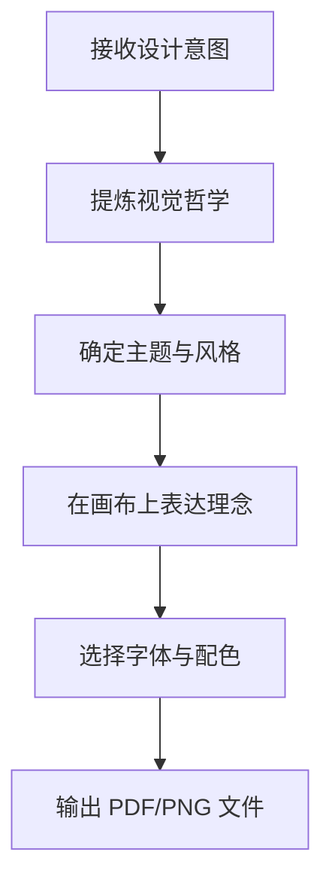

图表来源
- [skills/skills/canvas-design/SKILL.md:15-116](file://skills/skills/canvas-design/SKILL.md#L15-L116)

章节来源
- [skills/skills/canvas-design/SKILL.md:1-12](file://skills/skills/canvas-design/SKILL.md#L1-L12)

#### Slack GIF 创作者（slack-gif-creator）
- 场景价值：针对 Slack 平台的动图尺寸、帧率、色彩数量等约束，提供优化策略与动画概念，保证体积与质量平衡。
- 关键流程：根据用户输入生成帧序列，应用抖动、脉冲、弹跳、旋转、淡入淡出等动画概念，最终导出符合 Slack 要求的 GIF。
- 适用对象：产品/运营团队、社区运营；适合表情包、动效示意、快速传播素材。
- 预期效果：小体积、高辨识度的动图，满足平台限制与传播需求。

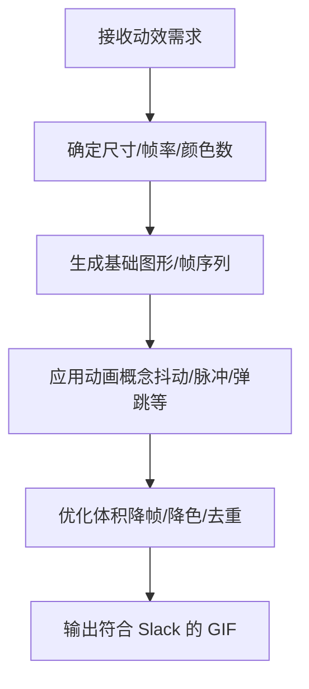

图表来源
- [skills/skills/slack-gif-creator/SKILL.md:11-232](file://skills/skills/slack-gif-creator/SKILL.md#L11-L232)

章节来源
- [skills/skills/slack-gif-creator/SKILL.md:1-7](file://skills/skills/slack-gif-creator/SKILL.md#L1-L7)

### 技术任务

#### Web 应用测试（webapp-testing）
- 场景价值：自动化验证前端功能、调试 UI 行为、截图与日志采集，降低回归成本。
- 关键流程：静态 HTML 直接解析；动态应用先启动服务，再进行侦察与动作执行；强调等待网络空闲后再检查 DOM。
- 适用对象：前端/测试工程师；适合本地开发联调、CI 集成。
- 预期效果：稳定可重复的自动化脚本，输出截图与日志，便于问题定位。

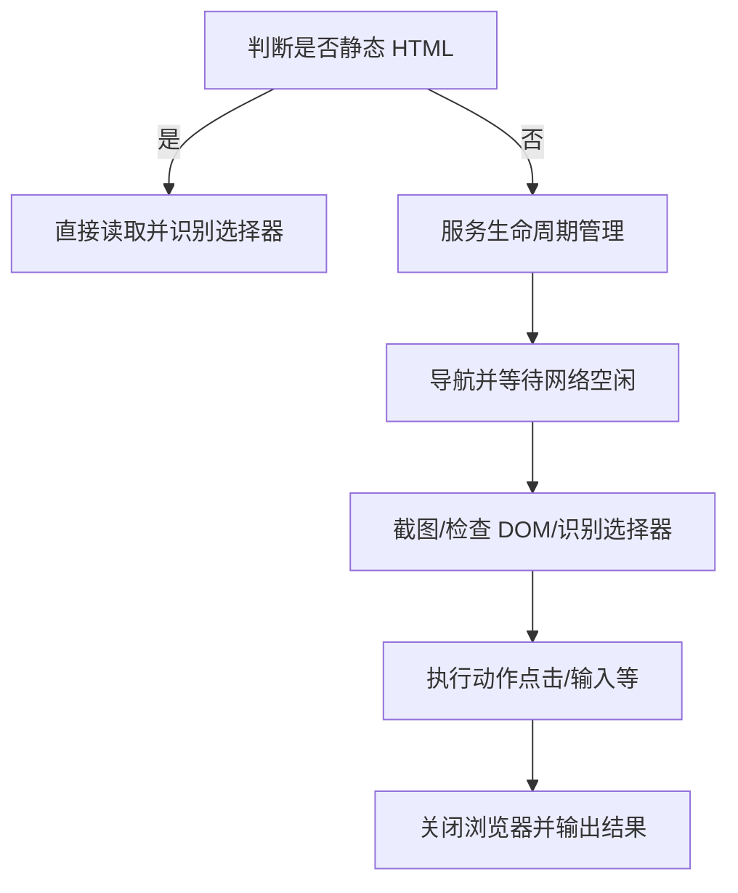

图表来源
- [skills/skills/webapp-testing/SKILL.md:16-33](file://skills/skills/webapp-testing/SKILL.md#L16-L33)
- [skills/skills/webapp-testing/SKILL.md:65-81](file://skills/skills/webapp-testing/SKILL.md#L65-L81)

章节来源
- [skills/skills/webapp-testing/SKILL.md:1-7](file://skills/skills/webapp-testing/SKILL.md#L1-L7)

#### Web 艺术构建器（web-artifacts-builder）
- 场景价值：使用现代前端技术栈（React/Tailwind/shadcn/ui）构建复杂可交互 artifact，打包为单文件 HTML，便于分享与演示。
- 关键流程：初始化项目 → 开发 artifact → 打包为单文件 HTML → 分享 artifact。
- 适用对象：前端/全栈工程师、产品经理；适合仪表盘、交互式演示、原型展示。
- 预期效果：即开即用的单文件 artifact，内嵌所有资源与依赖。

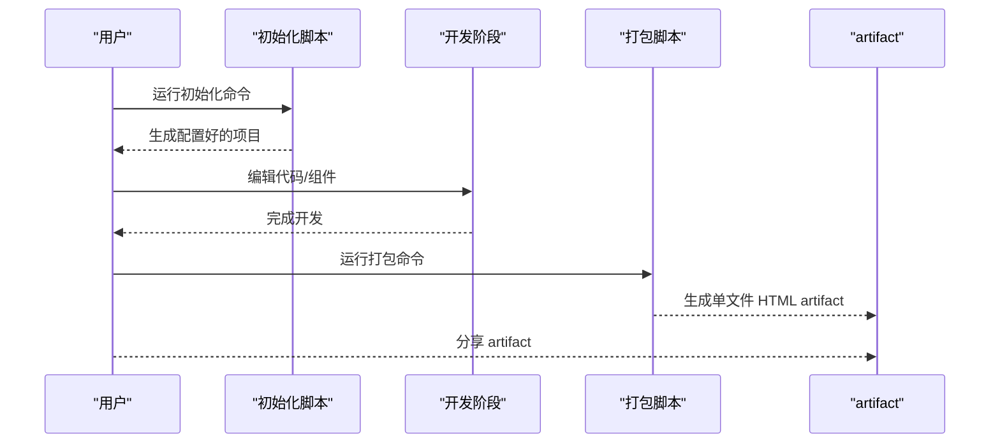

图表来源
- [skills/skills/web-artifacts-builder/SKILL.md:9-74](file://skills/skills/web-artifacts-builder/SKILL.md#L9-L74)

章节来源
- [skills/skills/web-artifacts-builder/SKILL.md:1-16](file://skills/skills/web-artifacts-builder/SKILL.md#L1-L16)

#### MCP 服务器构建器（mcp-builder）
- 场景价值：为 LLM 构建与外部服务交互的工具层，平衡 API 覆盖与工作流工具，提升真实世界任务的完成度。
- 关键流程：研究协议与框架 → 规划实现 → 设计工具命名与描述 → 实现工具与错误处理 → 评估与测试。
- 适用对象：平台工程师、集成工程师；适合对接第三方 API、构建可组合工具集。
- 预期效果：高质量 MCP 服务器，具备清晰工具命名、结构化输出与可验证评估。

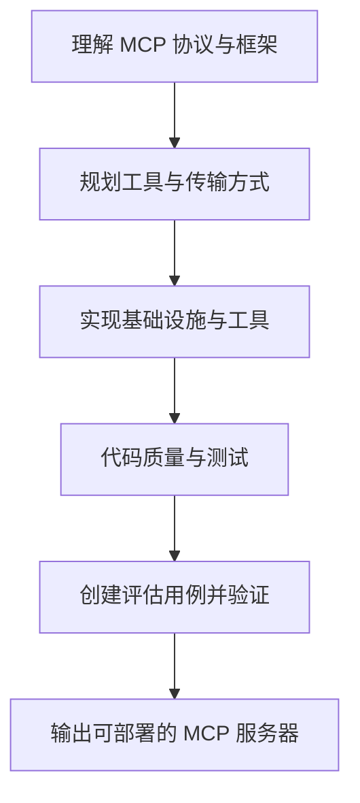

图表来源
- [skills/skills/mcp-builder/SKILL.md:15-76](file://skills/skills/mcp-builder/SKILL.md#L15-L76)
- [skills/skills/mcp-builder/SKILL.md:151-237](file://skills/skills/mcp-builder/SKILL.md#L151-L237)

章节来源
- [skills/skills/mcp-builder/SKILL.md:1-11](file://skills/skills/mcp-builder/SKILL.md#L1-L11)

#### Claude API（claude-api）
- 场景价值：指导如何正确选择 API 层级（单次调用、工作流、Agent）、模型与思考模式，避免常见坑。
- 关键流程：语言检测 → 选择表面（Messages/Agent SDK）→ 读取对应文档 → 实施（工具调用/流式/批处理/文件）。
- 适用对象：开发者；适合构建 LLM 应用、集成工具与自动化流程。
- 预期效果：高效、安全、可维护的应用集成方案。

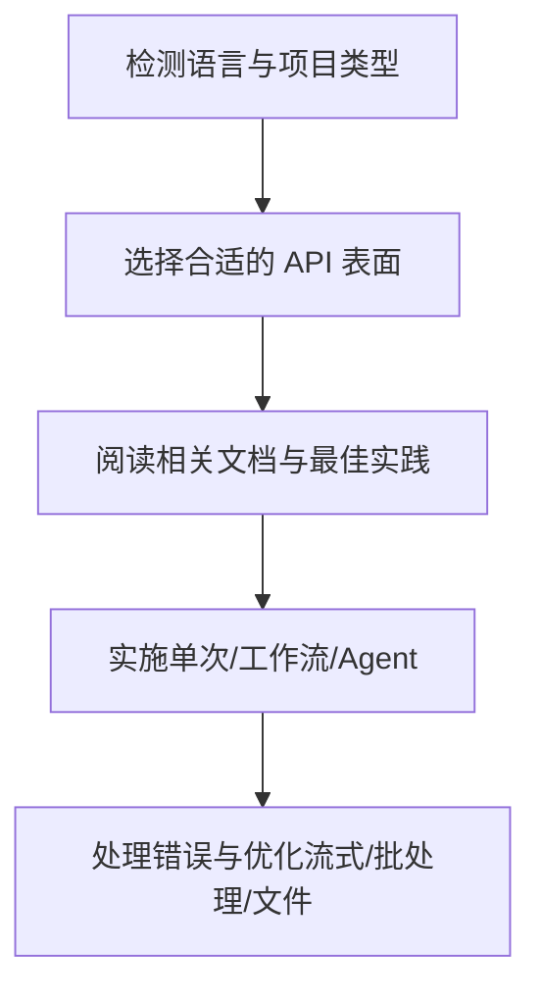

图表来源
- [skills/skills/claude-api/SKILL.md:19-51](file://skills/skills/claude-api/SKILL.md#L19-L51)
- [skills/skills/claude-api/SKILL.md:68-104](file://skills/skills/claude-api/SKILL.md#L68-L104)
- [skills/skills/claude-api/SKILL.md:171-212](file://skills/skills/claude-api/SKILL.md#L171-L212)

章节来源
- [skills/skills/claude-api/SKILL.md:1-5](file://skills/skills/claude-api/SKILL.md#L1-L5)

### 企业工作流程

#### 内部沟通（internal-comms）
- 场景价值：标准化内部沟通格式（3P 更新、公司通讯、FAQ、状态报告、领导更新、项目更新、事件报告），提升信息一致性与可读性。
- 关键流程：识别沟通类型 → 加载相应示例 → 按格式与语气要求撰写 → 输出成品。
- 适用对象：管理者、HR、项目经理；适合周报/月报、跨部门同步、公告发布。
- 预期效果：结构清晰、语气一致、易于审阅与归档的内部文档。

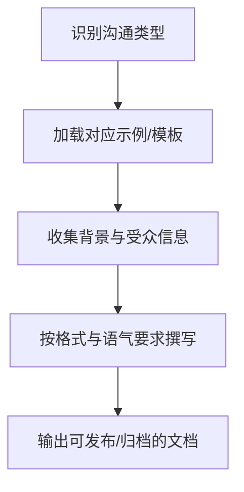

图表来源
- [skills/skills/internal-comms/SKILL.md:7-33](file://skills/skills/internal-comms/SKILL.md#L7-L33)

章节来源
- [skills/skills/internal-comms/SKILL.md:1-6](file://skills/skills/internal-comms/SKILL.md#L1-L6)

#### 品牌规范（brand-guidelines）
- 场景价值：统一视觉语言，确保输出物符合公司品牌色与字体规范，提升专业度与一致性。
- 关键流程：加载官方品牌资源 → 应用主色/辅色 → 字体智能映射 → 形状与强调色循环。
- 适用对象：市场/设计团队；适合报告、PPT、网页、物料。
- 预期效果：符合品牌调性的视觉呈现，自动适配深浅主题与可读性。

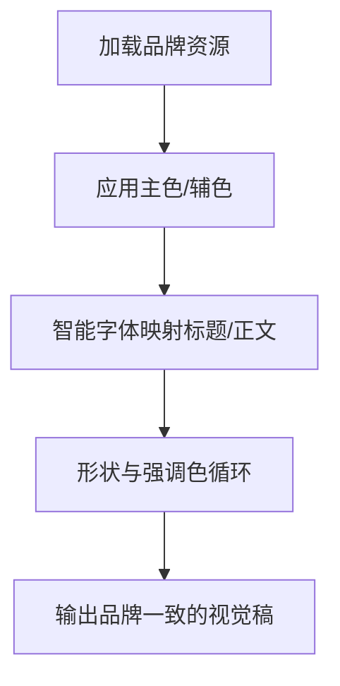

图表来源
- [skills/skills/brand-guidelines/SKILL.md:7-74](file://skills/skills/brand-guidelines/SKILL.md#L7-L74)

章节来源
- [skills/skills/brand-guidelines/SKILL.md:1-6](file://skills/skills/brand-guidelines/SKILL.md#L1-L6)

#### 主题工厂（theme-factory）
- 场景价值：为幻灯片、报告、网页等提供专业主题，一键应用色彩与字体组合，提升演示一致性。
- 关键流程：展示主题合集 → 用户选择 → 应用主题到目标 artifact → 保持对比度与可读性。
- 适用对象：演讲者、培训师、内容创作者；适合会议演示、课程讲义。
- 预期效果：统一风格的演示稿，突出重点、易于阅读。

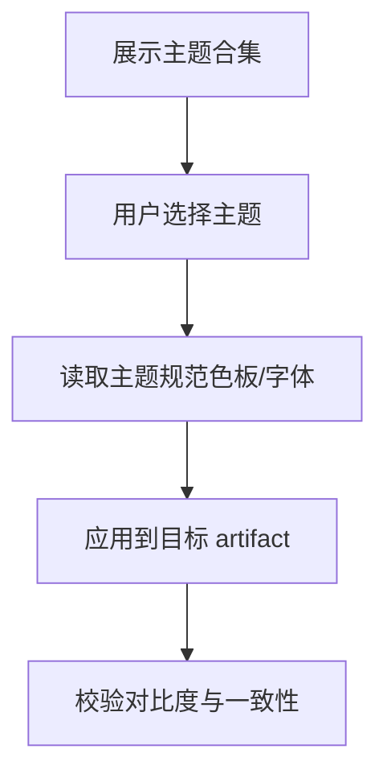

图表来源
- [skills/skills/theme-factory/SKILL.md:19-60](file://skills/skills/theme-factory/SKILL.md#L19-L60)

章节来源
- [skills/skills/theme-factory/SKILL.md:1-10](file://skills/skills/theme-factory/SKILL.md#L1-L10)

#### 文档协作文档（doc-coauthoring）
- 场景价值：结构化协作写文档，从背景收集到迭代打磨再到读者测试，确保文档对读者有效。
- 关键流程：背景收集 → 结构与草稿 → 多轮精炼 → 读者测试（子代理或手动）。
- 适用对象：技术作者、产品经理、架构师；适合设计文档、决策记录、技术规范。
- 预期效果：逻辑清晰、前后一致、无歧义的高质量文档。

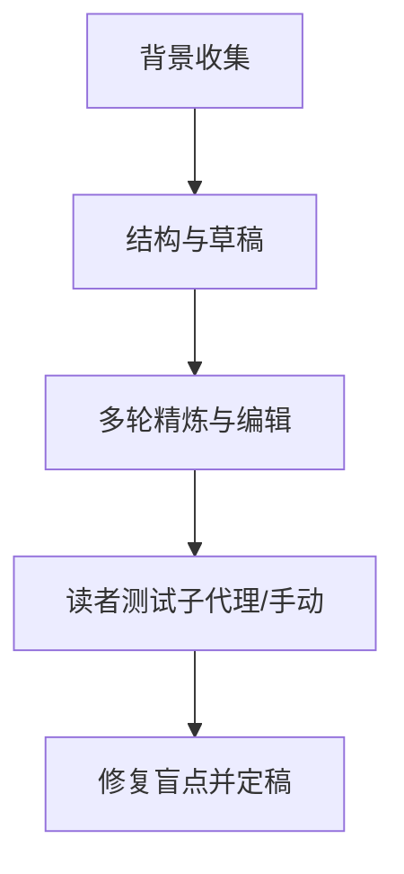

图表来源
- [skills/skills/doc-coauthoring/SKILL.md:8-27](file://skills/skills/doc-coauthoring/SKILL.md#L8-L27)
- [skills/skills/doc-coauthoring/SKILL.md:242-327](file://skills/skills/doc-coauthoring/SKILL.md#L242-L327)

章节来源
- [skills/skills/doc-coauthoring/SKILL.md:1-8](file://skills/skills/doc-coauthoring/SKILL.md#L1-L8)

#### 技能创建（skill-creator）
- 场景价值：从零到一创建/优化技能，包含测试用例设计、基准评估、可视化评审与描述优化，确保技能可用且易触发。
- 关键流程：捕获意图 → 写草稿 → 设计测试 → 评测与迭代 → 描述优化 → 打包发布。
- 适用对象：技能作者、产品/工程负责人；适合定制化工作流与团队知识沉淀。
- 预期效果：高触发准确率、可验证的技能，具备可扩展的评估体系。

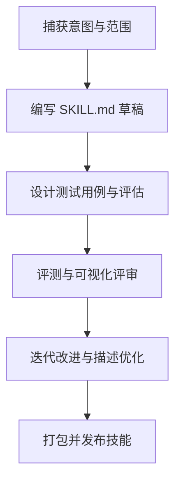

图表来源
- [skills/skills/skill-creator/SKILL.md:10-31](file://skills/skills/skill-creator/SKILL.md#L10-L31)
- [skills/skills/skill-creator/SKILL.md:333-405](file://skills/skills/skill-creator/SKILL.md#L333-L405)

章节来源
- [skills/skills/skill-creator/SKILL.md:1-8](file://skills/skills/skill-creator/SKILL.md#L1-L8)

## 依赖关系分析
- 技能间耦合：多数技能为自包含单元，彼此低耦合；部分技能（如前端构建、测试）依赖通用脚手架与打包工具链。
- 外部依赖：Web 艺术构建器依赖现代前端生态（React/Tailwind/shadcn/ui）；Web 应用测试依赖 Playwright；品牌与主题工厂依赖字体与配色规范；Claude API 技能依赖官方 SDK 与模型版本。
- 触发机制：技能通过 SKILL.md 中的描述字段决定是否被 Claude 触发，描述越具体、覆盖越全面，触发命中率越高。

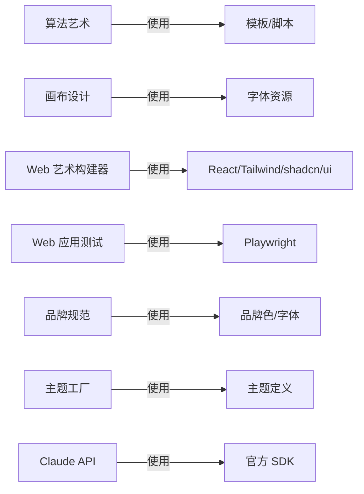

图表来源
- [skills/skills/algorithmic-art/SKILL.md:386-405](file://skills/skills/algorithmic-art/SKILL.md#L386-L405)
- [skills/skills/canvas-design/SKILL.md:108-111](file://skills/skills/canvas-design/SKILL.md#L108-L111)
- [skills/skills/web-artifacts-builder/SKILL.md:16](file://skills/skills/web-artifacts-builder/SKILL.md#L16)
- [skills/skills/webapp-testing/SKILL.md:9-14](file://skills/skills/webapp-testing/SKILL.md#L9-L14)
- [skills/skills/brand-guidelines/SKILL.md:62-74](file://skills/skills/brand-guidelines/SKILL.md#L62-L74)
- [skills/skills/theme-factory/SKILL.md:43-56](file://skills/skills/theme-factory/SKILL.md#L43-L56)
- [skills/skills/claude-api/SKILL.md:19-51](file://skills/skills/claude-api/SKILL.md#L19-L51)

章节来源
- [skills/README.md:14-18](file://skills/README.md#L14-L18)

## 性能考量
- 触发准确性：技能描述应覆盖典型触发语句与边界情况，减少误触发与漏触发。
- 上下文窗口与成本：在长对话中合理使用流式响应与结构化输出，避免超限与重复计算。
- 工具链效率：前端构建采用打包内联策略，减少运行时依赖；测试前等待网络空闲，避免无效重试。
- 评估与迭代：通过基准与可视化评审持续优化技能质量，降低人工回滚成本。

## 故障排查指南
- 触发不生效
  - 检查技能描述是否明确覆盖用户可能的表述；必要时使用“描述优化”流程。
  - 参考触发机制说明，确保任务复杂度足以促使 Claude 调用技能。
- 输出不符合预期
  - 对照技能步骤与约束，确认是否遗漏关键环节（如种子/参数/字体/颜色）。
  - 使用评估用例验证，定位失败项并迭代改进。
- 性能问题
  - Web 艺术构建器：优先使用打包后的单文件 artifact，减少加载时间。
  - Web 应用测试：先等待网络空闲再检查 DOM，避免因页面未渲染导致的失败。
- 品牌/主题不一致
  - 明确品牌规范与主题定义，确保应用顺序与对比度校验。

章节来源
- [skills/skills/skill-creator/SKILL.md:396-401](file://skills/skills/skill-creator/SKILL.md#L396-L401)
- [skills/skills/webapp-testing/SKILL.md:78-82](file://skills/skills/webapp-testing/SKILL.md#L78-L82)
- [skills/skills/web-artifacts-builder/SKILL.md:56-61](file://skills/skills/web-artifacts-builder/SKILL.md#L56-L61)
- [skills/skills/brand-guidelines/SKILL.md:69-74](file://skills/skills/brand-guidelines/SKILL.md#L69-L74)

## 结论
技能系统通过“可触发、可执行、可评估”的能力模块，将创意、技术与企业工作流整合到统一的协作范式中。对于个人用户，技能提供即开即用的专业工具与创作框架；对于企业用户，技能支撑标准化沟通、品牌一致性与工程化交付。建议在实际使用中：
- 明确触发条件与输出格式，提升技能命中率；
- 以评估与评审闭环持续优化技能质量；
- 结合团队规范与品牌资产，统一风格与体验。

## 附录
- Agent Skills 规范：参见规范库地址，了解标准与最佳实践。
- 技能模板：基于模板快速创建新技能，遵循三段式加载与资源组织原则。

章节来源
- [skills/spec/agent-skills-spec.md:1-4](file://skills/spec/agent-skills-spec.md#L1-L4)
- [skills/template/SKILL.md:1-7](file://skills/template/SKILL.md#L1-L7)