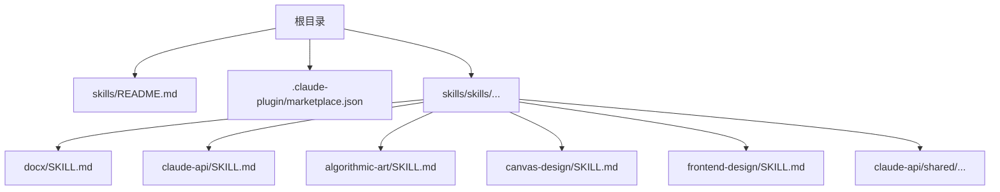
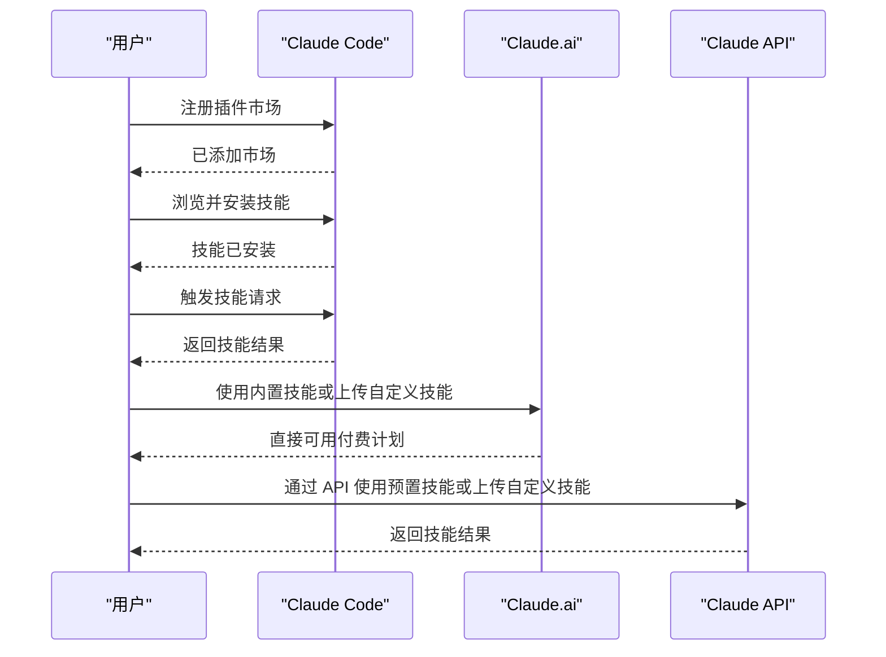
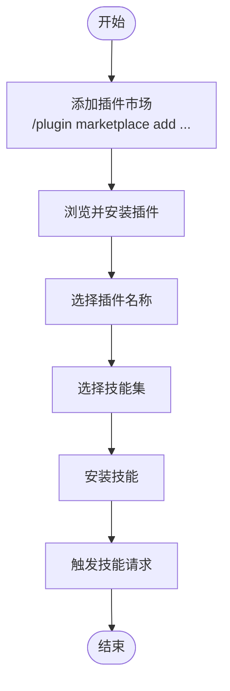
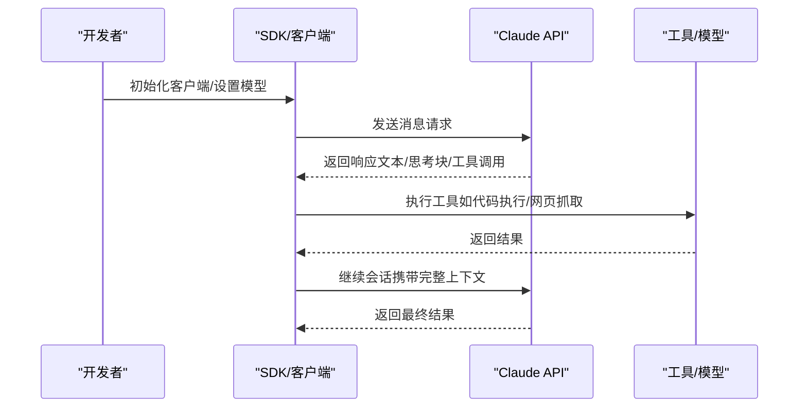
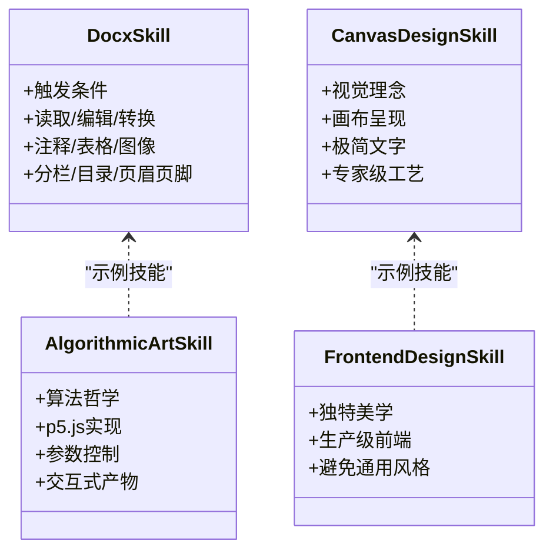
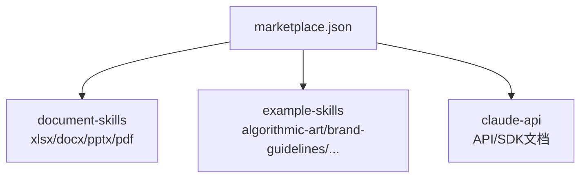

# 安装与设置

<cite>
**本文引用的文件**
- [skills/README.md](file://skills/README.md)
- [.claude-plugin/marketplace.json](file://skills/.claude-plugin/marketplace.json)
- [skills/skills/docx/SKILL.md](file://skills/skills/docx/SKILL.md)
- [skills/skills/claude-api/SKILL.md](file://skills/skills/claude-api/SKILL.md)
- [skills/skills/algorithmic-art/SKILL.md](file://skills/skills/algorithmic-art/SKILL.md)
- [skills/skills/canvas-design/SKILL.md](file://skills/skills/canvas-design/SKILL.md)
- [skills/skills/frontend-design/SKILL.md](file://skills/skills/frontend-design/SKILL.md)
- [skills/skills/claude-api/python/claude-api/README.md](file://skills/skills/claude-api/python/claude-api/README.md)
- [skills/skills/claude-api/typescript/claude-api/README.md](file://skills/skills/claude-api/typescript/claude-api/README.md)
- [skills/skills/claude-api/shared/models.md](file://skills/skills/claude-api/shared/models.md)
- [skills/skills/claude-api/shared/tool-use-concepts.md](file://skills/skills/claude-api/shared/tool-use-concepts.md)
- [skills/skills/claude-api/shared/live-sources.md](file://skills/skills/claude-api/shared/live-sources.md)
</cite>

## 目录
1. [简介](#简介)
2. [项目结构](#项目结构)
3. [核心组件](#核心组件)
4. [架构总览](#架构总览)
5. [详细组件分析](#详细组件分析)
6. [依赖关系分析](#依赖关系分析)
7. [性能考虑](#性能考虑)
8. [故障排除指南](#故障排除指南)
9. [结论](#结论)
10. [附录](#附录)

## 简介
本指南面向希望在 Claude Code、Claude.ai 以及 Claude API 中安装与使用“技能（Skills）”的用户。技能是可动态加载的任务专用知识包，包含说明、脚本与资源，帮助 Claude 在特定任务上更高效、可重复地完成工作。本仓库提供了技能集合与示例，涵盖创意设计、前端开发、算法艺术、文档处理、企业沟通、MCP 构建、Web 测试、PDF/DOCX/PPTX/XLSX 处理、以及 Claude API 的使用文档。

## 项目结构
该仓库采用“技能集合 + 插件市场定义 + 平台使用说明”的组织方式：
- 根目录下的 skills/README.md 提供平台使用入口与基本说明
- skills/.claude-plugin/marketplace.json 定义了插件市场与技能集合
- skills/skills 下包含各类技能的 SKILL.md 与配套脚本/模板
- skills/skills/claude-api/shared 提供模型、工具使用、实时文档等共享知识

图表来源
- [skills/README.md:29-59](file://skills/README.md#L29-L59)
- [.claude-plugin/marketplace.json:11-54](file://skills/.claude-plugin/marketplace.json#L11-L54)

章节来源
- [skills/README.md:29-59](file://skills/README.md#L29-L59)
- [.claude-plugin/marketplace.json:11-54](file://skills/.claude-plugin/marketplace.json#L11-L54)

## 核心组件
- 插件市场与技能集合：通过 marketplace.json 将多个技能打包为插件，便于在 Claude Code 中注册与安装
- 技能说明与用法：每个技能以 SKILL.md 形式提供触发条件、使用场景、最佳实践与参考示例
- API 使用指南：针对 Claude API 的语言特定文档，覆盖客户端初始化、消息请求、缓存、思考模式、错误处理、成本优化等
- 共享知识：模型列表、工具使用概念、实时文档源等，用于补充与校正

章节来源
- [.claude-plugin/marketplace.json:11-54](file://skills/.claude-plugin/marketplace.json#L11-L54)
- [skills/skills/docx/SKILL.md:1-591](file://skills/skills/docx/SKILL.md#L1-L591)
- [skills/skills/claude-api/SKILL.md:1-244](file://skills/skills/claude-api/SKILL.md#L1-L244)
- [skills/skills/claude-api/python/claude-api/README.md:1-405](file://skills/skills/claude-api/python/claude-api/README.md#L1-L405)
- [skills/skills/claude-api/typescript/claude-api/README.md:1-314](file://skills/skills/claude-api/typescript/claude-api/README.md#L1-L314)
- [skills/skills/claude-api/shared/models.md:1-69](file://skills/skills/claude-api/shared/models.md#L1-L69)
- [skills/skills/claude-api/shared/tool-use-concepts.md:1-306](file://skills/skills/claude-api/shared/tool-use-concepts.md#L1-L306)
- [skills/skills/claude-api/shared/live-sources.md:1-122](file://skills/skills/claude-api/shared/live-sources.md#L1-L122)

## 架构总览
下图展示了在不同平台上安装与使用技能的整体流程：从注册插件市场到选择并安装技能，再到在对话中触发技能执行。

图表来源
- [skills/README.md:31-59](file://skills/README.md#L31-L59)

章节来源
- [skills/README.md:31-59](file://skills/README.md#L31-L59)

## 详细组件分析

### 在 Claude Code 中安装与使用技能
- 注册插件市场
  - 在 Claude Code 中运行命令以添加插件市场
  - 参考路径：[skills/README.md:32-35](file://skills/README.md#L32-L35)
- 浏览与安装
  - 打开“浏览并安装插件”，选择插件名称（如 anthropic-agent-skills），再选择具体技能集（如 document-skills 或 example-skills）
  - 参考路径：[skills/README.md:37-47](file://skills/README.md#L37-L47)
- 直接安装
  - 支持直接安装特定技能，例如 document-skills 或 example-skills
  - 参考路径：[skills/README.md:43-47](file://skills/README.md#L43-L47)
- 使用技能
  - 安装后，只需提及技能即可触发；例如安装 document-skills 后，可要求 Claude 对 PDF 文件提取表单字段
  - 参考路径：[skills/README.md:49](file://skills/README.md#L49)

图表来源
- [skills/README.md:31-47](file://skills/README.md#L31-L47)

章节来源
- [skills/README.md:31-47](file://skills/README.md#L31-L47)

### 在 Claude.ai 中使用技能
- 已有技能
  - 示例技能已在付费计划中提供，可直接使用
  - 参考路径：[skills/README.md:53-55](file://skills/README.md#L53-L55)
- 自定义技能
  - 可上传自定义技能，按官方使用说明进行操作
  - 参考路径：[skills/README.md:55](file://skills/README.md#L55)

章节来源
- [skills/README.md:53-55](file://skills/README.md#L53-L55)

### 在 Claude API 中使用技能
- 平台能力
  - 可通过 Claude API 使用预置技能或上传自定义技能
  - 参考路径：[skills/README.md:59](file://skills/README.md#L59)
- 技能说明与触发
  - claude-api 技能用于指导如何构建基于 Claude API 的应用，包含默认参数、语言检测、表面选择（单次调用、工作流、代理）、架构与模型信息等
  - 参考路径：[skills/skills/claude-api/SKILL.md:1-244](file://skills/skills/claude-api/SKILL.md#L1-L244)
- 模型与定价
  - 使用共享模型文档获取当前模型列表与别名，确保使用正确的模型 ID
  - 参考路径：[skills/skills/claude-api/shared/models.md:1-69](file://skills/skills/claude-api/shared/models.md#L1-L69)
- 工具使用概念
  - 包含用户自定义工具、服务器端工具（代码执行、网页搜索/抓取、程序化工具调用、工具搜索、计算机使用）、内存工具、结构化输出等概念与最佳实践
  - 参考路径：[skills/skills/claude-api/shared/tool-use-concepts.md:1-306](file://skills/skills/claude-api/shared/tool-use-concepts.md#L1-L306)
- 实时文档源
  - 当需要最新信息时，可通过 live-sources.md 中的 WebFetch URL 获取当前文档
  - 参考路径：[skills/skills/claude-api/shared/live-sources.md:1-122](file://skills/skills/claude-api/shared/live-sources.md#L1-L122)

图表来源
- [skills/skills/claude-api/SKILL.md:68-131](file://skills/skills/claude-api/SKILL.md#L68-L131)
- [skills/skills/claude-api/shared/tool-use-concepts.md:60-84](file://skills/skills/claude-api/shared/tool-use-concepts.md#L60-L84)

章节来源
- [skills/skills/claude-api/SKILL.md:1-244](file://skills/skills/claude-api/SKILL.md#L1-L244)
- [skills/skills/claude-api/shared/models.md:1-69](file://skills/skills/claude-api/shared/models.md#L1-L69)
- [skills/skills/claude-api/shared/tool-use-concepts.md:1-306](file://skills/skills/claude-api/shared/tool-use-concepts.md#L1-L306)
- [skills/skills/claude-api/shared/live-sources.md:1-122](file://skills/skills/claude-api/shared/live-sources.md#L1-L122)

### 技能集合与示例
- 文档处理技能
  - 包括 Excel、Word、PowerPoint、PDF 能力，支持读取、编辑、转换、注释、表格、图像、分栏、目录、页眉页脚等
  - 参考路径：[skills/skills/docx/SKILL.md:1-591](file://skills/skills/docx/SKILL.md#L1-L591)
- 算法艺术技能
  - 基于 p5.js 的生成式艺术，强调算法哲学、参数化表达与交互式产物
  - 参考路径：[skills/skills/algorithmic-art/SKILL.md:1-405](file://skills/skills/algorithmic-art/SKILL.md#L1-L405)
- 画布设计技能
  - 创建视觉理念并通过画布呈现，强调极简文字、空间表达与专家级工艺感
  - 参考路径：[skills/skills/canvas-design/SKILL.md:1-130](file://skills/skills/canvas-design/SKILL.md#L1-L130)
- 前端设计技能
  - 引导创建具有独特美学的生产级前端界面，避免通用 AI 风格
  - 参考路径：[skills/skills/frontend-design/SKILL.md:1-43](file://skills/skills/frontend-design/SKILL.md#L1-L43)

图表来源
- [skills/skills/docx/SKILL.md:1-591](file://skills/skills/docx/SKILL.md#L1-L591)
- [skills/skills/algorithmic-art/SKILL.md:1-405](file://skills/skills/algorithmic-art/SKILL.md#L1-L405)
- [skills/skills/canvas-design/SKILL.md:1-130](file://skills/skills/canvas-design/SKILL.md#L1-L130)
- [skills/skills/frontend-design/SKILL.md:1-43](file://skills/skills/frontend-design/SKILL.md#L1-L43)

章节来源
- [skills/skills/docx/SKILL.md:1-591](file://skills/skills/docx/SKILL.md#L1-L591)
- [skills/skills/algorithmic-art/SKILL.md:1-405](file://skills/skills/algorithmic-art/SKILL.md#L1-L405)
- [skills/skills/canvas-design/SKILL.md:1-130](file://skills/skills/canvas-design/SKILL.md#L1-L130)
- [skills/skills/frontend-design/SKILL.md:1-43](file://skills/skills/frontend-design/SKILL.md#L1-L43)

## 依赖关系分析
- 插件市场与技能集合
  - marketplace.json 定义了三个主要插件：document-skills、example-skills、claude-api，分别包含对应的技能路径
  - 参考路径：[.claude-plugin/marketplace.json:11-54](file://skills/.claude-plugin/marketplace.json#L11-L54)
- 平台差异
  - Claude Code：通过插件市场注册与安装技能
  - Claude.ai：付费计划内直接可用示例技能，支持上传自定义技能
  - Claude API：通过 API 使用预置或自定义技能，结合 SDK 与工具使用概念

图表来源
- [.claude-plugin/marketplace.json:11-54](file://skills/.claude-plugin/marketplace.json#L11-L54)

章节来源
- [.claude-plugin/marketplace.json:11-54](file://skills/.claude-plugin/marketplace.json#L11-L54)

## 性能考虑
- 成本优化
  - 使用提示缓存减少重复上下文成本（可节省约 90%）
  - 选择合适的模型：默认使用 Opus 4.6，高吞吐量场景可考虑 Sonnet 4.6，简单任务可选 Haiku 4.5
  - 使用令牌计数估算输入成本，合理设置 max_tokens
  - 参考路径：[skills/skills/claude-api/python/claude-api/README.md:311-366](file://skills/skills/claude-api/python/claude-api/README.md#L311-L366)
- 思考与效率
  - Opus 4.6/ Sonnet 4.6 推荐使用自适应思考；旧模型使用预算令牌需满足约束
  - 参考路径：[skills/skills/claude-api/SKILL.md:149-158](file://skills/skills/claude-api/SKILL.md#L149-L158)
- 长对话与上下文
  - Opus 4.6 支持压缩（compaction）以应对长对话；需保留并回传 compaction 块
  - 参考路径：[skills/skills/claude-api/SKILL.md:161-168](file://skills/skills/claude-api/SKILL.md#L161-L168)

章节来源
- [skills/skills/claude-api/python/claude-api/README.md:311-366](file://skills/skills/claude-api/python/claude-api/README.md#L311-L366)
- [skills/skills/claude-api/SKILL.md:149-158](file://skills/skills/claude-api/SKILL.md#L149-L158)
- [skills/skills/claude-api/SKILL.md:161-168](file://skills/skills/claude-api/SKILL.md#L161-L168)

## 故障排除指南
- 插件市场未显示或安装失败
  - 确认已在 Claude Code 中成功添加插件市场
  - 参考路径：[skills/README.md:32-35](file://skills/README.md#L32-L35)
- 技能未被触发
  - 确认已正确安装技能集并在对话中明确提及技能或相关关键词
  - 参考路径：[skills/README.md:49](file://skills/README.md#L49)
- API 错误与限流
  - 使用 SDK 的类型化异常类进行错误处理；遇到 429/5xx 自动重试，必要时实现指数退避
  - 参考路径：[skills/skills/claude-api/python/claude-api/README.md:182-207](file://skills/skills/claude-api/python/claude-api/README.md#L182-L207)
- 模型 ID 不正确
  - 严格使用共享模型文档中的精确模型 ID，避免自行拼接或猜测
  - 参考路径：[skills/skills/claude-api/shared/models.md:3](file://skills/skills/claude-api/shared/models.md#L3)
- 工具使用问题
  - 确保工具定义清晰、描述准确；处理工具结果时保留 tool_use_id；多工具调用需一次性返回所有结果
  - 参考路径：[skills/skills/claude-api/shared/tool-use-concepts.md:87-98](file://skills/skills/claude-api/shared/tool-use-concepts.md#L87-L98)
- 需要最新文档
  - 使用 live-sources.md 中的 WebFetch URL 获取最新信息；若失败，使用缓存内容并提示可能过期
  - 参考路径：[skills/skills/claude-api/shared/live-sources.md:5-122](file://skills/skills/claude-api/shared/live-sources.md#L5-L122)

章节来源
- [skills/README.md:32-35](file://skills/README.md#L32-L35)
- [skills/README.md:49](file://skills/README.md#L49)
- [skills/skills/claude-api/python/claude-api/README.md:182-207](file://skills/skills/claude-api/python/claude-api/README.md#L182-L207)
- [skills/skills/claude-api/shared/models.md:3](file://skills/skills/claude-api/shared/models.md#L3)
- [skills/skills/claude-api/shared/tool-use-concepts.md:87-98](file://skills/skills/claude-api/shared/tool-use-concepts.md#L87-L98)
- [skills/skills/claude-api/shared/live-sources.md:5-122](file://skills/skills/claude-api/shared/live-sources.md#L5-L122)

## 结论
通过本仓库提供的技能集合与平台使用说明，用户可在 Claude Code、Claude.ai 与 Claude API 上快速安装与使用技能。建议优先使用 Claude Code 的插件市场进行安装，随后根据任务需求选择相应技能；在 Claude API 场景中，结合模型选择、工具使用与成本优化策略，构建稳定高效的智能应用。

## 附录
- 快速命令清单（仅列示命令路径，不展示具体命令）
  - 添加插件市场：[skills/README.md:32-35](file://skills/README.md#L32-L35)
  - 浏览与安装技能：[skills/README.md:37-47](file://skills/README.md#L37-L47)
  - 直接安装技能：[skills/README.md:43-47](file://skills/README.md#L43-L47)
  - 使用 Claude API（Python）：[skills/skills/claude-api/python/claude-api/README.md:1-405](file://skills/skills/claude-api/python/claude-api/README.md#L1-L405)
  - 使用 Claude API（TypeScript）：[skills/skills/claude-api/typescript/claude-api/README.md:1-314](file://skills/skills/claude-api/typescript/claude-api/README.md#L1-L314)
  - 模型与别名：[skills/skills/claude-api/shared/models.md:1-69](file://skills/skills/claude-api/shared/models.md#L1-L69)
  - 工具使用概念：[skills/skills/claude-api/shared/tool-use-concepts.md:1-306](file://skills/skills/claude-api/shared/tool-use-concepts.md#L1-L306)
  - 实时文档源：[skills/skills/claude-api/shared/live-sources.md:1-122](file://skills/skills/claude-api/shared/live-sources.md#L1-L122)