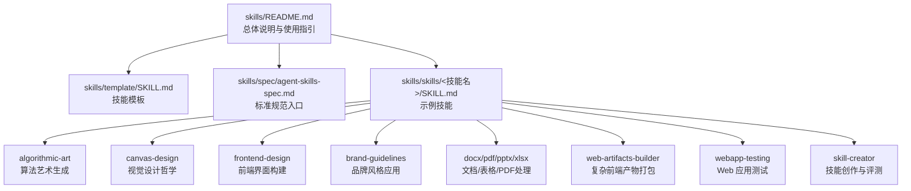
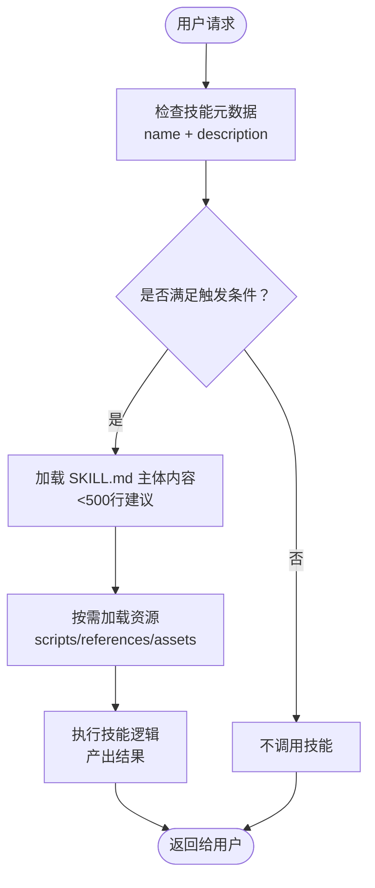
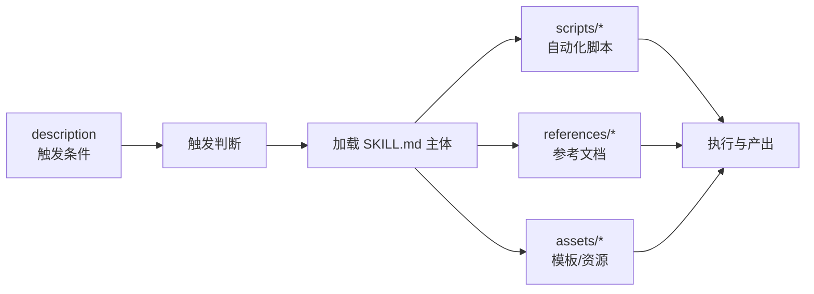

# 技能开发基础

<cite>
**本文引用的文件**
- [skills/README.md](file://skills/README.md)
- [skills/template/SKILL.md](file://skills/template/SKILL.md)
- [skills/spec/agent-skills-spec.md](file://skills/spec/agent-skills-spec.md)
- [skills/skills/algorithmic-art/SKILL.md](file://skills/skills/algorithmic-art/SKILL.md)
- [skills/skills/brand-guidelines/SKILL.md](file://skills/skills/brand-guidelines/SKILL.md)
- [skills/skills/canvas-design/SKILL.md](file://skills/skills/canvas-design/SKILL.md)
- [skills/skills/frontend-design/SKILL.md](file://skills/skills/frontend-design/SKILL.md)
- [skills/skills/docx/SKILL.md](file://skills/skills/docx/SKILL.md)
- [skills/skills/pdf/SKILL.md](file://skills/skills/pdf/SKILL.md)
- [skills/skills/pptx/SKILL.md](file://skills/skills/pptx/SKILL.md)
- [skills/skills/xlsx/SKILL.md](file://skills/skills/xlsx/SKILL.md)
- [skills/skills/skill-creator/SKILL.md](file://skills/skills/skill-creator/SKILL.md)
- [skills/skills/web-artifacts-builder/SKILL.md](file://skills/skills/web-artifacts-builder/SKILL.md)
- [skills/skills/webapp-testing/SKILL.md](file://skills/skills/webapp-testing/SKILL.md)
</cite>

## 目录
1. [引言](#引言)
2. [项目结构](#项目结构)
3. [核心组件](#核心组件)
4. [架构总览](#架构总览)
5. [详细组件分析](#详细组件分析)
6. [依赖分析](#依赖分析)
7. [性能考虑](#性能考虑)
8. [故障排查指南](#故障排查指南)
9. [结论](#结论)
10. [附录](#附录)

## 引言
本文件面向希望在 Claude 技能系统中创建高质量技能的开发者，系统讲解 SKILL.md 的结构与 YAML frontmatter 配置项，给出可直接复用的技能模板与示例，说明技能的基本组成（名称、描述、指令、示例、指南），并总结最佳实践与设计原则。通过仓库中的真实技能示例，读者可以快速上手创建第一个技能，并持续迭代优化。

## 项目结构
该仓库以“技能”为最小单元组织内容，每个技能是一个独立目录，包含一个 SKILL.md 文件以及可选的脚本、资源与参考文档。README 提供了总体说明与使用指引；template 提供了最小可用模板；spec 指向标准规范地址；各技能目录展示了不同领域的技能实现范式。

图表来源
- [skills/README.md:1-95](file://skills/README.md#L1-L95)
- [skills/template/SKILL.md:1-7](file://skills/template/SKILL.md#L1-L7)
- [skills/spec/agent-skills-spec.md:1-4](file://skills/spec/agent-skills-spec.md#L1-L4)

章节来源
- [skills/README.md:1-95](file://skills/README.md#L1-L95)

## 核心组件
- YAML frontmatter（必需字段）
  - name：技能唯一标识（小写、短横线分隔）
  - description：触发条件与能力说明（用于触发匹配）
  - license：可选，许可证信息（部分技能包含）
- 主体内容（Markdown）
  - 指令：明确步骤、边界、输出格式与质量要求
  - 示例：输入/输出样例或典型场景
  - 指南：风格、排版、一致性与最佳实践
- 可选资源
  - scripts/：可执行脚本（如自动化、验证、打包）
  - references/：参考文档（按需加载）
  - assets/：模板、字体、图标等资源

章节来源
- [skills/template/SKILL.md:1-7](file://skills/template/SKILL.md#L1-L7)
- [skills/skills/skill-creator/SKILL.md:71-110](file://skills/skills/skill-creator/SKILL.md#L71-L110)

## 架构总览
技能系统采用“元数据优先”的加载策略：
- 元数据（name + description）始终在上下文中，作为触发依据
- 当技能被触发时，主体内容（SKILL.md）按需加载，限制在一定字数内
- 资源文件（scripts/references/assets）按需读取，支持动态执行与引用

图表来源
- [skills/skills/skill-creator/SKILL.md:86-99](file://skills/skills/skill-creator/SKILL.md#L86-L99)

章节来源
- [skills/skills/skill-creator/SKILL.md:86-99](file://skills/skills/skill-creator/SKILL.md#L86-L99)

## 详细组件分析

### YAML Frontmatter 配置详解
- 必填项
  - name：技能唯一标识，用于识别与触发
  - description：技能做什么、何时触发，是主要触发依据
- 可选项
  - license：许可证声明（部分技能包含）
- 设计要点
  - 描述应包含“触发关键词 + 功能范围”，避免过于宽泛或模糊
  - 建议在描述中强调“何时使用”，帮助模型准确判断

章节来源
- [skills/template/SKILL.md:1-7](file://skills/template/SKILL.md#L1-L7)
- [skills/skills/skill-creator/SKILL.md:66-69](file://skills/skills/skill-creator/SKILL.md#L66-L69)

### 指令（Instructions）
- 明确目标、边界与约束
- 给出可验证的质量标准（如“最终产物必须可直接使用”）
- 对复杂流程拆解为步骤，必要时提供“先读模板/参考”的前置说明

示例参考
- 算法艺术：先哲学后实现，模板固定 UI 结构，算法与参数可变
- 品牌风格：固定配色与字体方案，强调一致性
- 文档处理：严格遵循格式规范与工具链约束

章节来源
- [skills/skills/algorithmic-art/SKILL.md:101-129](file://skills/skills/algorithmic-art/SKILL.md#L101-L129)
- [skills/skills/brand-guidelines/SKILL.md:15-37](file://skills/skills/brand-guidelines/SKILL.md#L15-L37)
- [skills/skills/docx/SKILL.md:378-395](file://skills/skills/docx/SKILL.md#L378-L395)

### 示例（Examples）
- 列举典型输入与期望输出
- 包含边界场景与常见错误示范
- 有助于评测与迭代

章节来源
- [skills/README.md:61-82](file://skills/README.md#L61-L82)
- [skills/skills/skill-creator/SKILL.md:129-136](file://skills/skills/skill-creator/SKILL.md#L129-L136)

### 指南（Guidelines）
- 风格与一致性：字体、颜色、布局、动效等
- 输出质量：可读性、可访问性、跨平台兼容
- 安全与合规：避免敏感信息、恶意代码与侵权内容

章节来源
- [skills/skills/frontend-design/SKILL.md:27-43](file://skills/skills/frontend-design/SKILL.md#L27-L43)
- [skills/skills/web-artifacts-builder/SKILL.md:18-22](file://skills/skills/web-artifacts-builder/SKILL.md#L18-L22)

### 资源与参考（scripts/references/assets）
- scripts：可复用的自动化脚本（如验证、打包、测试）
- references：长文档的分层参考（按需加载）
- assets：模板、字体、图标等静态资源

章节来源
- [skills/skills/skill-creator/SKILL.md:71-84](file://skills/skills/skill-creator/SKILL.md#L71-L84)
- [skills/skills/web-artifacts-builder/SKILL.md:41-55](file://skills/skills/web-artifacts-builder/SKILL.md#L41-L55)

### 技能模板与示例

#### 最小模板（template）
- 仅包含 frontmatter 与占位指令
- 适合快速起步与复制粘贴

章节来源
- [skills/template/SKILL.md:1-7](file://skills/template/SKILL.md#L1-L7)

#### 复杂示例一：算法艺术（algorithmic-art）
- 分两阶段：哲学创作 → 代码实现
- 固定模板 UI，算法与参数可变
- 强调“可重现性”“专家级工艺感”

章节来源
- [skills/skills/algorithmic-art/SKILL.md:101-129](file://skills/skills/algorithmic-art/SKILL.md#L101-L129)
- [skills/skills/algorithmic-art/SKILL.md:221-337](file://skills/skills/algorithmic-art/SKILL.md#L221-L337)

#### 复杂示例二：画布设计（canvas-design）
- 从“视觉哲学”到“画布表达”
- 强调空间、色彩、比例与极简文本

章节来源
- [skills/skills/canvas-design/SKILL.md:15-116](file://skills/skills/canvas-design/SKILL.md#L15-L116)

#### 复杂示例三：前端设计（frontend-design）
- 明确美学方向与实现复杂度匹配
- 避免“AI 框架”式通用设计

章节来源
- [skills/skills/frontend-design/SKILL.md:11-43](file://skills/skills/frontend-design/SKILL.md#L11-L43)

#### 复杂示例四：品牌风格（brand-guidelines）
- 固定主色、辅色与字体
- 自动化应用与跨平台一致性

章节来源
- [skills/skills/brand-guidelines/SKILL.md:15-74](file://skills/skills/brand-guidelines/SKILL.md#L15-L74)

#### 复杂示例五：文档处理（docx/pdf/pptx/xlsx）
- 严格的格式与工具链约束
- 详尽的规则清单与常见陷阱

章节来源
- [skills/skills/docx/SKILL.md:378-395](file://skills/skills/docx/SKILL.md#L378-L395)
- [skills/skills/pdf/SKILL.md:296-315](file://skills/skills/pdf/SKILL.md#L296-L315)
- [skills/skills/pptx/SKILL.md:126-138](file://skills/skills/pptx/SKILL.md#L126-L138)
- [skills/skills/xlsx/SKILL.md:265-292](file://skills/skills/xlsx/SKILL.md#L265-L292)

#### 复杂示例六：Web 前端产物（web-artifacts-builder）
- 使用现代前端技术栈
- 初始化 → 开发 → 打包 → 展示 → 测试

章节来源
- [skills/skills/web-artifacts-builder/SKILL.md:9-74](file://skills/skills/web-artifacts-builder/SKILL.md#L9-L74)

#### 复杂示例七：Web 应用测试（webapp-testing）
- Playwright 自动化测试
- 决策树：静态 HTML vs 动态应用

章节来源
- [skills/skills/webapp-testing/SKILL.md:16-96](file://skills/skills/webapp-testing/SKILL.md#L16-L96)

### 创建你的第一个技能（实操步骤）
- 步骤 1：确定意图与触发词
  - 明确技能要解决的问题域与触发时机
- 步骤 2：编写 SKILL.md
  - 填写 frontmatter（name、description、license）
  - 编写指令、示例与指南
  - 如需，添加 scripts/references/assets
- 步骤 3：本地验证
  - 使用 README 中的“基本技能”示例进行对照
- 步骤 4：迭代优化
  - 基于用户反馈与评测结果改进

章节来源
- [skills/README.md:61-88](file://skills/README.md#L61-L88)
- [skills/skills/skill-creator/SKILL.md:45-70](file://skills/skills/skill-creator/SKILL.md#L45-L70)

## 依赖分析
- 触发机制
  - description 是主要触发依据，应包含“何时使用”的具体语境
- 加载策略
  - 元数据常驻，主体内容按需加载，资源按需读取
- 工具链
  - 不同技能依赖不同工具（如 docx 的 docx、pdf 的 pypdf/reportlab、pptx 的 markitdown、xlsx 的 openpyxl/pandas）

图表来源
- [skills/skills/skill-creator/SKILL.md:86-99](file://skills/skills/skill-creator/SKILL.md#L86-L99)
- [skills/skills/docx/SKILL.md:585-591](file://skills/skills/docx/SKILL.md#L585-L591)
- [skills/skills/pdf/SKILL.md:296-315](file://skills/skills/pdf/SKILL.md#L296-L315)
- [skills/skills/pptx/SKILL.md:226-233](file://skills/skills/pptx/SKILL.md#L226-L233)
- [skills/skills/xlsx/SKILL.md:265-292](file://skills/skills/xlsx/SKILL.md#L265-L292)

章节来源
- [skills/skills/skill-creator/SKILL.md:86-99](file://skills/skills/skill-creator/SKILL.md#L86-L99)

## 性能考虑
- 控制 SKILL.md 字数，避免超过 500 行，必要时分层组织并通过 references 提供深度内容
- 将重复性任务下沉到 scripts，减少每次调用的计算开销
- 对大文件/资源按需加载，避免不必要的 IO
- 在前端产物场景，优先使用打包脚本生成单文件产物，降低传输与渲染成本

## 故障排查指南
- 触发不足
  - 检查 description 是否包含足够多的触发关键词与使用场景
  - 参考“描述优化”流程，生成触发评估查询集并迭代
- 输出不符合预期
  - 明确输出格式与验收标准，补充示例与断言
  - 使用评测流水线生成基准报告，定位薄弱环节
- 工具链问题
  - 按技能文档核对依赖版本与命令行参数
  - 使用 README 中提供的“基本技能”示例进行对照测试

章节来源
- [skills/skills/skill-creator/SKILL.md:333-405](file://skills/skills/skill-creator/SKILL.md#L333-L405)
- [skills/README.md:61-88](file://skills/README.md#L61-L88)

## 结论
高质量的技能以清晰的元数据、严谨的指令、丰富的示例与一致的指南为基础。通过模板起步、示例借鉴与评测驱动的迭代，开发者可以在 Claude 技能生态中高效交付可复用、可维护且易触发的技能。

## 附录

### YAML frontmatter 字段速查
- name：技能唯一标识（小写、短横线分隔）
- description：触发条件与功能说明（主触发依据）
- license：可选，许可证声明

章节来源
- [skills/template/SKILL.md:1-7](file://skills/template/SKILL.md#L1-L7)

### 标准规范入口
- Agent Skills 规范位于外部链接，可在需要时查阅最新标准

章节来源
- [skills/spec/agent-skills-spec.md:1-4](file://skills/spec/agent-skills-spec.md#L1-L4)