# 项目概述

<cite>
**本文引用的文件**
- [skills/README.md](file://skills/README.md)
- [skills/spec/agent-skills-spec.md](file://skills/spec/agent-skills-spec.md)
- [skills/template/SKILL.md](file://skills/template/SKILL.md)
- [skills/.claude-plugin/marketplace.json](file://skills/.claude-plugin/marketplace.json)
- [skills/skills/algorithmic-art/SKILL.md](file://skills/skills/algorithmic-art/SKILL.md)
- [skills/skills/canvas-design/SKILL.md](file://skills/skills/canvas-design/SKILL.md)
- [skills/skills/claude-api/SKILL.md](file://skills/skills/claude-api/SKILL.md)
- [skills/skills/docx/SKILL.md](file://skills/skills/docx/SKILL.md)
- [skills/skills/mcp-builder/SKILL.md](file://skills/skills/mcp-builder/SKILL.md)
- [skills/skills/web-artifacts-builder/SKILL.md](file://skills/skills/web-artifacts-builder/SKILL.md)
- [skills/skills/skill-creator/SKILL.md](file://skills/skills/skill-creator/SKILL.md)
- [skills/skills/theme-factory/SKILL.md](file://skills/skills/theme-factory/SKILL.md)
- [skills/skills/webapp-testing/SKILL.md](file://skills/skills/webapp-testing/SKILL.md)
- [skills/skills/slack-gif-creator/SKILL.md](file://skills/skills/slack-gif-creator/SKILL.md)
- [skills/skills/frontend-design/SKILL.md](file://skills/skills/frontend-design/SKILL.md)
- [skills/skills/frontend-design/LICENSE.txt](file://skills/skills/frontend-design/LICENSE.txt)
</cite>

## 更新摘要
**所做更改**
- 新增前端设计技能章节，详细介绍从创意设计到工程实现的完整前端开发流程
- 更新核心组件部分，将前端设计技能纳入项目核心能力体系
- 扩展详细组件分析，增加前端设计技能的完整工作流程
- 更新依赖关系分析，反映前端设计技能在技能生态系统中的地位
- 增强性能考虑部分，加入前端设计相关的优化建议
- 更新故障排除指南，包含前端设计相关的常见问题解决方案

## 目录
1. [引言](#引言)
2. [项目结构](#项目结构)
3. [核心组件](#核心组件)
4. [架构总览](#架构总览)
5. [详细组件分析](#详细组件分析)
6. [依赖关系分析](#依赖关系分析)
7. [性能考虑](#性能考虑)
8. [故障排除指南](#故障排除指南)
9. [结论](#结论)
10. [附录](#附录)

## 引言
本项目是 Anthropic 的 Claude AI 技能系统（Agent Skills）示例仓库，旨在展示如何通过"技能"（Skill）为 Claude 提供可复用、可扩展的任务能力。每个技能是一个自包含的目录，包含元数据与说明文档（SKILL.md），以及可选的脚本与资源。技能系统支持从创意设计、文档处理到企业工作流、MCP 服务器构建、前端产物打包、Web 应用测试、GIF 制作等广泛场景。

**更新** 新增前端设计技能作为项目核心能力之一，涵盖从创意设计到工程实现的完整前端开发流程，为 Claude 提供生产级的前端界面设计与实现能力。该技能采用 Apache 2.0 许可证，确保开源共享的同时保护知识产权。

技能系统的核心价值在于：
- 将复杂任务拆解为可重复、可评估的工作流
- 通过触发条件（描述字段）精准激活合适的技能
- 支持评测、迭代与性能基准，持续优化技能质量
- 通过模板与参考实现快速创建高质量技能

## 项目结构
仓库采用按功能域划分的目录组织方式，主干为 skills/，其中包含多个技能子目录；另有 spec/（规范）、template/（模板）、.claude-plugin/（插件市场清单）等辅助模块。

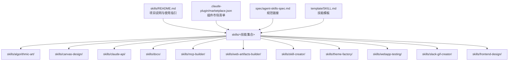

**图示来源**
- [skills/README.md:1-95](file://skills/README.md#L1-L95)
- [skills/.claude-plugin/marketplace.json:1-56](file://skills/.claude-plugin/marketplace.json#L1-L56)
- [skills/spec/agent-skills-spec.md:1-4](file://skills/spec/agent-skills-spec.md#L1-L4)
- [skills/template/SKILL.md:1-7](file://skills/template/SKILL.md#L1-L7)

**章节来源**
- [skills/README.md:12-28](file://skills/README.md#L12-L28)
- [skills/.claude-plugin/marketplace.json:11-54](file://skills/.claude-plugin/marketplace.json#L11-L54)

## 核心组件
- 插件市场清单（marketplace.json）
  - 定义插件名称、版本、所有者信息
  - 声明多个技能集合（如 document-skills、example-skills、claude-api），并指定技能路径
  - **更新** example-skills 集合现已包含前端设计技能，体现其作为核心能力的地位
- 触发机制（SKILL.md frontmatter）
  - name：技能唯一标识
  - description：触发条件与能力描述，决定何时激活
- 模板（template/SKILL.md）
  - 提供最小可用的 SKILL.md 结构，便于快速创建新技能
- 规范（spec/agent-skills-spec.md）
  - 指向官方 Agent Skills 规范地址，作为设计与实现依据

**章节来源**
- [.claude-plugin/marketplace.json:1-56](file://skills/.claude-plugin/marketplace.json#L1-L56)
- [template/SKILL.md:1-7](file://skills/template/SKILL.md#L1-L7)
- [spec/agent-skills-spec.md:1-4](file://skills/spec/agent-skills-spec.md#L1-L4)

## 架构总览
技能系统由"触发—加载—执行—产出"闭环构成。Claude 在对话中根据用户意图与技能描述匹配合适技能；当技能被激活时，Claude 读取该技能的 SKILL.md 与必要资源，按指令完成任务并输出结果。

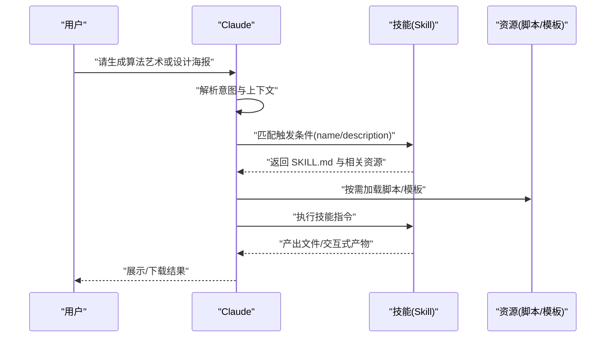

**图示来源**
- [skills/README.md:61-88](file://skills/README.md#L61-L88)
- [skills/skills/skill-creator/SKILL.md:86-117](file://skills/skills/skill-creator/SKILL.md#L86-L117)

## 详细组件分析

### 前端设计技能（frontend-design）
**新增** 前端设计技能是项目的核心能力之一，专门用于创建具有高设计质量的生产级前端界面。

- 能力概要
  - 创建独特且生产级的前端界面，避免通用的"AI 糟糕"美学
  - 从创意设计到工程实现的完整前端开发流程
  - 支持网站、着陆页、仪表板、React 组件、HTML/CSS 布局等各种前端应用
- 关键设计思维
  - **目的性**：明确界面解决的问题和目标用户群体
  - **风格选择**：从多种极端美学风格中选择并坚持执行
  - **约束条件**：技术要求（框架、性能、可访问性）
  - **差异化**：确定什么让界面令人难忘
- 前端美学指南
  - **字体**：选择独特且有个性的字体，避免通用字体
  - **色彩与主题**：使用 CSS 变量保持一致性
  - **动效**：专注于高影响力时刻的动画效果
  - **空间构图**：意外的布局、不对称、重叠、对角线流动
  - **背景与视觉细节**：创造氛围和深度，而非默认纯色

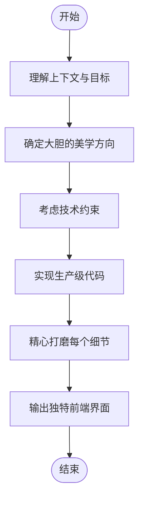

**图示来源**
- [skills/skills/frontend-design/SKILL.md:11-43](file://skills/skills/frontend-design/SKILL.md#L11-L43)

**章节来源**
- [skills/skills/frontend-design/SKILL.md:1-43](file://skills/skills/frontend-design/SKILL.md#L1-L43)

### 算法艺术技能（algorithmic-art）
- 能力概要
  - 基于 p5.js 的算法艺术创作流程：先生成"算法美学宣言"，再实现为可交互的 HTML 产物
  - 强调"过程优于产物""参数化表达""专家级工艺感"
- 关键流程
  - 算法哲学创作（4-6 段）
  - 参数化实现（种子随机、参数控制、颜色方案）
  - 可交互产物（单文件 HTML，内嵌 p5.js 与 UI 控件）
- 输出物
  - 算法哲学文本（.md）
  - 自包含 HTML 产物（.html）

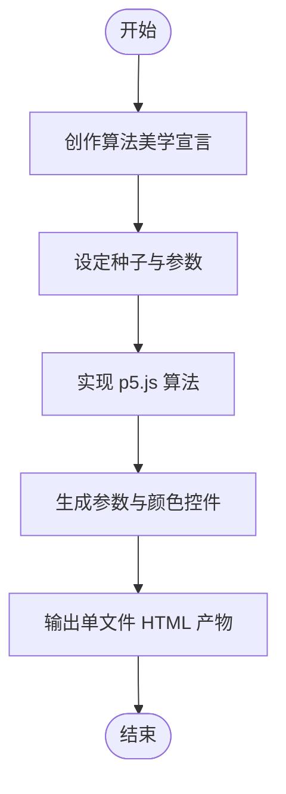

**图示来源**
- [skills/skills/algorithmic-art/SKILL.md:13-218](file://skills/skills/algorithmic-art/SKILL.md#L13-L218)

**章节来源**
- [skills/skills/algorithmic-art/SKILL.md:1-405](file://skills/skills/algorithmic-art/SKILL.md#L1-L405)

### 画布设计技能（canvas-design）
- 能力概要
  - 通过"视觉美学宣言"指导静态视觉作品的设计与实现
  - 输出 .md（理念）、.pdf/.png（作品）
- 关键流程
  - 视觉哲学创作（强调空间、色彩、比例、层次）
  - 概念推导（从用户输入中提炼隐含主题）
  - 画布实现（排版、字体、留白、极简文字）
- 输出物
  - 设计哲学（.md）
  - 单页 PDF 或 PNG（可多页）

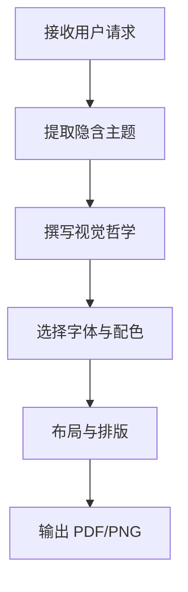

**图示来源**
- [skills/skills/canvas-design/SKILL.md:15-116](file://skills/skills/canvas-design/SKILL.md#L15-L116)

**章节来源**
- [skills/skills/canvas-design/SKILL.md:1-130](file://skills/skills/canvas-design/SKILL.md#L1-L130)

### Claude API 技能（claude-api）
- 能力概要
  - 面向 Claude API 与 SDK 的应用开发指南，覆盖模型选择、思考模式、工具调用、批量处理、文件上传、错误处理等
- 关键点
  - 默认模型与思考模式（如 Opus 4.6 + adaptive thinking）
  - 语言检测与对应文档路径（Python/TypeScript/Java/Go/Ruby/C#/PHP/cURL）
  - 表面层选择决策树（单次调用、工作流、代理、Agent SDK）
  - 结构化输出与工具运行器
- 输出物
  - 语言特定的 API 使用说明与最佳实践

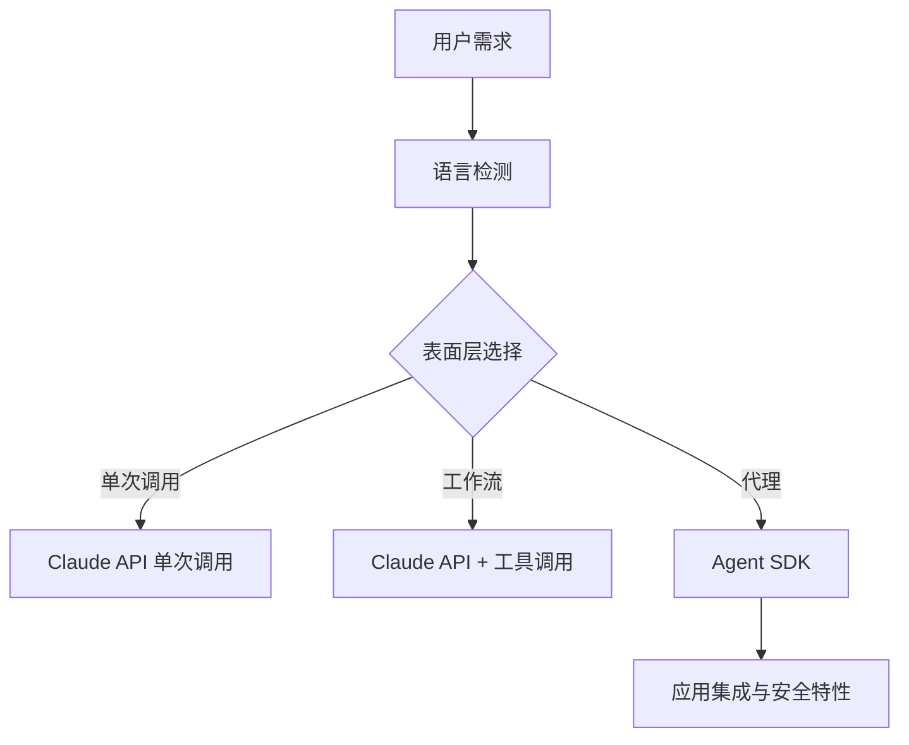

**图示来源**
- [skills/skills/claude-api/SKILL.md:68-104](file://skills/skills/claude-api/SKILL.md#L68-L104)
- [skills/skills/claude-api/SKILL.md:171-211](file://skills/skills/claude-api/SKILL.md#L171-L211)

**章节来源**
- [skills/skills/claude-api/SKILL.md:1-244](file://skills/skills/claude-api/SKILL.md#L1-L244)

### 文档处理技能（docx）
- 能力概要
  - Word 文档的创建、编辑与分析，基于 docx-js 与 XML 编辑
- 关键点
  - 新建文档：页面尺寸、样式覆盖、列表与表格、图片、分栏、目录、页眉页脚
  - 编辑现有文档：解包 XML、跟踪修订与批注、打包修复
  - 关键规则：DXA 单位、禁止换行符、禁止百分比宽度、表格双宽约束、清除着色
- 输出物
  - .docx 文件（新建或编辑后）

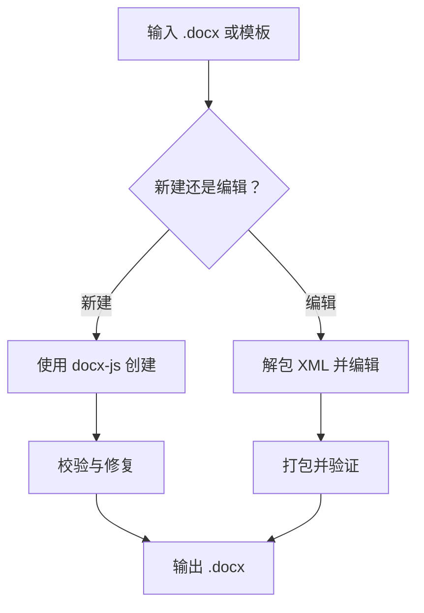

**图示来源**
- [skills/skills/docx/SKILL.md:56-441](file://skills/skills/docx/SKILL.md#L56-L441)

**章节来源**
- [skills/skills/docx/SKILL.md:1-591](file://skills/skills/docx/SKILL.md#L1-L591)

### MCP 服务器构建技能（mcp-builder）
- 能力概要
  - 指导构建高质量 MCP（模型上下文协议）服务器，连接外部服务并通过良好设计的工具让 LLM 执行真实世界任务
- 关键流程
  - 深入研究与规划：API 覆盖 vs 工作流工具、命名与可发现性、上下文管理、可操作错误消息
  - 学习协议与框架：TypeScript/Python SDK、传输机制（HTTP/stdio）
  - 实现：基础设施、工具实现（输入/输出模式、注解）、测试与评估
  - 评估：10 个真实问题、稳定答案、XML 格式
- 输出物
  - MCP 服务器实现与评估报告

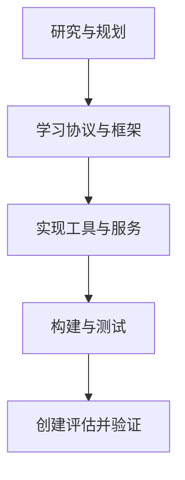

**图示来源**
- [skills/skills/mcp-builder/SKILL.md:17-193](file://skills/skills/mcp-builder/SKILL.md#L17-L193)

**章节来源**
- [skills/skills/mcp-builder/SKILL.md:1-237](file://skills/skills/mcp-builder/SKILL.md#L1-L237)

### Web 前端产物构建技能（web-artifacts-builder）
- 能力概要
  - 使用现代前端技术栈（React/Tailwind/shadcn/ui）构建复杂的 Claude 前端产物
- 关键流程
  - 初始化项目（脚手架）
  - 开发与调试
  - 打包为单文件 HTML（内联资源）
  - 分享与可选测试
- 输出物
  - 单文件 HTML 前端产物

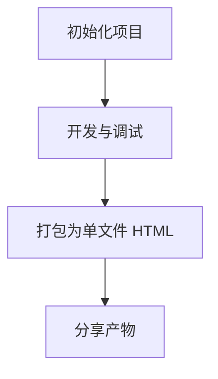

**图示来源**
- [skills/skills/web-artifacts-builder/SKILL.md:9-74](file://skills/skills/web-artifacts-builder/SKILL.md#L9-L74)

**章节来源**
- [skills/skills/web-artifacts-builder/SKILL.md:1-74](file://skills/skills/web-artifacts-builder/SKILL.md#L1-L74)

### 技能创建与优化技能（skill-creator）
- 能力概要
  - 从零创建技能、修改与改进现有技能、评测与性能基准、优化触发描述
- 关键流程
  - 捕捉意图、面试与调研、编写 SKILL.md、测试用例、评测与迭代、描述优化、打包发布
- 输出物
  - 进化的技能包（.skill 文件）与评测报告

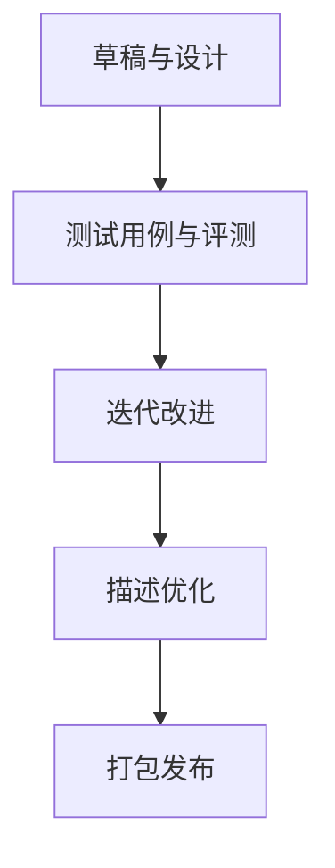

**图示来源**
- [skills/skills/skill-creator/SKILL.md:10-320](file://skills/skills/skill-creator/SKILL.md#L10-L320)

**章节来源**
- [skills/skills/skill-creator/SKILL.md:1-486](file://skills/skills/skill-creator/SKILL.md#L1-L486)

### 主题工厂技能（theme-factory）
- 能力概要
  - 为幻灯片、文档、报告、HTML 页面等应用专业主题（颜色与字体组合）
- 关键流程
  - 展示主题样例 → 用户选择 → 应用主题 → 一致性检查
- 输出物
  - 应用主题后的文档/演示稿

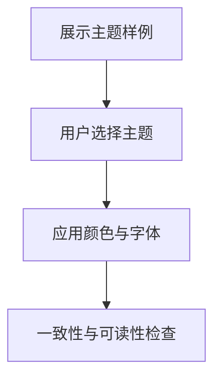

**图示来源**
- [skills/skills/theme-factory/SKILL.md:19-60](file://skills/skills/theme-factory/SKILL.md#L19-L60)

**章节来源**
- [skills/skills/theme-factory/SKILL.md:1-60](file://skills/skills/theme-factory/SKILL.md#L1-L60)

### Web 应用测试技能（webapp-testing）
- 能力概要
  - 使用 Playwright 测试本地 Web 应用，支持断言、截图、日志查看
- 关键流程
  - 静态 HTML？直接读取 → 动态应用？启动服务器 → 探测→行动（截图/DOM 检查→定位选择器→执行动作）
- 输出物
  - 测试脚本与结果（截图/日志）

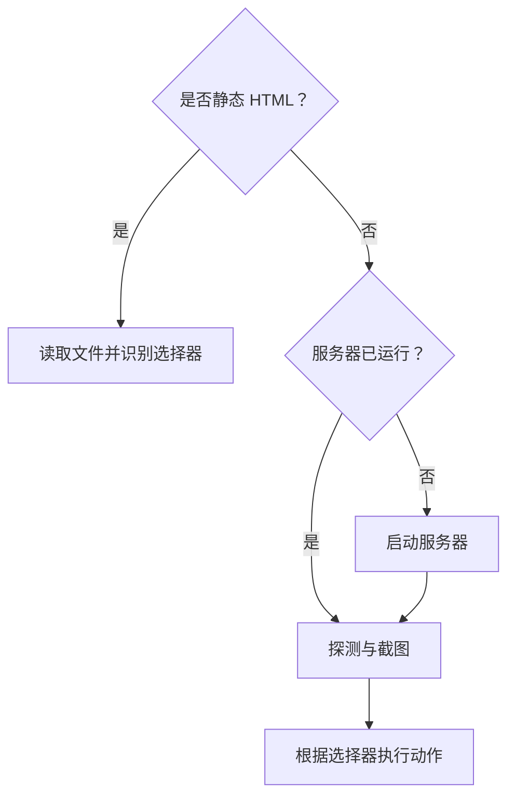

**图示来源**
- [skills/skills/webapp-testing/SKILL.md:16-96](file://skills/skills/webapp-testing/SKILL.md#L16-L96)

**章节来源**
- [skills/skills/webapp-testing/SKILL.md:1-96](file://skills/skills/webapp-testing/SKILL.md#L1-L96)

### Slack GIF 制作技能（slack-gif-creator）
- 能力概要
  - 为 Slack 优化的动画 GIF 制作工具链，包含尺寸、帧率、颜色数、时长约束与优化策略
- 关键流程
  - 选择尺寸与参数 → 生成帧（PIL 图形绘制）→ 保存与优化 → 验证合规
- 输出物
  - 符合 Slack 要求的 GIF

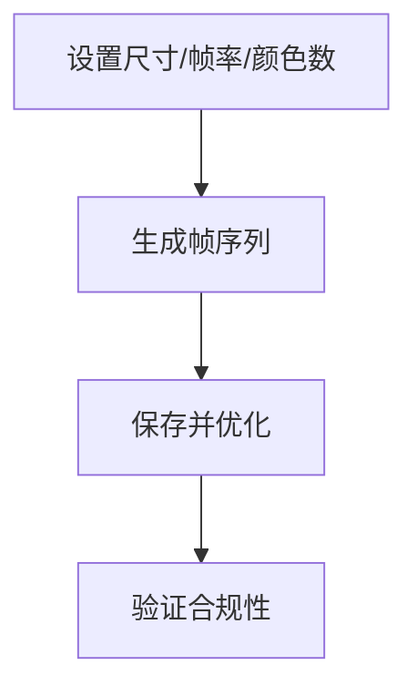

**图示来源**
- [skills/skills/slack-gif-creator/SKILL.md:11-232](file://skills/skills/slack-gif-creator/SKILL.md#L11-L232)

**章节来源**
- [skills/skills/slack-gif-creator/SKILL.md:1-255](file://skills/skills/slack-gif-creator/SKILL.md#L1-L255)

## 依赖关系分析
- 插件市场清单（marketplace.json）声明了技能集合与其来源路径，驱动 Claude 加载与注册技能
- **更新** example-skills 集合现已包含前端设计技能，体现其作为核心能力的地位
- 模板（template/SKILL.md）为所有技能提供统一的最小结构，确保触发描述与说明格式一致
- 各技能内部通过脚本与参考文件协作，形成"指令 + 资源"的可执行单元
- 规范（spec/agent-skills-spec.md）指向官方标准，保证实现一致性与可移植性

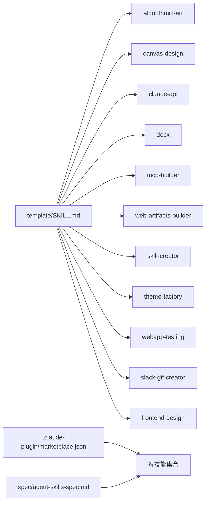

**图示来源**
- [skills/template/SKILL.md:1-7](file://skills/template/SKILL.md#L1-L7)
- [skills/.claude-plugin/marketplace.json:11-54](file://skills/.claude-plugin/marketplace.json#L11-L54)
- [skills/spec/agent-skills-spec.md:1-4](file://skills/spec/agent-skills-spec.md#L1-L4)

**章节来源**
- [skills/.claude-plugin/marketplace.json:11-54](file://skills/.claude-plugin/marketplace.json#L11-L54)

## 性能考虑
- 上下文窗口与加载策略
  - 技能采用渐进披露（Progressive Disclosure）：元数据始终在上下文，正文按需加载，资源按需执行，避免超大上下文污染
- 触发准确性
  - 技能描述是触发的关键，应明确"何时触发""做什么"，并覆盖常见变体与近似表达
- 评测与基准
  - 使用标准化评测集与指标（通过 skill-creator 的评测管线），持续监控吞吐、延迟与准确率
- 产物体积与兼容性
  - 文档与 GIF 等产物需遵循平台限制（如 Docx 的 DXA/百分比规则、GIF 的尺寸/颜色/帧率），减少二次转换成本
- **更新** 前端设计性能优化
  - 选择合适的前端框架和优化策略，平衡视觉效果与性能表现
  - 使用 CSS 变量和现代 CSS 特性提升渲染性能
  - 优化动画和过渡效果，避免过度消耗系统资源
  - 遵循前端美学指南中的性能最佳实践，确保代码质量和用户体验

## 故障排除指南
- 触发不足
  - 现象：简单任务未触发技能
  - 处理：增强描述中的触发关键词与上下文，使技能更易被激活
- 文档产物异常
  - 现象：表格渲染错乱、Google Docs 不兼容
  - 处理：使用 DXA 宽度、避免百分比宽度、确保表宽与列宽一致
- GIF 不合规
  - 现象：尺寸/颜色/时长不满足 Slack 要求
  - 处理：调整尺寸、降低颜色数、缩短时长、启用去重与 Emoji 优化
- API 错误处理
  - 现象：旧版模型预算令牌参数报错、预填充助手消息返回 400
  - 处理：使用 Opus/Sonnet 的自适应思考，避免预填充助手消息，改用结构化输出
- **更新** 前端设计相关问题
  - 现象：前端界面不符合预期美学或技术约束
  - 处理：明确设计方向和约束条件，遵循前端美学指南，确保实现与设计愿景一致
  - 现象：前端代码性能不佳或兼容性问题
  - 处理：优化 CSS 和 JavaScript，使用现代浏览器特性，确保跨平台兼容性
  - 现象：字体或主题不一致
  - 处理：使用 CSS 变量统一管理颜色和字体，确保设计系统的连贯性

**章节来源**
- [skills/skills/claude-api/SKILL.md:233-244](file://skills/skills/claude-api/SKILL.md#L233-L244)
- [skills/skills/docx/SKILL.md:378-395](file://skills/skills/docx/SKILL.md#L378-L395)
- [skills/skills/slack-gif-creator/SKILL.md:114-133](file://skills/skills/slack-gif-creator/SKILL.md#L114-L133)
- [skills/skills/frontend-design/SKILL.md:27-43](file://skills/skills/frontend-design/SKILL.md#L27-L43)

## 结论
本项目以"技能"为核心，围绕 Claude 的 Agent Skills 标准，提供了从创意到工程、从文档到前端、从 API 到测试的完整能力谱系。**更新** 新增的前端设计技能作为核心能力之一，填补了从创意设计到工程实现的空白，为 Claude 提供了生产级的前端界面设计与实现能力。

前端设计技能采用 Apache 2.0 开源许可证，确保了技能的开放共享和可持续发展。该技能不仅提供了详细的设计思维和美学指南，还包含了从概念设计到代码实现的完整工作流程，为开发者提供了强大的前端设计能力。

通过模板化、渐进披露与评测闭环，技能系统既适合初学者快速上手，也能支撑资深开发者进行深度定制与优化。建议在实际落地中：
- 明确触发描述与边界
- 优先使用渐进披露与资源按需加载
- 建立评测与迭代流程
- 遵循平台与规范约束
- **更新** 充分利用前端设计技能的独特美学优势，确保前端界面既美观又实用
- **更新** 遵循 Apache 2.0 许可证要求，正确标注版权和贡献者信息

## 附录
- 快速开始
  - 使用模板创建 SKILL.md，编写触发描述与步骤说明
  - 在 marketplace.json 中注册技能集合，按需添加脚本与参考文件
  - 通过 skill-creator 进行评测与迭代，最终打包为 .skill 文件
  - **更新** 利用前端设计技能的美学指南，确保前端界面的独特性和高质量
  - **更新** 遵循 Apache 2.0 许可证要求，正确使用和分发前端设计技能
- 常见用例示例
  - 生成算法艺术：先写"算法美学宣言"，再实现为可交互 HTML
  - 制作设计海报：撰写"视觉美学宣言"，输出 PDF/PNG
  - 编辑 Word 文档：解包 XML、插入修订与批注、重新打包
  - 构建 MCP 服务器：设计工具与响应模式，创建评估问题集
  - 构建前端产物：初始化 React/Tailwind 项目，打包为单文件 HTML
  - **更新** 创建前端界面：理解用户需求，确定美学方向，实现生产级代码，精心打磨细节
  - 测试 Web 应用：使用 Playwright 启动服务器并自动化断言
  - 制作 GIF：设置尺寸/帧率/颜色数，生成帧并优化体积
  - **更新** 设计独特的前端界面：选择极端美学风格，确保技术约束与差异化设计